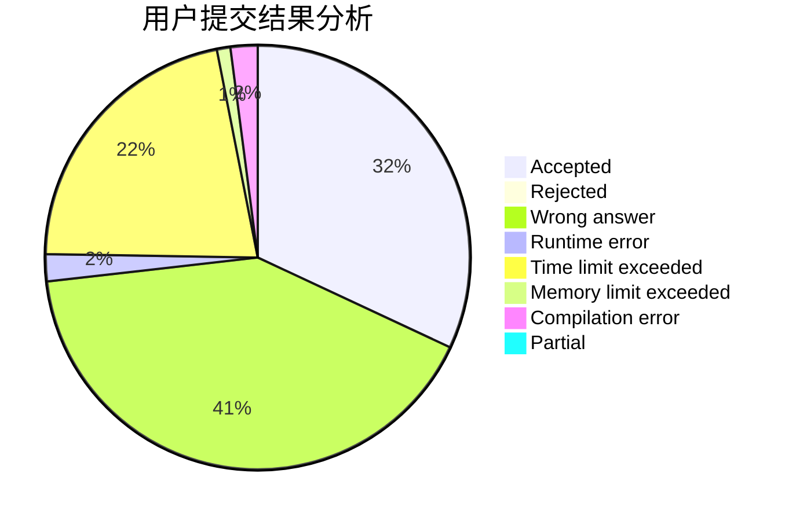
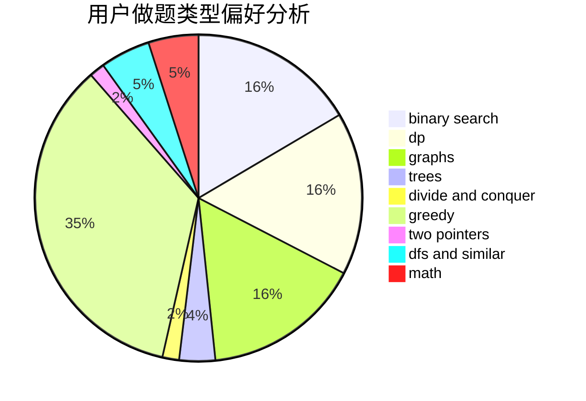

# _rockdu

<!-- tabs:start -->

#### **用户提交结果分析**

#### **用户做题类型偏好分析**

<!-- tabs:end -->
# 推荐题目
[1220C](https://codeforces.com/contest/1220/problem/C)
[659G](https://codeforces.com/contest/659/problem/G)
[1312F](https://codeforces.com/contest/1312/problem/F)
[1295F](https://codeforces.com/contest/1295/problem/F)
[759B](https://codeforces.com/contest/759/problem/B)
[611C](https://codeforces.com/contest/611/problem/C)
[590A](https://codeforces.com/contest/590/problem/A)
[232A](https://codeforces.com/contest/232/problem/A)
[1075A](https://codeforces.com/contest/1075/problem/A)
[586F](https://codeforces.com/contest/586/problem/F)
