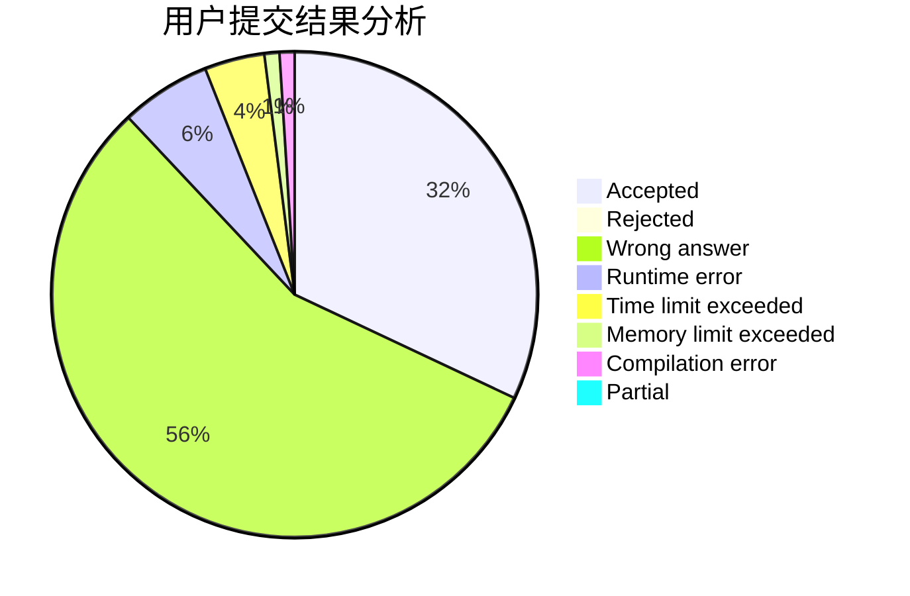
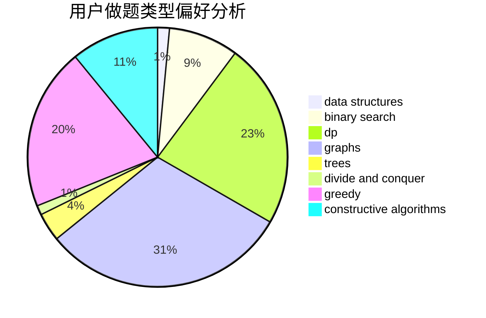
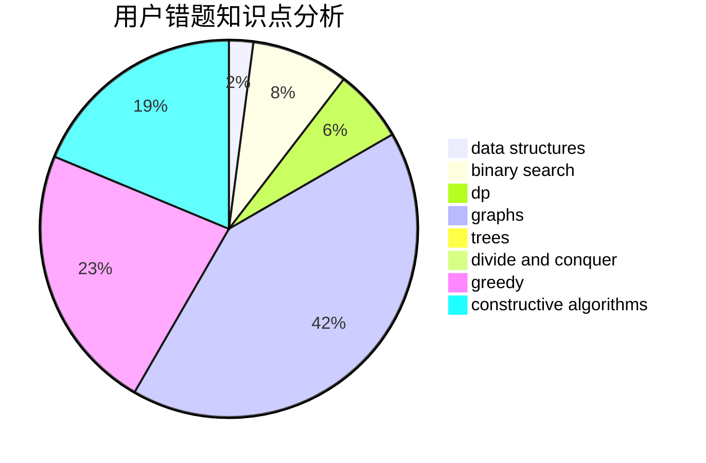

# _wzx27

<!-- tabs:start -->

#### **用户提交结果分析**

#### **用户做题类型偏好分析**

#### **用户错题知识点分析**

<!-- tabs:end -->
# 推荐题目
[581B](https://codeforces.com/contest/581/problem/B)		implementation,
                        math		  
[898D](https://codeforces.com/contest/898/problem/D)		greedy		  
[88A](https://codeforces.com/contest/88/problem/A)		brute force,
                        implementation		  
[300E](https://codeforces.com/contest/300/problem/E)		binary search,
                        math,
                        number theory		  
[358D](https://codeforces.com/contest/358/problem/D)		dp,
                        greedy		  
[272E](https://codeforces.com/contest/272/problem/E)		combinatorics,
                        constructive algorithms,
                        graphs		  
[215D](https://codeforces.com/contest/215/problem/D)		greedy		  
[809E](https://codeforces.com/contest/809/problem/E)		divide and conquer,
                        math,
                        number theory,
                        trees		  
[452C](https://codeforces.com/contest/452/problem/C)		combinatorics,
                        math,
                        probabilities		  
[1085A](https://codeforces.com/contest/1085/problem/A)		implementation,
                        strings		  
