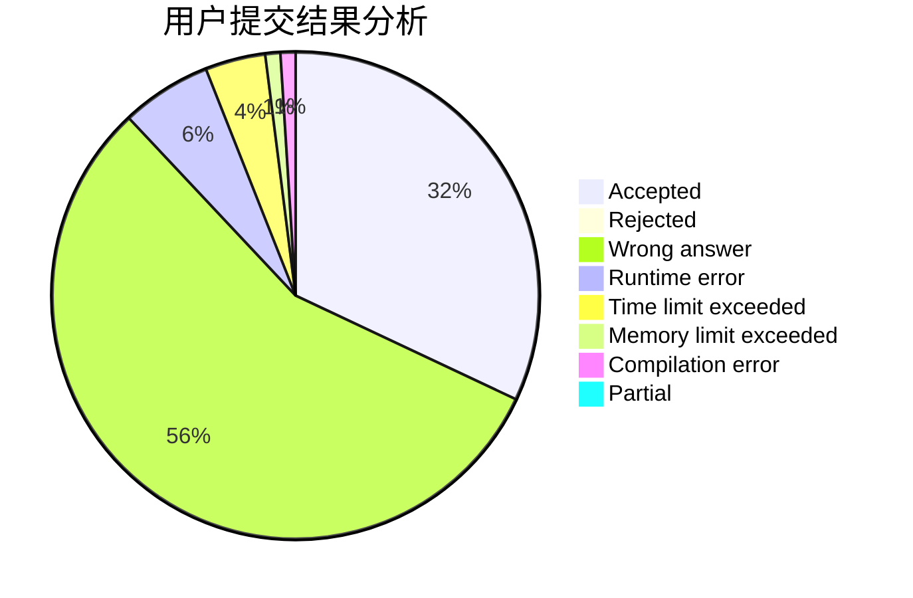
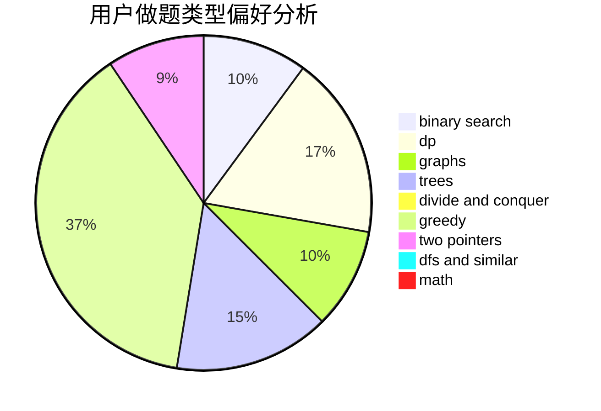

# _wzx27

<!-- tabs:start -->

#### **用户提交结果分析**

#### **用户做题类型偏好分析**

<!-- tabs:end -->
# 推荐题目
[601C](https://codeforces.com/contest/601/problem/C)
[914F](https://codeforces.com/contest/914/problem/F)
[909A](https://codeforces.com/contest/909/problem/A)
[319C](https://codeforces.com/contest/319/problem/C)
[383E](https://codeforces.com/contest/383/problem/E)
[288E](https://codeforces.com/contest/288/problem/E)
[235A](https://codeforces.com/contest/235/problem/A)
[827D](https://codeforces.com/contest/827/problem/D)
[474C](https://codeforces.com/contest/474/problem/C)
[1085F](https://codeforces.com/contest/1085/problem/F)
