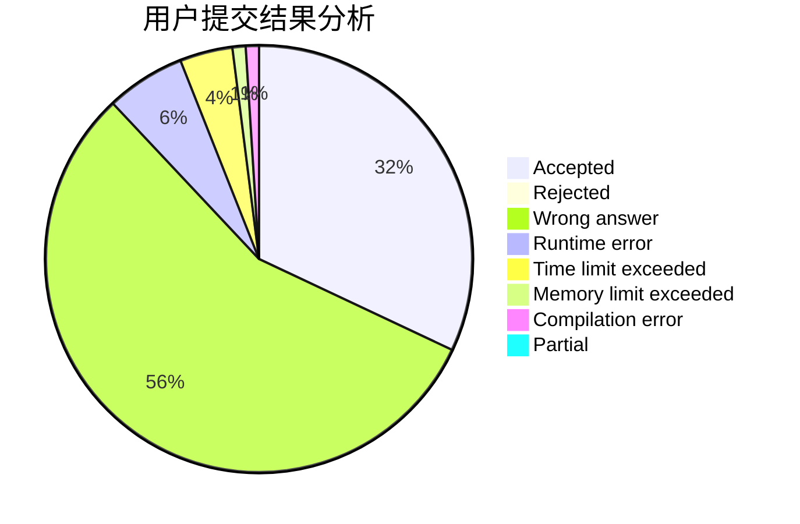
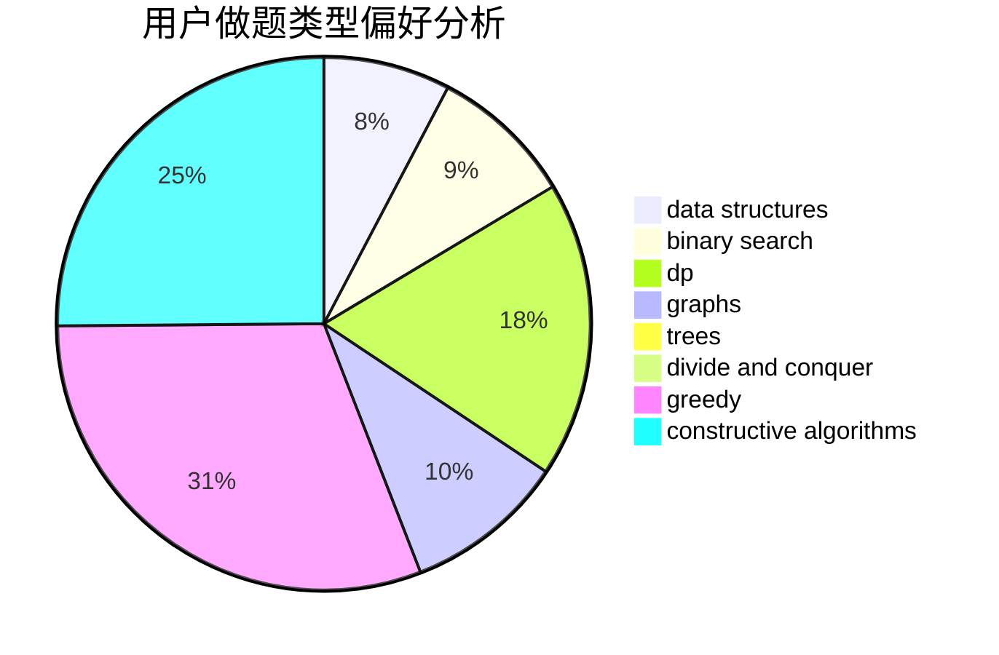
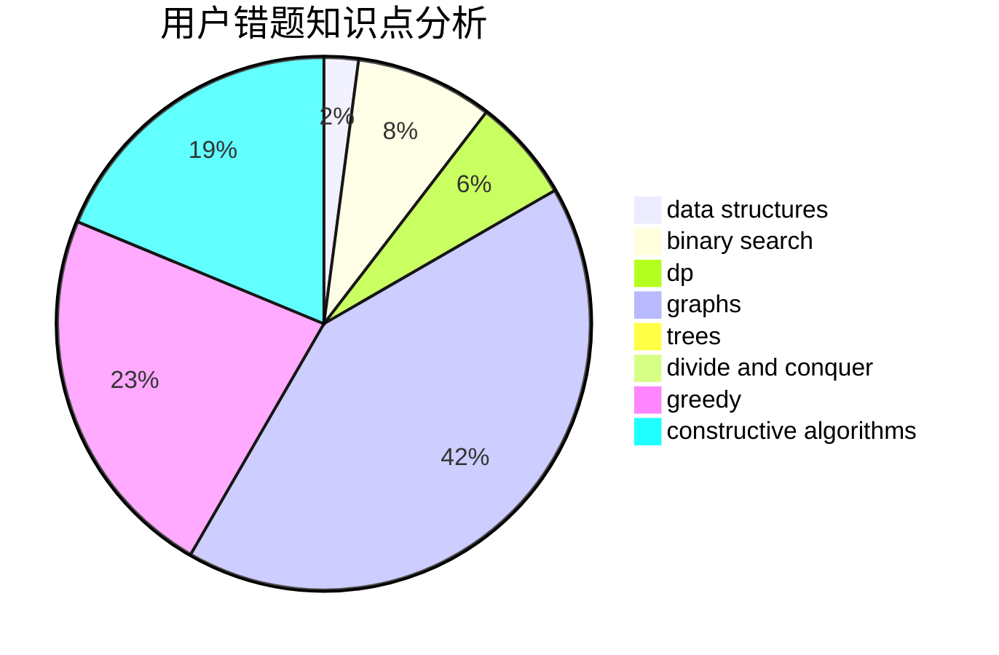

# _wzx27

<!-- tabs:start -->

#### **用户提交结果分析**

#### **用户做题类型偏好分析**

#### **用户错题知识点分析**

<!-- tabs:end -->
# 推荐题目
[601C](https://codeforces.com/contest/601/problem/C)		dp,
                        math,
                        probabilities		  
[914F](https://codeforces.com/contest/914/problem/F)		bitmasks,
                        brute force,
                        data structures,
                        string suffix structures,
                        strings		  
[909A](https://codeforces.com/contest/909/problem/A)		brute force,
                        greedy,
                        sortings		  
[319C](https://codeforces.com/contest/319/problem/C)		dp,
                        geometry		  
[383E](https://codeforces.com/contest/383/problem/E)		combinatorics,
                        divide and conquer,
                        dp		  
[288E](https://codeforces.com/contest/288/problem/E)		dp,
                        implementation,
                        math		  
[235A](https://codeforces.com/contest/235/problem/A)		number theory		  
[827D](https://codeforces.com/contest/827/problem/D)		data structures,
                        dfs and similar,
                        graphs,
                        trees		  
[474C](https://codeforces.com/contest/474/problem/C)		brute force,
                        geometry		  
[1085F](https://codeforces.com/contest/1085/problem/F)		nan		  
