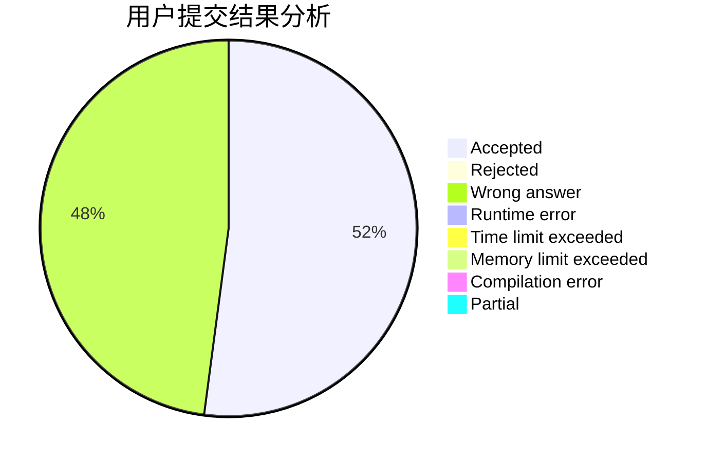
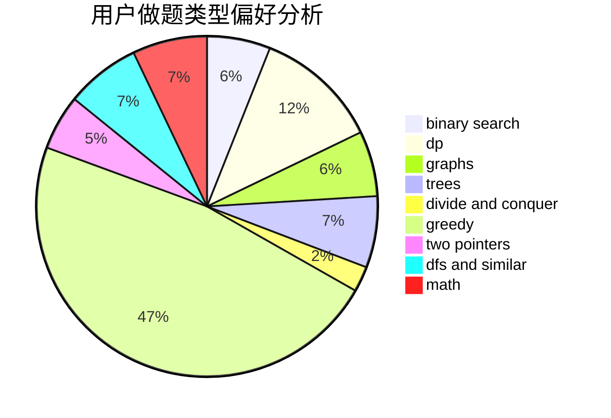

# _zwy

<!-- tabs:start -->

#### **用户提交结果分析**

#### **用户做题类型偏好分析**

<!-- tabs:end -->
# 推荐题目
[1119D](https://codeforces.com/contest/1119/problem/D)
[1313A](https://codeforces.com/contest/1313/problem/A)
[369A](https://codeforces.com/contest/369/problem/A)
[961B](https://codeforces.com/contest/961/problem/B)
[901C](https://codeforces.com/contest/901/problem/C)
[1335F](https://codeforces.com/contest/1335/problem/F)
[251A](https://codeforces.com/contest/251/problem/A)
[1082B](https://codeforces.com/contest/1082/problem/B)
[952F](https://codeforces.com/contest/952/problem/F)
[148E](https://codeforces.com/contest/148/problem/E)
