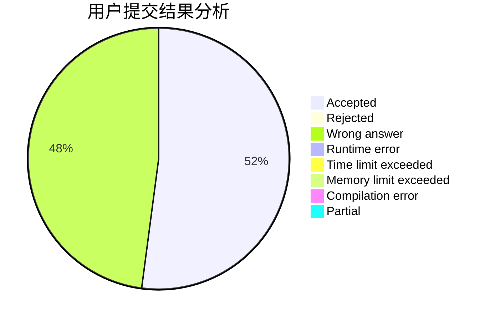
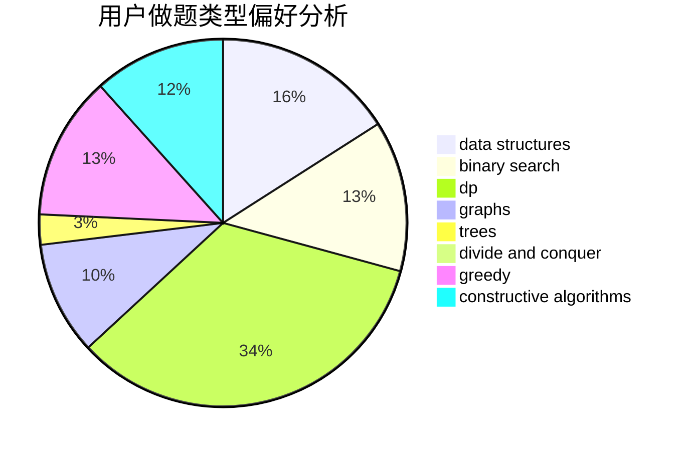
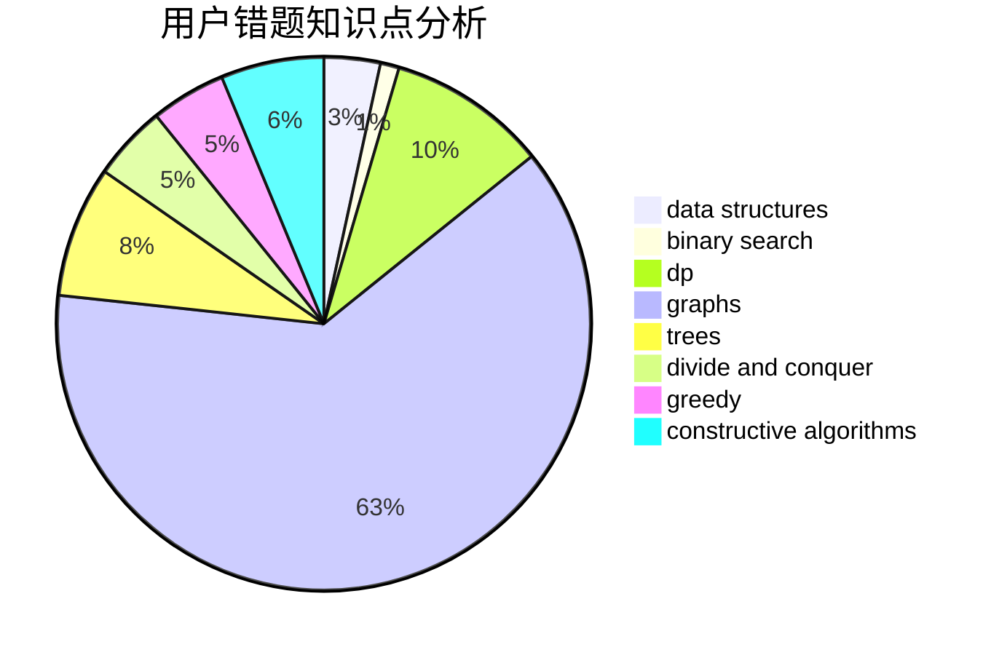

# _zwy

<!-- tabs:start -->

#### **用户提交结果分析**

#### **用户做题类型偏好分析**

#### **用户错题知识点分析**

<!-- tabs:end -->
# 推荐题目
[1117F](https://codeforces.com/contest/1117/problem/F)		bitmasks,
                        dp		  
[1304E](https://codeforces.com/contest/1304/problem/E)		data structures,
                        dfs and similar,
                        shortest paths,
                        trees		  
[341D](https://codeforces.com/contest/341/problem/D)		data structures		  
[93A](https://codeforces.com/contest/93/problem/A)		implementation		  
[883I](https://codeforces.com/contest/883/problem/I)		binary search,
                        dp		  
[1329E](https://codeforces.com/contest/1329/problem/E)		binary search,
                        greedy		  
[22C](https://codeforces.com/contest/22/problem/C)		graphs		  
[1081F](https://codeforces.com/contest/1081/problem/F)		constructive algorithms,
                        implementation,
                        interactive		  
[932A](https://codeforces.com/contest/932/problem/A)		constructive algorithms		  
[1482B](https://codeforces.com/contest/1482/problem/B)		implementation,
                        math		  
