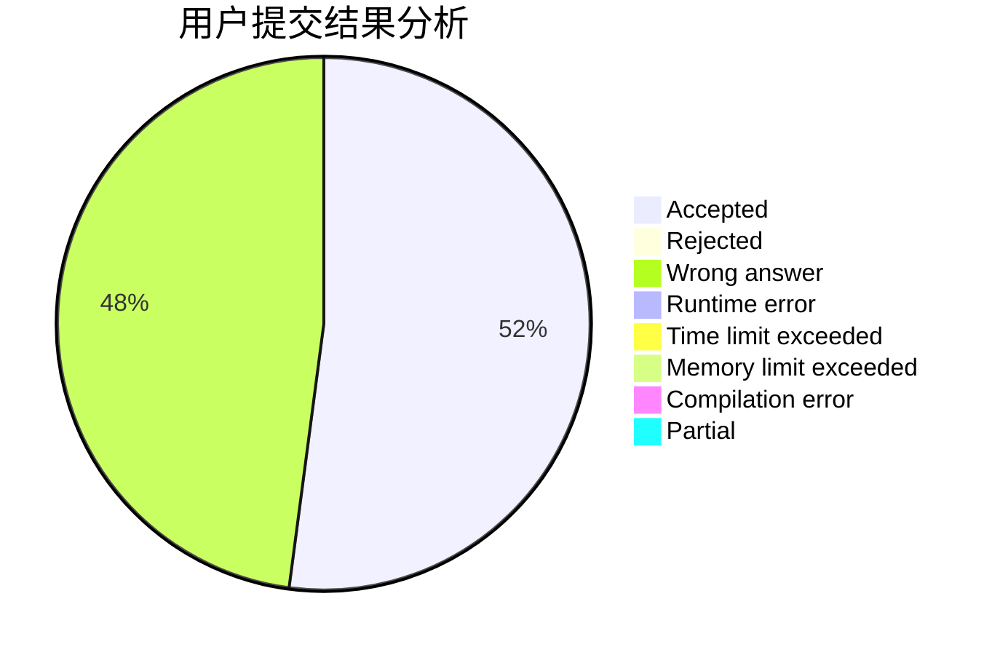
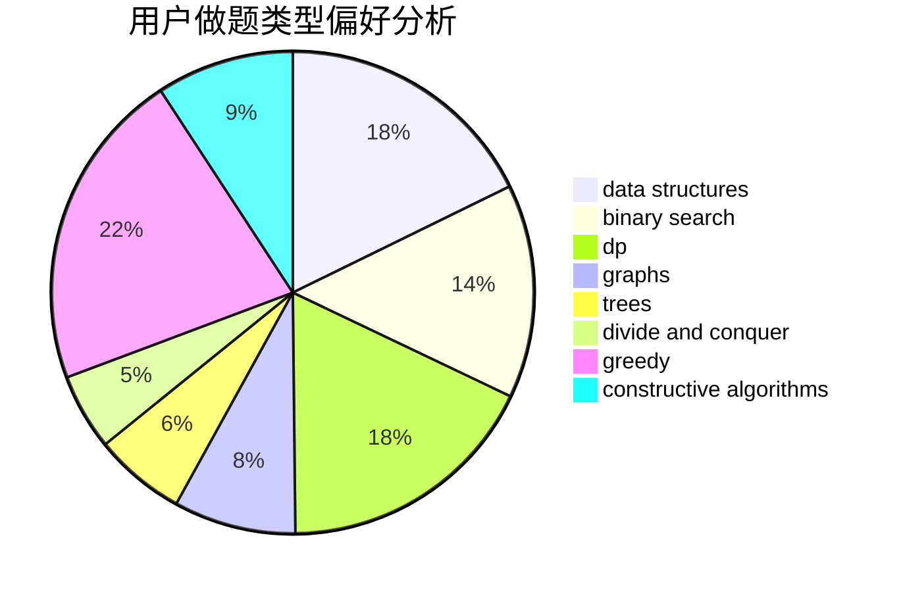
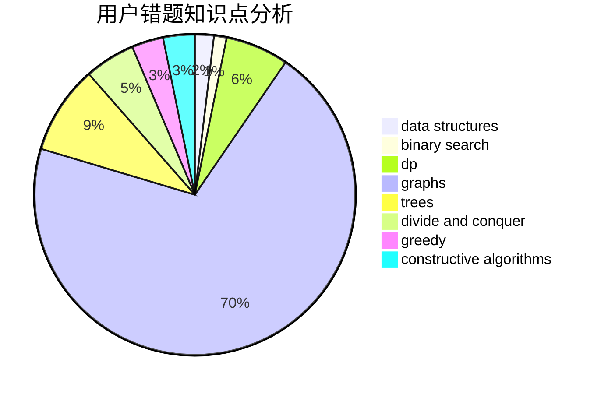

# _zwy

<!-- tabs:start -->

#### **用户提交结果分析**

#### **用户做题类型偏好分析**

#### **用户错题知识点分析**

<!-- tabs:end -->
# 推荐题目
[1119D](https://codeforces.com/contest/1119/problem/D)		binary search,
                        sortings		  
[1313A](https://codeforces.com/contest/1313/problem/A)		brute force,
                        greedy,
                        implementation		  
[369A](https://codeforces.com/contest/369/problem/A)		greedy,
                        implementation		  
[961B](https://codeforces.com/contest/961/problem/B)		data structures,
                        dp,
                        implementation,
                        two pointers		  
[901C](https://codeforces.com/contest/901/problem/C)		binary search,
                        data structures,
                        dfs and similar,
                        dsu,
                        graphs,
                        two pointers		  
[1335F](https://codeforces.com/contest/1335/problem/F)		data structures,
                        dfs and similar,
                        dsu,
                        graphs,
                        greedy,
                        matrices		  
[251A](https://codeforces.com/contest/251/problem/A)		binary search,
                        combinatorics,
                        two pointers		  
[1082B](https://codeforces.com/contest/1082/problem/B)		greedy		  
[952F](https://codeforces.com/contest/952/problem/F)		nan		  
[148E](https://codeforces.com/contest/148/problem/E)		dp		  
