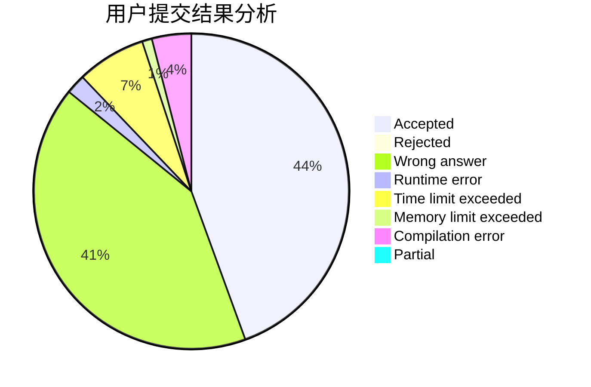
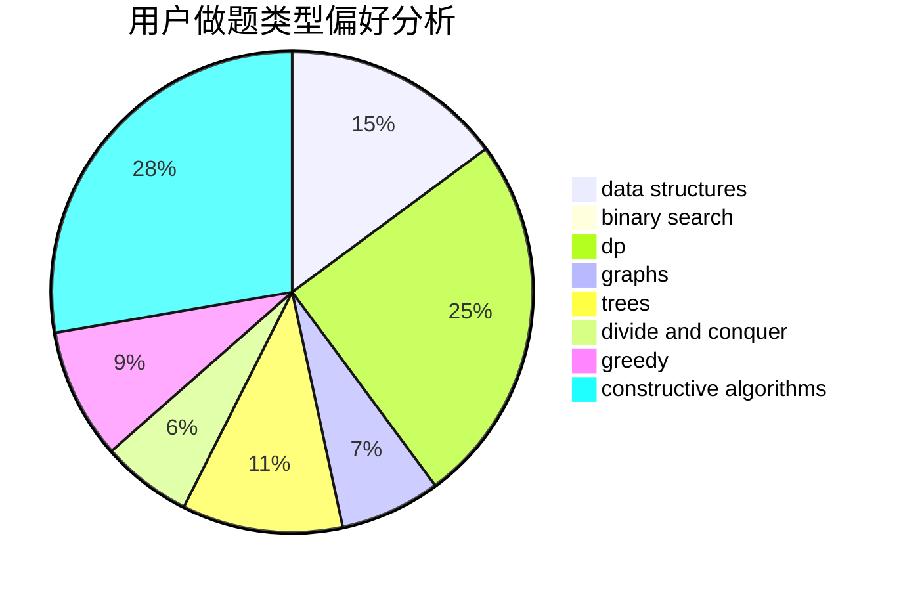

# _zzw4257

<!-- tabs:start -->

#### **用户提交结果分析**

#### **用户做题类型偏好分析**

#### **用户错题知识点分析**

<!-- tabs:end -->
# 推荐题目
[838F](https://codeforces.com/contest/838/problem/F)		nan		  
[710C](https://codeforces.com/contest/710/problem/C)		constructive algorithms,
                        math		  
[1077D](https://codeforces.com/contest/1077/problem/D)		binary search,
                        sortings		  
[598E](https://codeforces.com/contest/598/problem/E)		brute force,
                        dp		  
[1153B](https://codeforces.com/contest/1153/problem/B)		constructive algorithms,
                        greedy		  
[19A](https://codeforces.com/contest/19/problem/A)		implementation		  
[98C](https://codeforces.com/contest/98/problem/C)		geometry,
                        ternary search		  
[483D](https://codeforces.com/contest/483/problem/D)		dsu,graphs,sortings,trees		  
[847B](https://codeforces.com/contest/847/problem/B)		binary search,
                        data structures		  
[590D](https://codeforces.com/contest/590/problem/D)		dp		  
