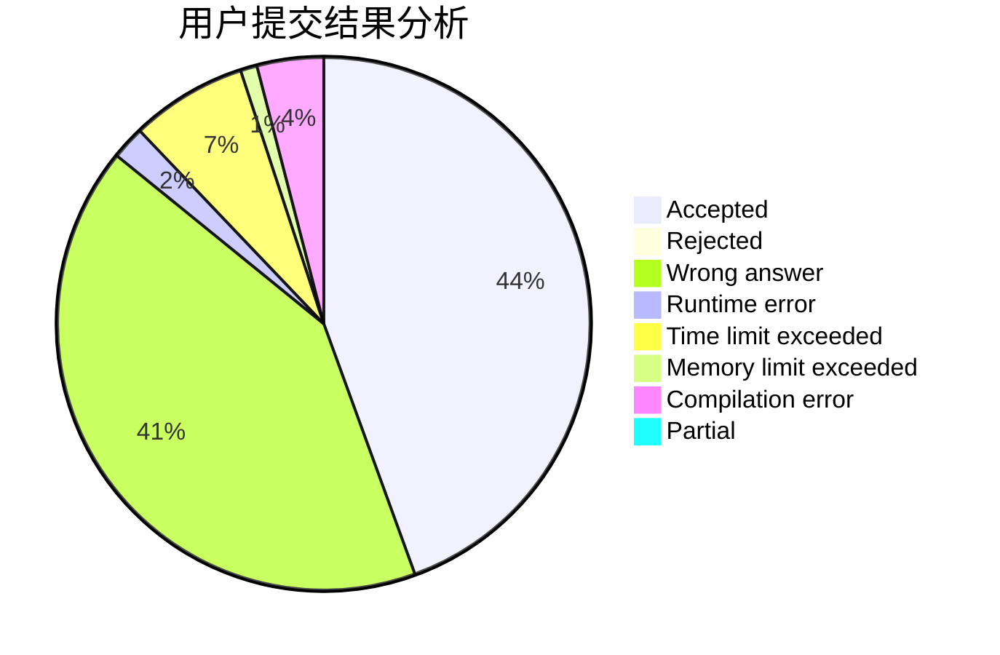
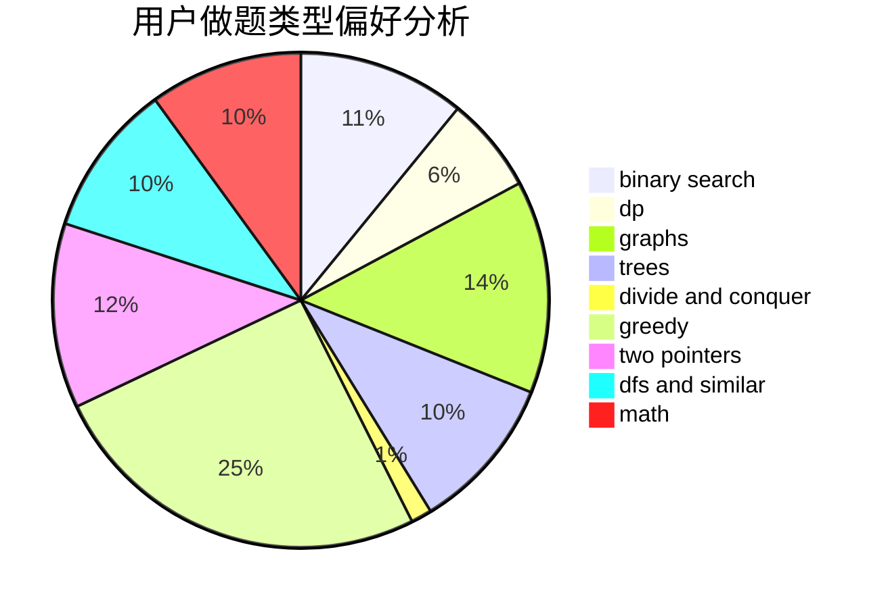

# _zzw4257

<!-- tabs:start -->

#### **用户提交结果分析**

#### **用户做题类型偏好分析**

<!-- tabs:end -->
# 推荐题目
[838F](https://codeforces.com/contest/838/problem/F)
[710C](https://codeforces.com/contest/710/problem/C)
[1077D](https://codeforces.com/contest/1077/problem/D)
[598E](https://codeforces.com/contest/598/problem/E)
[1153B](https://codeforces.com/contest/1153/problem/B)
[19A](https://codeforces.com/contest/19/problem/A)
[98C](https://codeforces.com/contest/98/problem/C)
[483D](https://codeforces.com/contest/483/problem/D)
[847B](https://codeforces.com/contest/847/problem/B)
[590D](https://codeforces.com/contest/590/problem/D)
