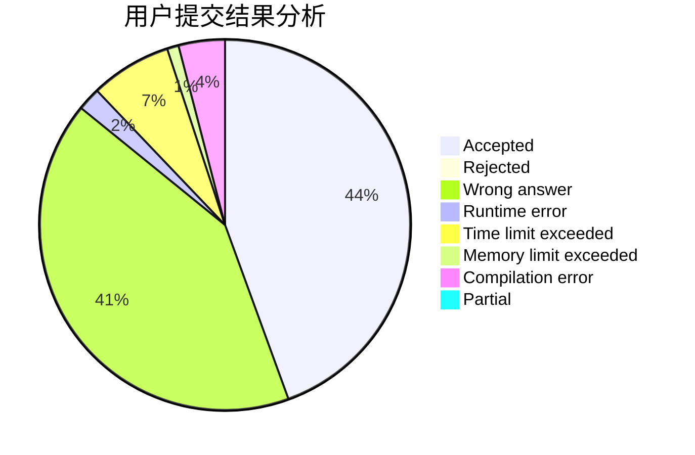
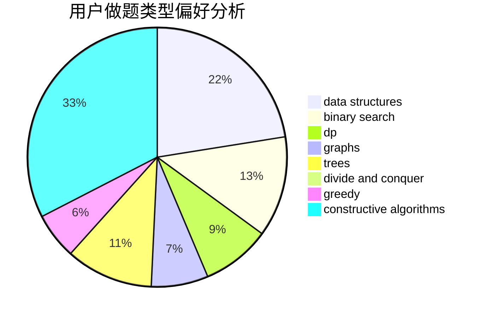

# _zzw4257

<!-- tabs:start -->

#### **用户提交结果分析**

#### **用户做题类型偏好分析**

#### **用户错题知识点分析**

<!-- tabs:end -->
# 推荐题目
[818G](https://codeforces.com/contest/818/problem/G)		flows,
                        graphs		  
[690A2](https://codeforces.com/contest/690A/problem/2)		nan		  
[1077C](https://codeforces.com/contest/1077/problem/C)		nan		  
[576E](https://codeforces.com/contest/576/problem/E)		binary search,
                        data structures		  
[1151B](https://codeforces.com/contest/1151/problem/B)		bitmasks,
                        brute force,
                        constructive algorithms,
                        dp		  
[171H](https://codeforces.com/contest/171/problem/H)		*special problem,
                        implementation		  
[975D](https://codeforces.com/contest/975/problem/D)		geometry,
                        math		  
[463D](https://codeforces.com/contest/463/problem/D)		dfs and similar,
                        dp,
                        graphs,
                        implementation		  
[828D](https://codeforces.com/contest/828/problem/D)		dsu,graphs,sortings,trees		  
[570B](https://codeforces.com/contest/570/problem/B)		constructive algorithms,
                        games,
                        greedy,
                        implementation,
                        math		  
