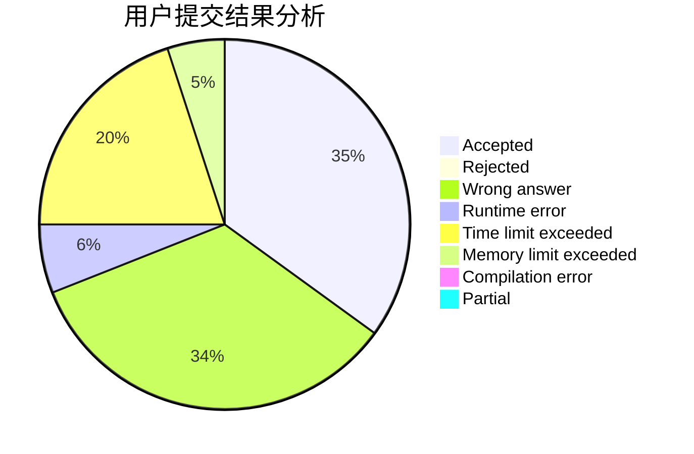
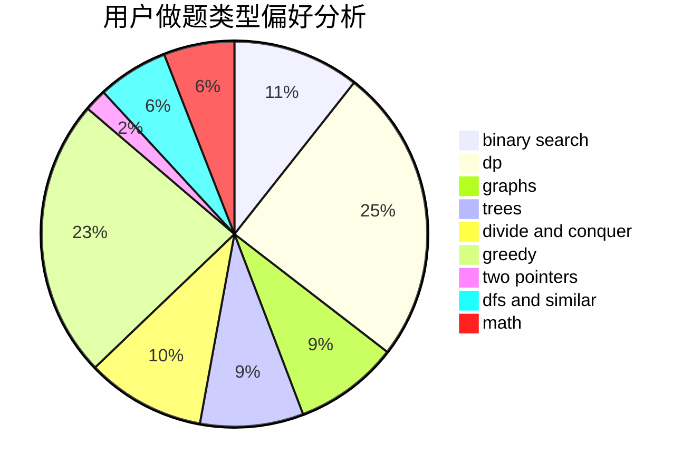

# Alyaly

<!-- tabs:start -->

#### **用户提交结果分析**

#### **用户做题类型偏好分析**

<!-- tabs:end -->
# 推荐题目
[318C](https://codeforces.com/contest/318/problem/C)
[317A](https://codeforces.com/contest/317/problem/A)
[314C](https://codeforces.com/contest/314/problem/C)
[14D](https://codeforces.com/contest/14/problem/D)
[320B](https://codeforces.com/contest/320/problem/B)
[318A](https://codeforces.com/contest/318/problem/A)
[319C](https://codeforces.com/contest/319/problem/C)
[317E](https://codeforces.com/contest/317/problem/E)
[315A](https://codeforces.com/contest/315/problem/A)
[1020B](https://codeforces.com/contest/1020/problem/B)
