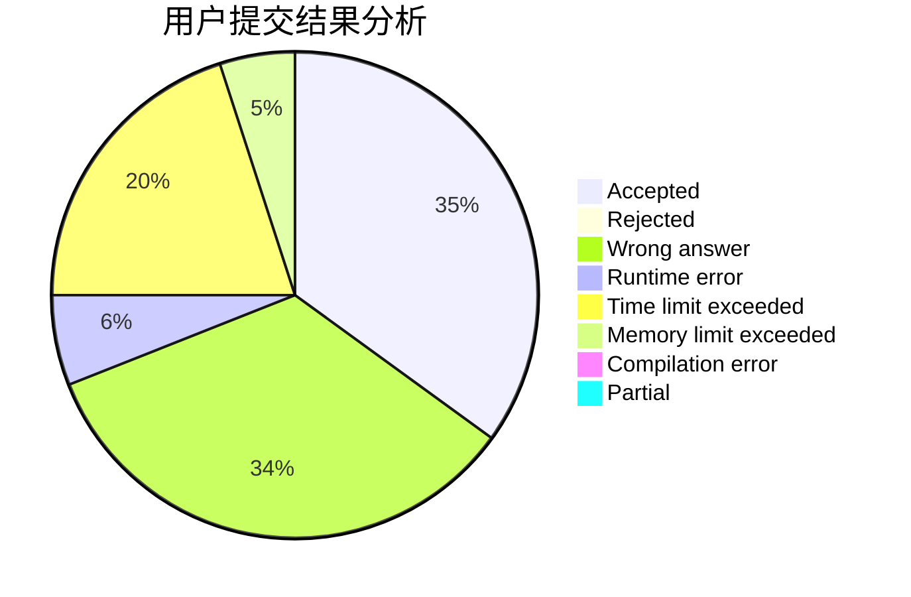
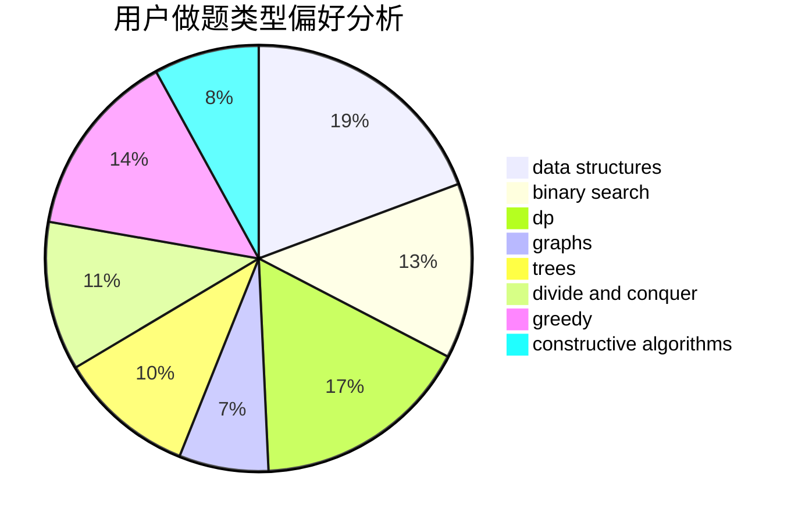
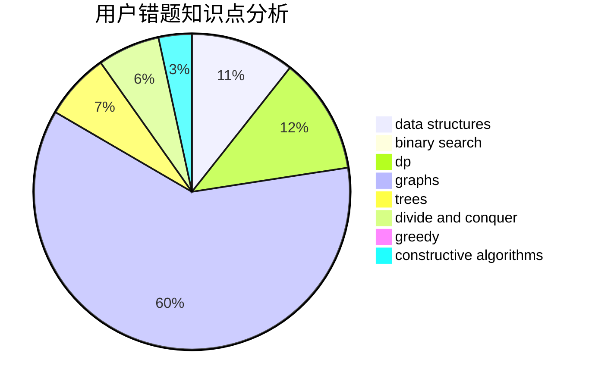

# Alyaly

<!-- tabs:start -->

#### **用户提交结果分析**

#### **用户做题类型偏好分析**

#### **用户错题知识点分析**

<!-- tabs:end -->
# 推荐题目
[318C](https://codeforces.com/contest/318/problem/C)		dsu,graphs,sortings,trees		  
[317A](https://codeforces.com/contest/317/problem/A)		brute force		  
[314C](https://codeforces.com/contest/314/problem/C)		data structures,
                        dp		  
[14D](https://codeforces.com/contest/14/problem/D)		dfs and similar,
                        dp,
                        graphs,
                        shortest paths,
                        trees,
                        two pointers		  
[320B](https://codeforces.com/contest/320/problem/B)		dfs and similar,
                        graphs		  
[318A](https://codeforces.com/contest/318/problem/A)		math		  
[319C](https://codeforces.com/contest/319/problem/C)		dp,
                        geometry		  
[317E](https://codeforces.com/contest/317/problem/E)		constructive algorithms,
                        shortest paths		  
[315A](https://codeforces.com/contest/315/problem/A)		brute force		  
[1020B](https://codeforces.com/contest/1020/problem/B)		brute force,
                        dfs and similar,
                        graphs		  
