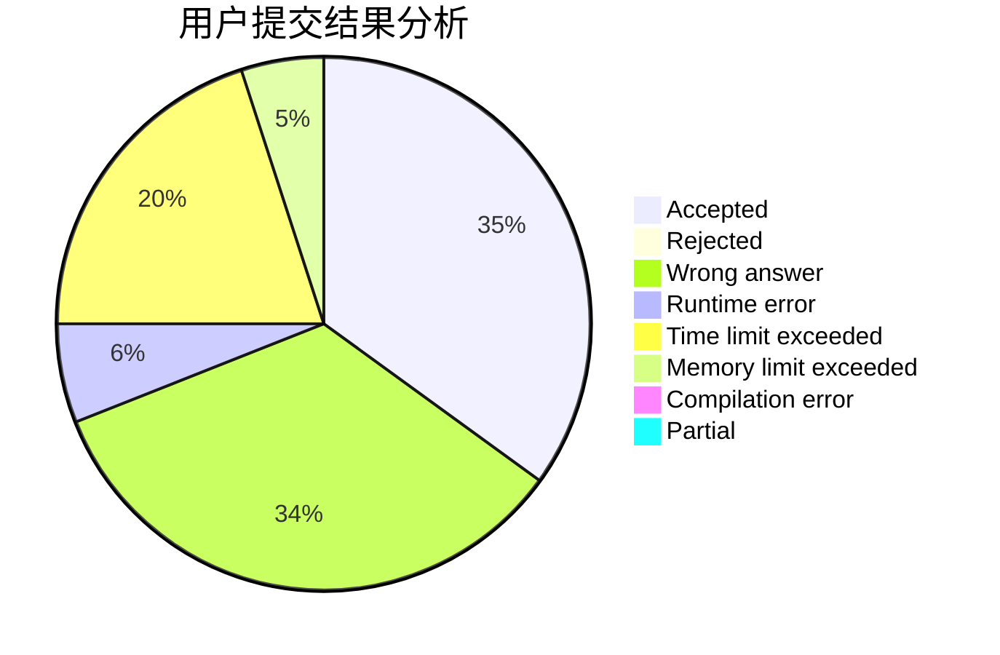
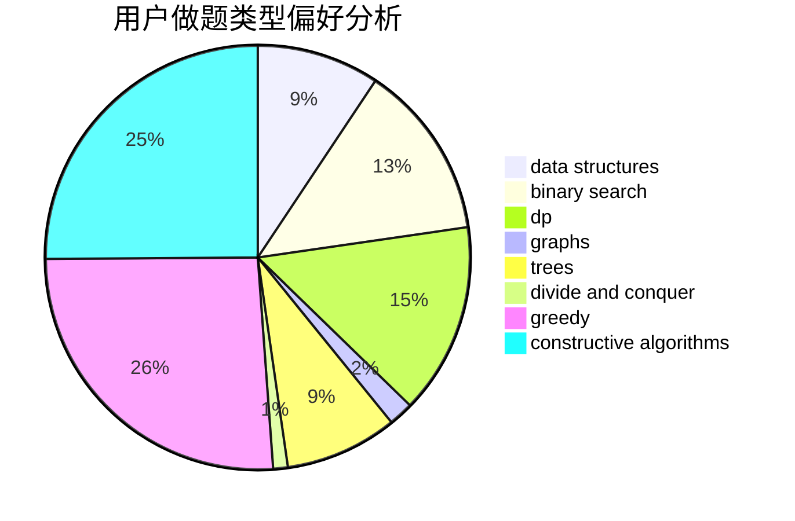
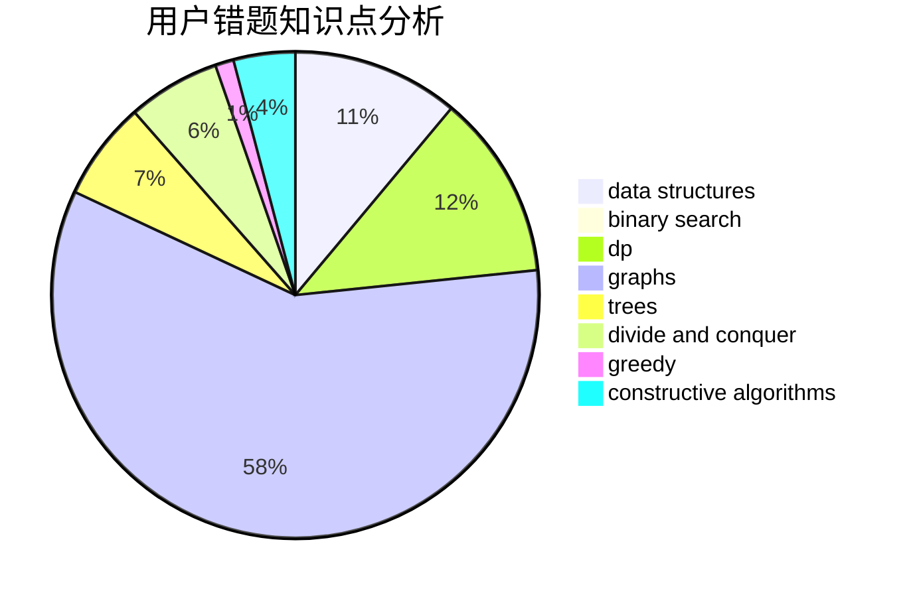

# Alyaly

<!-- tabs:start -->

#### **用户提交结果分析**

#### **用户做题类型偏好分析**

#### **用户错题知识点分析**

<!-- tabs:end -->
# 推荐题目
[300A](https://codeforces.com/contest/300/problem/A)		brute force,
                        constructive algorithms,
                        implementation		  
[29B](https://codeforces.com/contest/29/problem/B)		implementation		  
[297D](https://codeforces.com/contest/297/problem/D)		constructive algorithms		  
[1491G](https://codeforces.com/contest/1491/problem/G)		constructive algorithms,
                        graphs,
                        math		  
[301D](https://codeforces.com/contest/301/problem/D)		data structures		  
[2B](https://codeforces.com/contest/2/problem/B)		dp,
                        math		  
[300E](https://codeforces.com/contest/300/problem/E)		binary search,
                        math,
                        number theory		  
[2A](https://codeforces.com/contest/2/problem/A)		hashing,
                        implementation		  
[297E](https://codeforces.com/contest/297/problem/E)		data structures		  
[101B](https://codeforces.com/contest/101/problem/B)		binary search,
                        data structures,
                        dp		  
