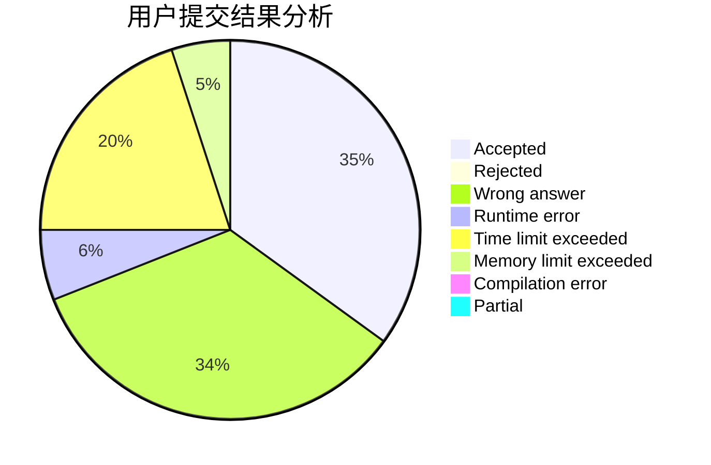
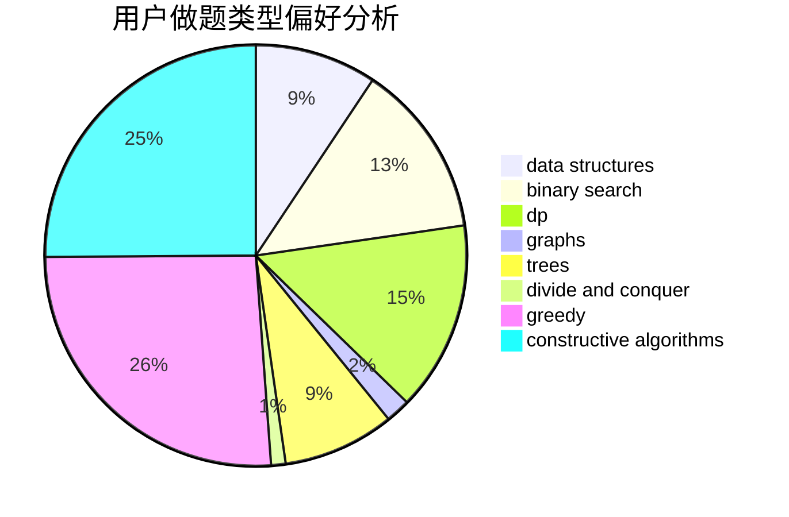
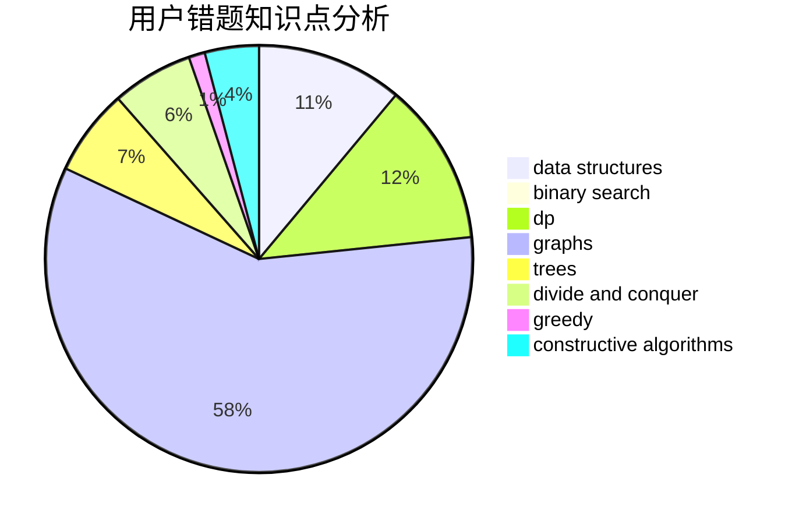

# Alyaly
<!-- tabs:start -->
#### **用户提交结果分析**

#### **用户做题类型偏好分析**

#### **用户错题知识点分析**

<!-- tabs:end -->
# 推荐题目
[Switch and Flip](http://codeforces.com/problemset/problem/1491/G)		constructive algorithms,
                        graphs,
                        math		  
[Traffic Lights](http://codeforces.com/problemset/problem/29/B)		implementation		  
[Empire Strikes Back](http://codeforces.com/problemset/problem/300/E)		binary search,
                        math,
                        number theory		  
[Winner](http://codeforces.com/problemset/problem/2/A)		hashing,
                        implementation		  
[Color the Carpet](http://codeforces.com/problemset/problem/297/D)		constructive algorithms		  
[Array](http://codeforces.com/problemset/problem/300/A)		brute force,
                        constructive algorithms,
                        implementation		  
[Tree Queries](http://codeforces.com/problemset/problem/1328/E)		dfs and similar,
                        graphs,
                        trees		  
[Yaroslav and Divisors](http://codeforces.com/problemset/problem/301/D)		data structures		  
[Ksusha the Squirrel](http://codeforces.com/problemset/problem/299/B)		brute force,
                        implementation		  
[Almost Regular Bracket Sequence](http://codeforces.com/problemset/problem/1095/E)		implementation		  
<!-- tabs:start -->
#### **data structures**
[Switch and Flip](http://codeforces.com/problemset/problem/301/D)		data structures		  
[Traffic Lights](http://codeforces.com/problemset/problem/101/B)		binary search,
                        data structures,
                        dp		  
[Empire Strikes Back](http://codeforces.com/problemset/problem/1253/E)		data structures,
                        dp,
                        greedy,
                        sortings		  
[Winner](http://codeforces.com/problemset/problem/29/C)		data structures,
                        dfs and similar,
                        graphs,
                        implementation		  
[Color the Carpet](http://codeforces.com/problemset/problem/297/E)		data structures		  
[Array](https://codeforces.com/contest/1248/problem/E)		data structures,
                        greedy,
                        implementation		  
[Tree Queries](http://codeforces.com/problemset/problem/1252/K)		data structures,
                        math,
                        matrices		  
[Yaroslav and Divisors](http://codeforces.com/problemset/problem/1446/D2)		data structures,
                        greedy,
                        two pointers		  
[Ksusha the Squirrel](http://codeforces.com/problemset/problem/1194/E)		bitmasks,
                        brute force,
                        data structures,
                        geometry,
                        sortings		  
[Almost Regular Bracket Sequence](http://codeforces.com/problemset/problem/1492/C)		binary search,
                        data structures,
                        dp,
                        greedy,
                        two pointers		  
#### **binary search**
[Switch and Flip](http://codeforces.com/problemset/problem/300/E)		binary search,
                        math,
                        number theory		  
[Traffic Lights](http://codeforces.com/problemset/problem/101/B)		binary search,
                        data structures,
                        dp		  
[Empire Strikes Back](http://codeforces.com/problemset/problem/301/B)		binary search,
                        graphs,
                        shortest paths		  
[Winner](https://codeforces.com/contest/1246/problem/C)		binary search,
                        dp		  
[Color the Carpet](http://codeforces.com/problemset/problem/1492/C)		binary search,
                        data structures,
                        dp,
                        greedy,
                        two pointers		  
[Array](http://codeforces.com/problemset/problem/1463/D)		binary search,
                        constructive algorithms,
                        greedy,
                        two pointers		  
[Tree Queries](http://codeforces.com/problemset/problem/1490/G)		binary search,
                        data structures,
                        math		  
[Yaroslav and Divisors](http://codeforces.com/problemset/problem/1479/D)		binary search,
                        bitmasks,
                        brute force,
                        data structures,
                        probabilities,
                        trees		  
[Ksusha the Squirrel](http://codeforces.com/problemset/problem/1436/E)		binary search,
                        data structures,
                        two pointers		  
[Almost Regular Bracket Sequence](http://codeforces.com/problemset/problem/1461/D)		binary search,
                        brute force,
                        data structures,
                        divide and conquer,
                        implementation,
                        sortings		  
#### **dp**
[Switch and Flip](http://codeforces.com/problemset/problem/1249/F)		dp,
                        trees		  
[Traffic Lights](http://codeforces.com/problemset/problem/101/B)		binary search,
                        data structures,
                        dp		  
[Empire Strikes Back](http://codeforces.com/problemset/problem/1155/F)		brute force,
                        dp,
                        graphs		  
[Winner](http://codeforces.com/problemset/problem/1253/E)		data structures,
                        dp,
                        greedy,
                        sortings		  
[Color the Carpet](https://codeforces.com/contest/1246/problem/C)		binary search,
                        dp		  
[Array](http://codeforces.com/problemset/problem/1249/E)		dp,
                        shortest paths		  
[Tree Queries](http://codeforces.com/problemset/problem/301/E)		dp		  
[Yaroslav and Divisors](http://codeforces.com/problemset/problem/300/D)		dp,
                        fft		  
[Ksusha the Squirrel](http://codeforces.com/problemset/problem/2/B)		dp,
                        math		  
[Almost Regular Bracket Sequence](http://codeforces.com/problemset/problem/1423/J)		bitmasks,
                        constructive algorithms,
                        dp,
                        math		  
#### **graph**
[Switch and Flip](http://codeforces.com/problemset/problem/1491/G)		constructive algorithms,
                        graphs,
                        math		  
[Traffic Lights](http://codeforces.com/problemset/problem/1328/E)		dfs and similar,
                        graphs,
                        trees		  
[Empire Strikes Back](http://codeforces.com/problemset/problem/303/C)		brute force,
                        graphs,
                        math,
                        number theory		  
[Winner](http://codeforces.com/problemset/problem/301/B)		binary search,
                        graphs,
                        shortest paths		  
[Color the Carpet](http://codeforces.com/problemset/problem/29/E)		graphs,
                        shortest paths		  
[Array](http://codeforces.com/problemset/problem/1155/F)		brute force,
                        dp,
                        graphs		  
[Tree Queries](http://codeforces.com/problemset/problem/29/C)		data structures,
                        dfs and similar,
                        graphs,
                        implementation		  
[Yaroslav and Divisors](http://codeforces.com/problemset/problem/300/B)		brute force,
                        dfs and similar,
                        graphs		  
[Ksusha the Squirrel](http://codeforces.com/problemset/problem/1082/D)		constructive algorithms,
                        graphs,
                        implementation		  
[Almost Regular Bracket Sequence](http://codeforces.com/problemset/problem/1487/C)		brute force,
                        constructive algorithms,
                        dfs and similar,
                        graphs,
                        greedy,
                        implementation,
                        math		  
#### **trees**
[Switch and Flip](http://codeforces.com/problemset/problem/1328/E)		dfs and similar,
                        graphs,
                        trees		  
[Traffic Lights](http://codeforces.com/problemset/problem/1249/F)		dp,
                        trees		  
[Empire Strikes Back](https://codeforces.com/contest/1074/problem/B)		dfs and similar,
                        interactive,
                        trees		  
[Winner](http://codeforces.com/problemset/problem/29/D)		constructive algorithms,
                        dfs and similar,
                        trees		  
[Color the Carpet](http://codeforces.com/problemset/problem/1479/D)		binary search,
                        bitmasks,
                        brute force,
                        data structures,
                        probabilities,
                        trees		  
[Array](http://codeforces.com/problemset/problem/1511/C)		brute force,
                        data structures,
                        implementation,
                        trees		  
[Tree Queries](http://codeforces.com/problemset/problem/1499/F)		combinatorics,
                        dfs and similar,
                        dp,
                        trees		  
[Yaroslav and Divisors](http://codeforces.com/problemset/problem/1491/E)		brute force,
                        dfs and similar,
                        divide and conquer,
                        number theory,
                        trees		  
[Ksusha the Squirrel](http://codeforces.com/problemset/problem/1466/D)		data structures,
                        greedy,
                        sortings,
                        trees		  
[Almost Regular Bracket Sequence](http://codeforces.com/problemset/problem/1495/D)		combinatorics,
                        dfs and similar,
                        graphs,
                        math,
                        shortest paths,
                        trees		  
#### **divide and conquer**
[Switch and Flip](http://codeforces.com/problemset/problem/1070/M)		constructive algorithms,
                        divide and conquer,
                        geometry		  
[Traffic Lights](http://codeforces.com/problemset/problem/1461/D)		binary search,
                        brute force,
                        data structures,
                        divide and conquer,
                        implementation,
                        sortings		  
[Empire Strikes Back](http://codeforces.com/problemset/problem/1466/G)		combinatorics,
                        divide and conquer,
                        hashing,
                        math,
                        string suffix structures,
                        strings		  
[Winner](http://codeforces.com/problemset/problem/1490/D)		dfs and similar,
                        divide and conquer,
                        implementation		  
[Color the Carpet](https://codeforces.com/contest/1483/problem/C)		data structures,
                        divide and conquer,
                        dp		  
[Array](http://codeforces.com/problemset/problem/1491/E)		brute force,
                        dfs and similar,
                        divide and conquer,
                        number theory,
                        trees		  
[Tree Queries](http://codeforces.com/problemset/problem/1303/G)		data structures,
                        divide and conquer,
                        geometry,
                        trees		  
[Yaroslav and Divisors](http://codeforces.com/problemset/problem/1494/D)		constructive algorithms,
                        data structures,
                        dfs and similar,
                        divide and conquer,
                        dsu,
                        greedy,
                        sortings,
                        trees		  
[Ksusha the Squirrel](http://codeforces.com/problemset/problem/1482/E)		data structures,
                        divide and conquer,
                        dp		  
[Almost Regular Bracket Sequence](http://codeforces.com/problemset/problem/566/C)		dfs and similar,
                        divide and conquer,
                        trees		  
#### **greedy**
[Switch and Flip](http://codeforces.com/problemset/problem/1253/E)		data structures,
                        dp,
                        greedy,
                        sortings		  
[Traffic Lights](https://codeforces.com/contest/299/problem/C)		games,
                        greedy		  
[Empire Strikes Back](http://codeforces.com/problemset/problem/1117/B)		greedy,
                        math,
                        sortings		  
[Winner](https://codeforces.com/contest/1248/problem/E)		data structures,
                        greedy,
                        implementation		  
[Color the Carpet](https://codeforces.com/contest/298/problem/D)		constructive algorithms,
                        greedy		  
[Array](http://codeforces.com/problemset/problem/1508/A)		constructive algorithms,
                        greedy,
                        implementation,
                        math,
                        strings,
                        two pointers		  
[Tree Queries](http://codeforces.com/problemset/problem/1446/D2)		data structures,
                        greedy,
                        two pointers		  
[Yaroslav and Divisors](http://codeforces.com/problemset/problem/1468/E)		greedy		  
[Ksusha the Squirrel](http://codeforces.com/problemset/problem/1492/C)		binary search,
                        data structures,
                        dp,
                        greedy,
                        two pointers		  
[Almost Regular Bracket Sequence](https://codeforces.com/contest/1496/problem/C)		geometry,
                        greedy,
                        math,
                        sortings		  
#### **constructive algorithms**
[Switch and Flip](http://codeforces.com/problemset/problem/1491/G)		constructive algorithms,
                        graphs,
                        math		  
[Traffic Lights](http://codeforces.com/problemset/problem/297/D)		constructive algorithms		  
[Empire Strikes Back](http://codeforces.com/problemset/problem/300/A)		brute force,
                        constructive algorithms,
                        implementation		  
[Winner](http://codeforces.com/problemset/problem/1070/M)		constructive algorithms,
                        divide and conquer,
                        geometry		  
[Color the Carpet](http://codeforces.com/problemset/problem/297/C)		constructive algorithms		  
[Array](http://codeforces.com/problemset/problem/301/A)		constructive algorithms		  
[Tree Queries](http://codeforces.com/problemset/problem/301/C)		constructive algorithms		  
[Yaroslav and Divisors](http://codeforces.com/problemset/problem/1082/D)		constructive algorithms,
                        graphs,
                        implementation		  
[Ksusha the Squirrel](https://codeforces.com/contest/298/problem/D)		constructive algorithms,
                        greedy		  
[Almost Regular Bracket Sequence](http://codeforces.com/problemset/problem/29/D)		constructive algorithms,
                        dfs and similar,
                        trees		  
#### **sortings**
[Switch and Flip](http://codeforces.com/problemset/problem/1253/E)		data structures,
                        dp,
                        greedy,
                        sortings		  
[Traffic Lights](http://codeforces.com/problemset/problem/1117/B)		greedy,
                        math,
                        sortings		  
[Empire Strikes Back](http://codeforces.com/problemset/problem/1194/E)		bitmasks,
                        brute force,
                        data structures,
                        geometry,
                        sortings		  
[Winner](https://codeforces.com/contest/1496/problem/C)		geometry,
                        greedy,
                        math,
                        sortings		  
[Color the Carpet](http://codeforces.com/problemset/problem/1495/A)		geometry,
                        greedy,
                        math,
                        sortings		  
[Array](http://codeforces.com/problemset/problem/1497/A)		brute force,
                        data structures,
                        greedy,
                        sortings		  
[Tree Queries](http://codeforces.com/problemset/problem/1427/A)		math,
                        sortings		  
[Yaroslav and Divisors](http://codeforces.com/problemset/problem/1461/D)		binary search,
                        brute force,
                        data structures,
                        divide and conquer,
                        implementation,
                        sortings		  
[Ksusha the Squirrel](http://codeforces.com/problemset/problem/1437/C)		dp,
                        flows,
                        graph matchings,
                        greedy,
                        math,
                        sortings		  
[Almost Regular Bracket Sequence](http://codeforces.com/problemset/problem/1473/A)		greedy,
                        implementation,
                        math,
                        sortings		  
<!-- tabs:end -->
