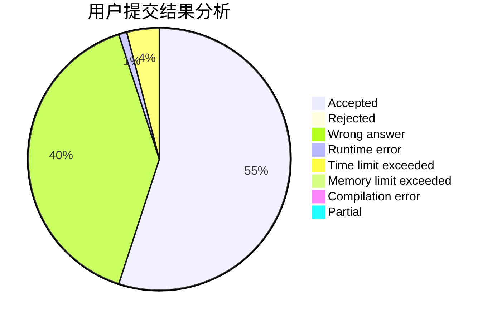
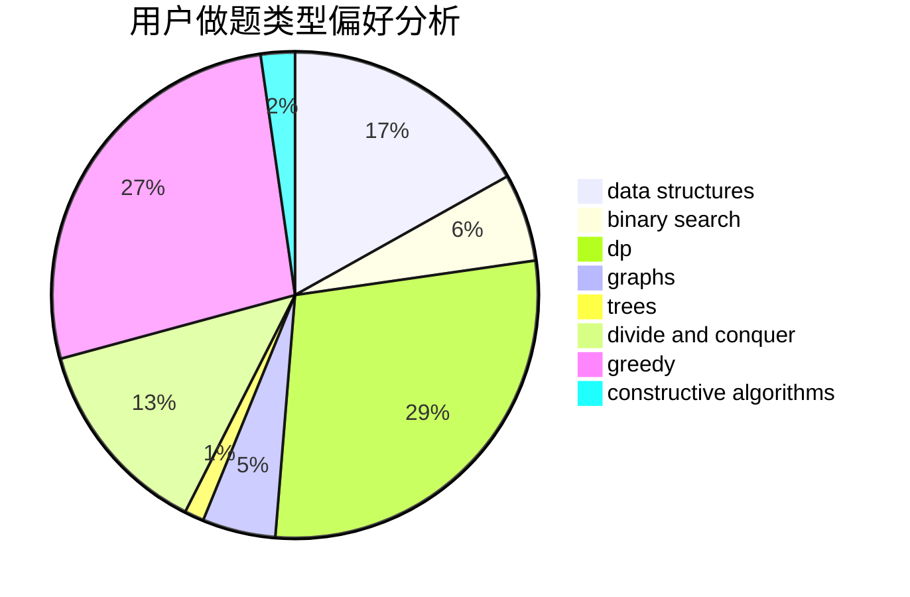
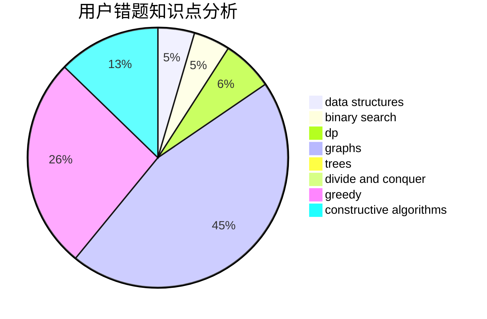

# a4199

<!-- tabs:start -->

#### **用户提交结果分析**

#### **用户做题类型偏好分析**

#### **用户错题知识点分析**

<!-- tabs:end -->
# 推荐题目
[382E](https://codeforces.com/contest/382/problem/E)		combinatorics,
                        dp		  
[765E](https://codeforces.com/contest/765/problem/E)		dfs and similar,
                        dp,
                        greedy,
                        implementation,
                        trees		  
[283A](https://codeforces.com/contest/283/problem/A)		constructive algorithms,
                        data structures,
                        implementation		  
[776B](https://codeforces.com/contest/776/problem/B)		constructive algorithms,
                        number theory		  
[1467C](https://codeforces.com/contest/1467/problem/C)		constructive algorithms,
                        greedy		  
[736A](https://codeforces.com/contest/736/problem/A)		dsu,graphs,sortings,trees		  
[678B](https://codeforces.com/contest/678/problem/B)		implementation		  
[1372F](https://codeforces.com/contest/1372/problem/F)		binary search,
                        divide and conquer,
                        interactive		  
[876A](https://codeforces.com/contest/876/problem/A)		math		  
[258B](https://codeforces.com/contest/258/problem/B)		brute force,
                        combinatorics,
                        dp		  
