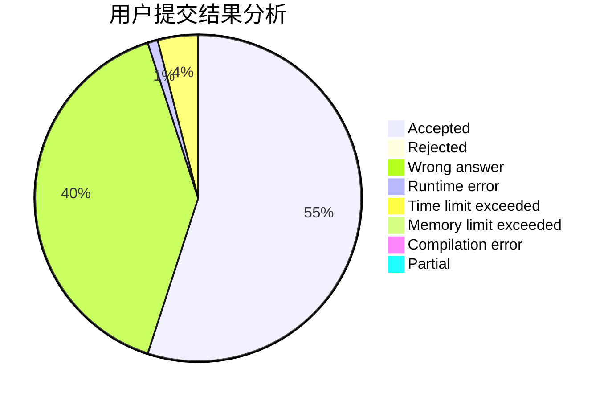
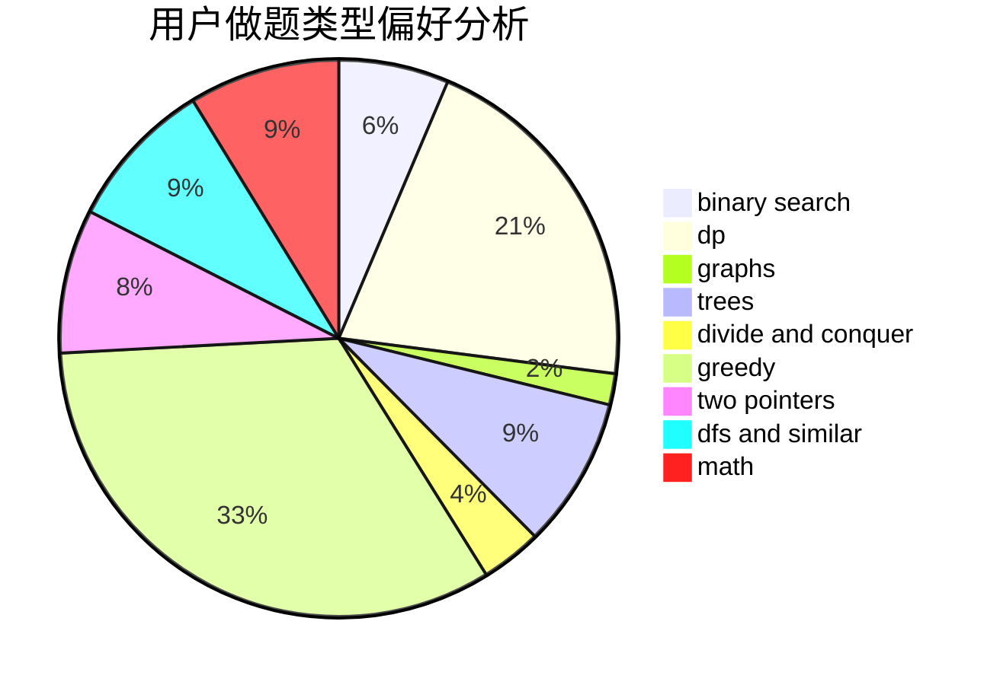

# a4199

<!-- tabs:start -->

#### **用户提交结果分析**

#### **用户做题类型偏好分析**

<!-- tabs:end -->
# 推荐题目
[382E](https://codeforces.com/contest/382/problem/E)
[765E](https://codeforces.com/contest/765/problem/E)
[283A](https://codeforces.com/contest/283/problem/A)
[776B](https://codeforces.com/contest/776/problem/B)
[1467C](https://codeforces.com/contest/1467/problem/C)
[736A](https://codeforces.com/contest/736/problem/A)
[678B](https://codeforces.com/contest/678/problem/B)
[1372F](https://codeforces.com/contest/1372/problem/F)
[876A](https://codeforces.com/contest/876/problem/A)
[258B](https://codeforces.com/contest/258/problem/B)
