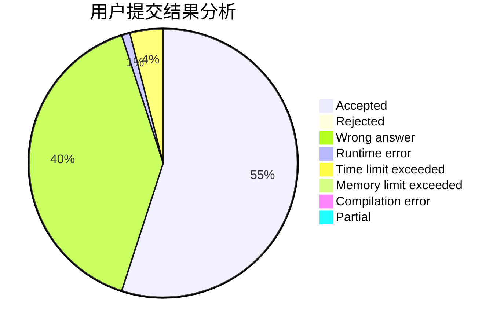
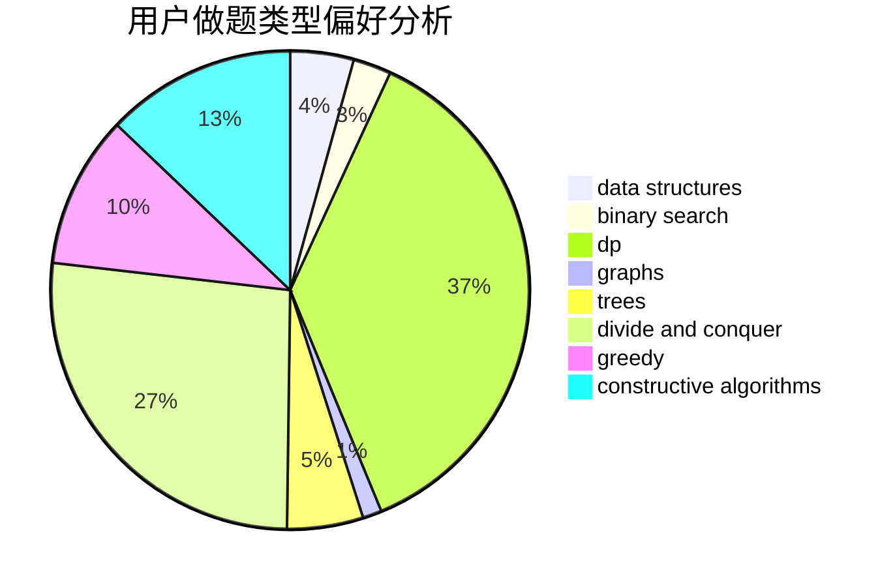
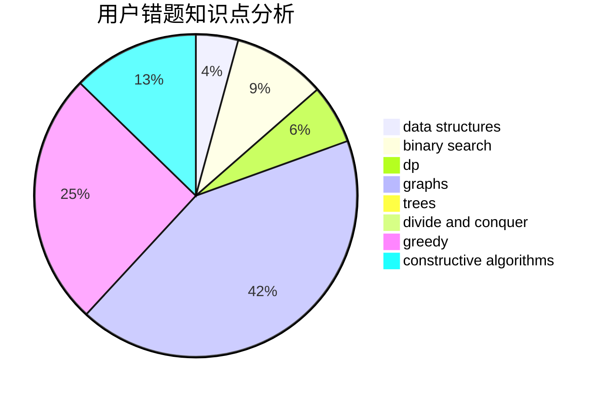

# a4199

<!-- tabs:start -->

#### **用户提交结果分析**

#### **用户做题类型偏好分析**

#### **用户错题知识点分析**

<!-- tabs:end -->
# 推荐题目
[356D](https://codeforces.com/contest/356/problem/D)		bitmasks,
                        constructive algorithms,
                        dp,
                        greedy		  
[746C](https://codeforces.com/contest/746/problem/C)		constructive algorithms,
                        implementation,
                        math		  
[267A](https://codeforces.com/contest/267/problem/A)		math,
                        number theory		  
[756D](https://codeforces.com/contest/756/problem/D)		brute force,
                        combinatorics,
                        dp,
                        string suffix structures		  
[1458D](https://codeforces.com/contest/1458/problem/D)		data structures,
                        graphs,
                        greedy		  
[718E](https://codeforces.com/contest/718/problem/E)		bitmasks,
                        graphs		  
[653F](https://codeforces.com/contest/653/problem/F)		data structures,
                        string suffix structures,
                        strings		  
[1366A](https://codeforces.com/contest/1366/problem/A)		binary search,
                        greedy,
                        math		  
[858A](https://codeforces.com/contest/858/problem/A)		brute force,
                        math,
                        number theory		  
[235C](https://codeforces.com/contest/235/problem/C)		data structures,
                        string suffix structures,
                        strings		  
