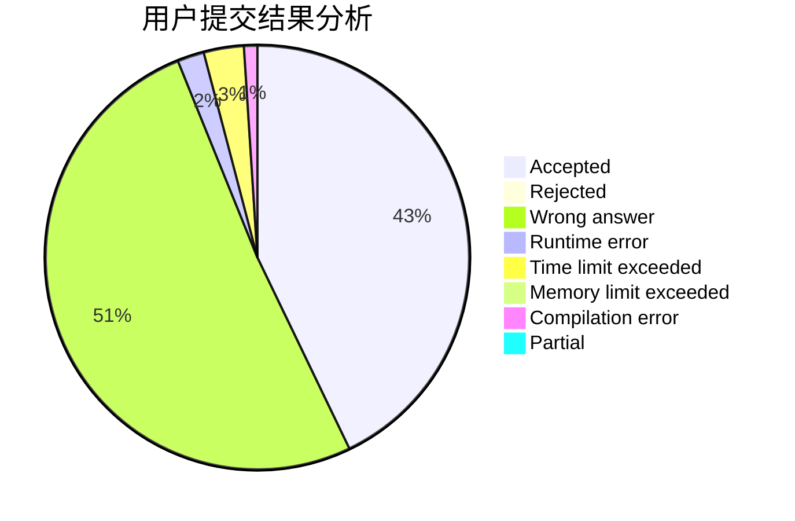
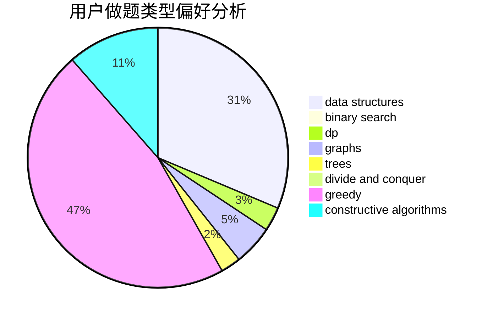

# a_fan_of_xiaofan7

<!-- tabs:start -->

#### **用户提交结果分析**

#### **用户做题类型偏好分析**

#### **用户错题知识点分析**

<!-- tabs:end -->
# 推荐题目
[732D](https://codeforces.com/contest/732/problem/D)		binary search,
                        greedy,
                        sortings		  
[633A](https://codeforces.com/contest/633/problem/A)		brute force,
                        math,
                        number theory		  
[1372B](https://codeforces.com/contest/1372/problem/B)		greedy,
                        math,
                        number theory		  
[161C](https://codeforces.com/contest/161/problem/C)		divide and conquer		  
[127A](https://codeforces.com/contest/127/problem/A)		geometry		  
[1078A](https://codeforces.com/contest/1078/problem/A)		dsu,graphs,sortings,trees		  
[773D](https://codeforces.com/contest/773/problem/D)		dp,
                        graphs,
                        shortest paths		  
[350B](https://codeforces.com/contest/350/problem/B)		graphs		  
[1291C](https://codeforces.com/contest/1291/problem/C)		dsu,graphs,sortings,trees		  
[436E](https://codeforces.com/contest/436/problem/E)		data structures,
                        greedy		  
