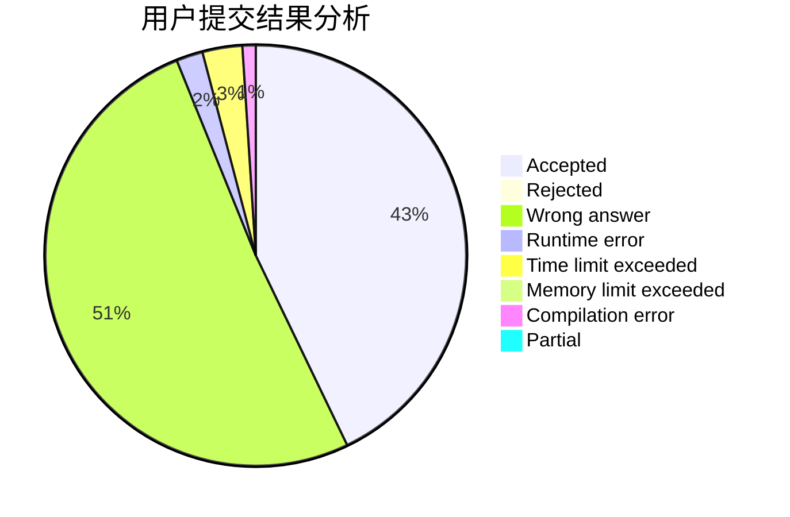
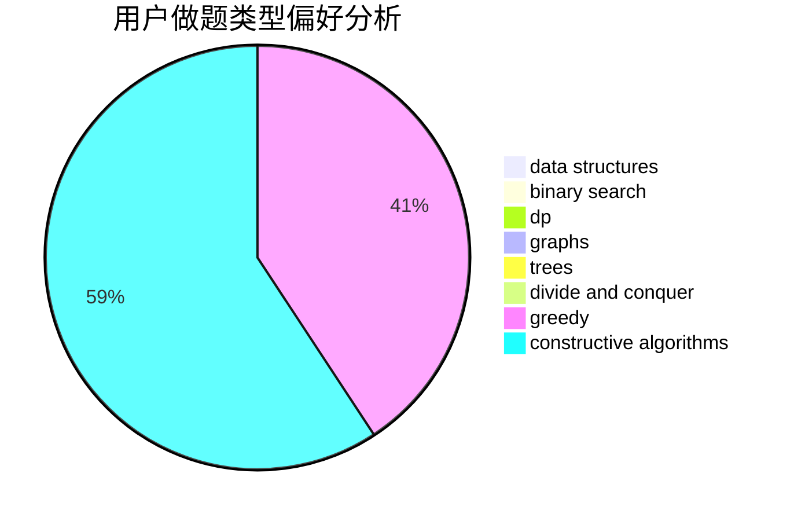
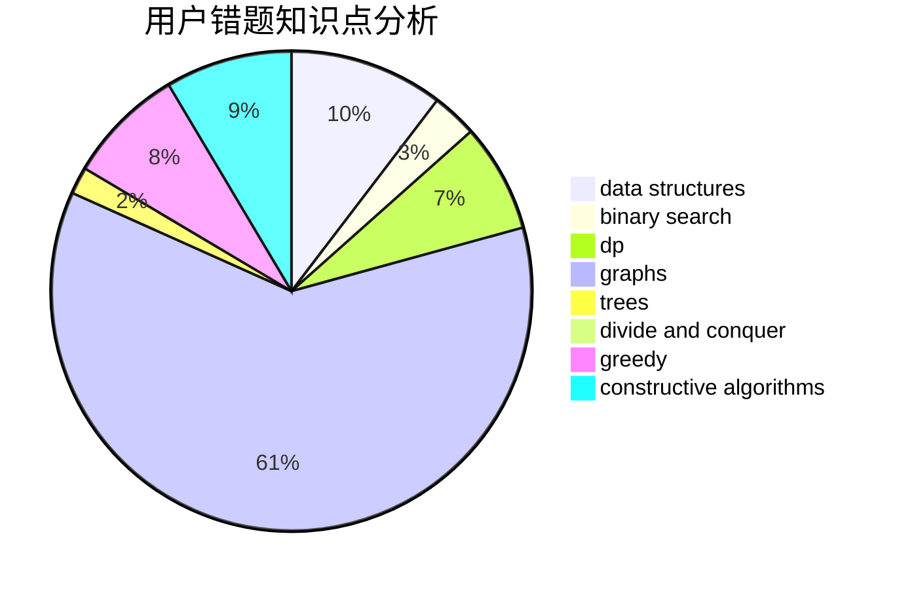

# a_fan_of_xiaofan7

<!-- tabs:start -->

#### **用户提交结果分析**

#### **用户做题类型偏好分析**

#### **用户错题知识点分析**

<!-- tabs:end -->
# 推荐题目
[750C](https://codeforces.com/contest/750/problem/C)		binary search,
                        greedy,
                        math		  
[665C](https://codeforces.com/contest/665/problem/C)		dp,
                        greedy,
                        strings		  
[1380G](https://codeforces.com/contest/1380/problem/G)		greedy,
                        math,
                        probabilities		  
[187C](https://codeforces.com/contest/187/problem/C)		dfs and similar,
                        dsu		  
[12862](https://codeforces.com/contest/1286/problem/2)		dsu,graphs,sortings,trees		  
[1078D](https://codeforces.com/contest/1078/problem/D)		dsu,graphs,sortings,trees		  
[792D](https://codeforces.com/contest/792/problem/D)		bitmasks,
                        trees		  
[377C](https://codeforces.com/contest/377/problem/C)		bitmasks,
                        dp,
                        games		  
[1298B](https://codeforces.com/contest/1298/problem/B)		dsu,graphs,sortings,trees		  
[457E](https://codeforces.com/contest/457/problem/E)		constructive algorithms,
                        flows,
                        math		  
