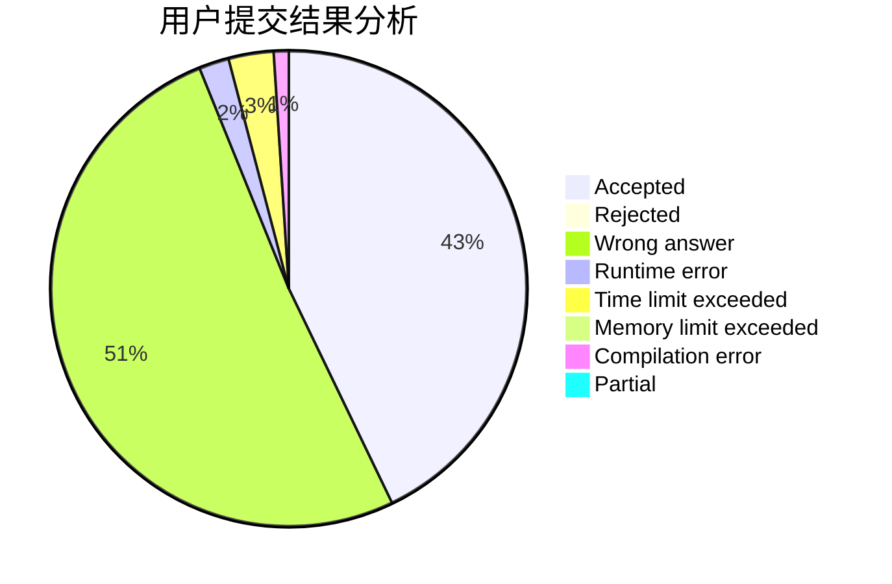
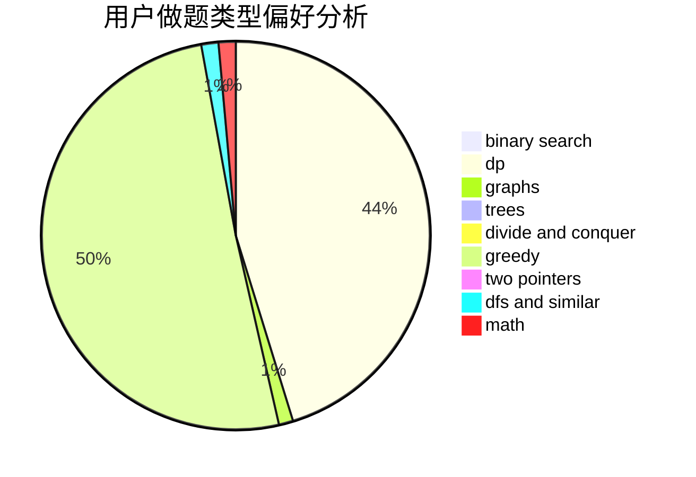

# a_fan_of_xiaofan7

<!-- tabs:start -->

#### **用户提交结果分析**

#### **用户做题类型偏好分析**

<!-- tabs:end -->
# 推荐题目
[750C](https://codeforces.com/contest/750/problem/C)
[665C](https://codeforces.com/contest/665/problem/C)
[1380G](https://codeforces.com/contest/1380/problem/G)
[187C](https://codeforces.com/contest/187/problem/C)
[12862](https://codeforces.com/contest/1286/problem/2)
[1078D](https://codeforces.com/contest/1078/problem/D)
[792D](https://codeforces.com/contest/792/problem/D)
[377C](https://codeforces.com/contest/377/problem/C)
[1298B](https://codeforces.com/contest/1298/problem/B)
[457E](https://codeforces.com/contest/457/problem/E)
