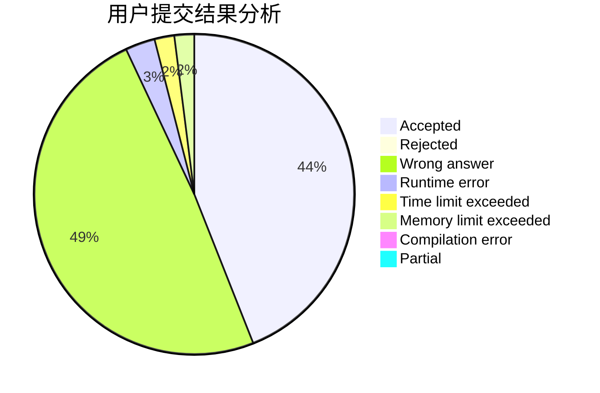
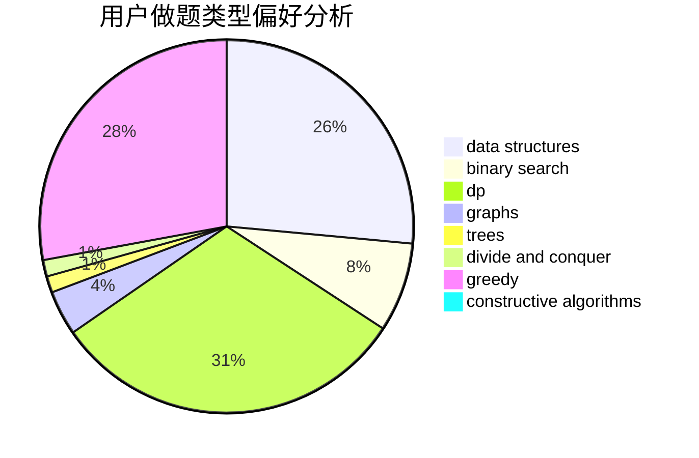

# aa2985759

<!-- tabs:start -->

#### **用户提交结果分析**

#### **用户做题类型偏好分析**

#### **用户错题知识点分析**

<!-- tabs:end -->
# 推荐题目
[894A](https://codeforces.com/contest/894/problem/A)		brute force,
                        dp		  
[1197E](https://codeforces.com/contest/1197/problem/E)		binary search,
                        combinatorics,
                        data structures,
                        dp,
                        shortest paths,
                        sortings		  
[77E](https://codeforces.com/contest/77/problem/E)		geometry		  
[611A](https://codeforces.com/contest/611/problem/A)		implementation		  
[1509D](https://codeforces.com/contest/1509/problem/D)		dsu,graphs,sortings,trees		  
[853D](https://codeforces.com/contest/853/problem/D)		binary search,
                        dp,
                        greedy		  
[1030E](https://codeforces.com/contest/1030/problem/E)		bitmasks,
                        dp		  
[329E](https://codeforces.com/contest/329/problem/E)		math		  
[1206A](https://codeforces.com/contest/1206/problem/A)		math,
                        sortings		  
[483B](https://codeforces.com/contest/483/problem/B)		binary search,
                        math		  
