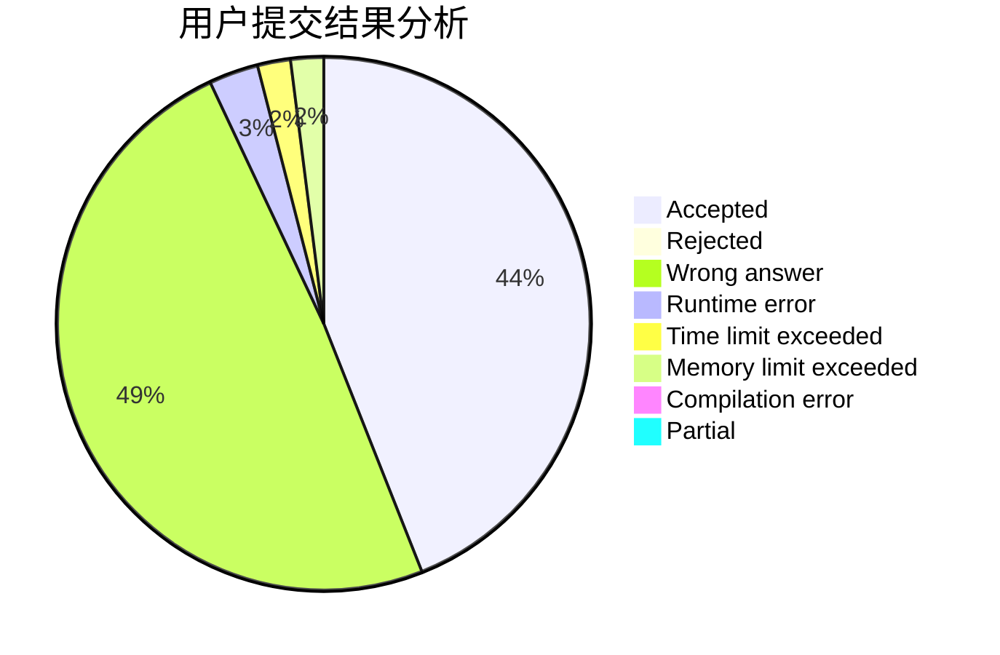
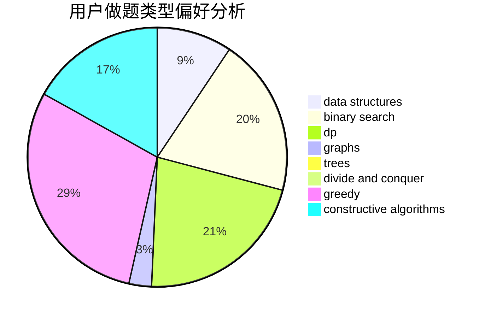
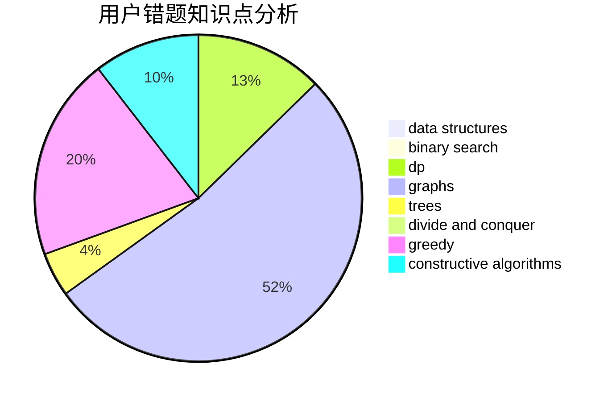

# aa2985759

<!-- tabs:start -->

#### **用户提交结果分析**

#### **用户做题类型偏好分析**

#### **用户错题知识点分析**

<!-- tabs:end -->
# 推荐题目
[911G](https://codeforces.com/contest/911/problem/G)		data structures		  
[1201B](https://codeforces.com/contest/1201/problem/B)		greedy,
                        math		  
[798C](https://codeforces.com/contest/798/problem/C)		dp,
                        greedy,
                        number theory		  
[630A](https://codeforces.com/contest/630/problem/A)		number theory		  
[160B](https://codeforces.com/contest/160/problem/B)		greedy,
                        sortings		  
[872A](https://codeforces.com/contest/872/problem/A)		dsu,graphs,sortings,trees		  
[1031B](https://codeforces.com/contest/1031/problem/B)		nan		  
[357B](https://codeforces.com/contest/357/problem/B)		constructive algorithms,
                        implementation		  
[12102](https://codeforces.com/contest/1210/problem/2)		dsu,graphs,sortings,trees		  
[504A](https://codeforces.com/contest/504/problem/A)		dsu,graphs,sortings,trees		  
