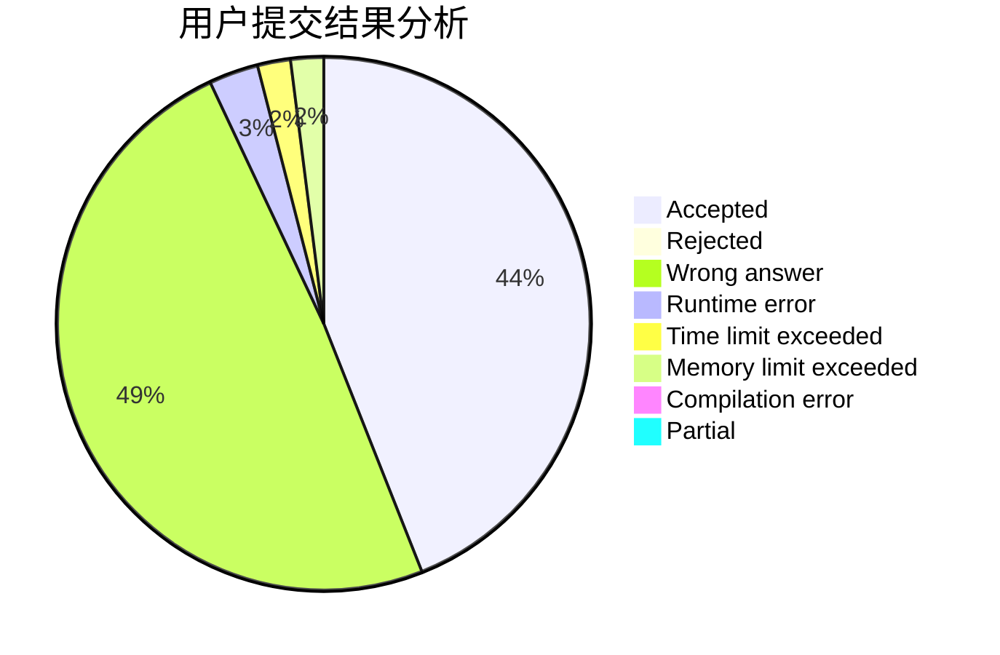
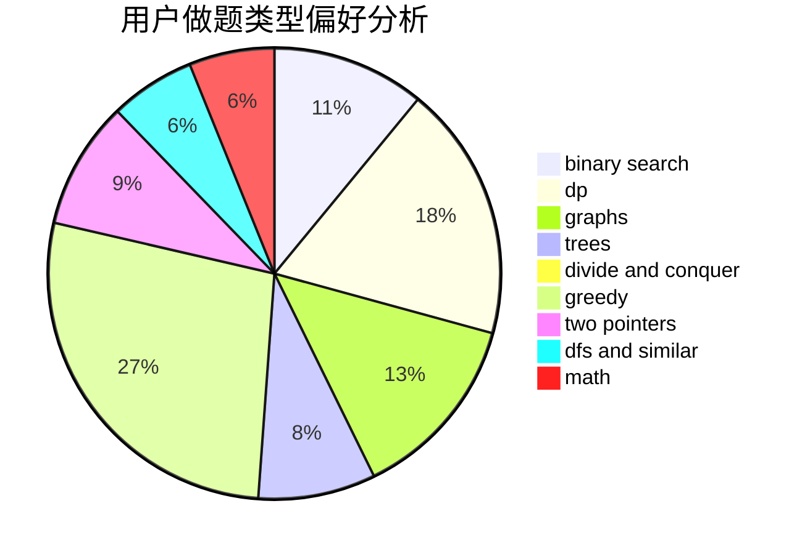

# aa2985759

<!-- tabs:start -->

#### **用户提交结果分析**

#### **用户做题类型偏好分析**

<!-- tabs:end -->
# 推荐题目
[911G](https://codeforces.com/contest/911/problem/G)
[1201B](https://codeforces.com/contest/1201/problem/B)
[798C](https://codeforces.com/contest/798/problem/C)
[630A](https://codeforces.com/contest/630/problem/A)
[160B](https://codeforces.com/contest/160/problem/B)
[872A](https://codeforces.com/contest/872/problem/A)
[1031B](https://codeforces.com/contest/1031/problem/B)
[357B](https://codeforces.com/contest/357/problem/B)
[12102](https://codeforces.com/contest/1210/problem/2)
[504A](https://codeforces.com/contest/504/problem/A)
