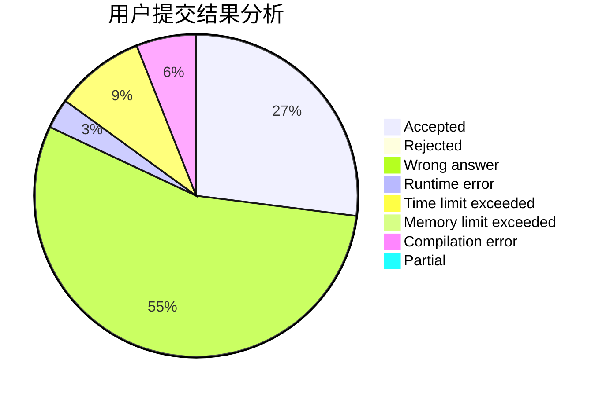
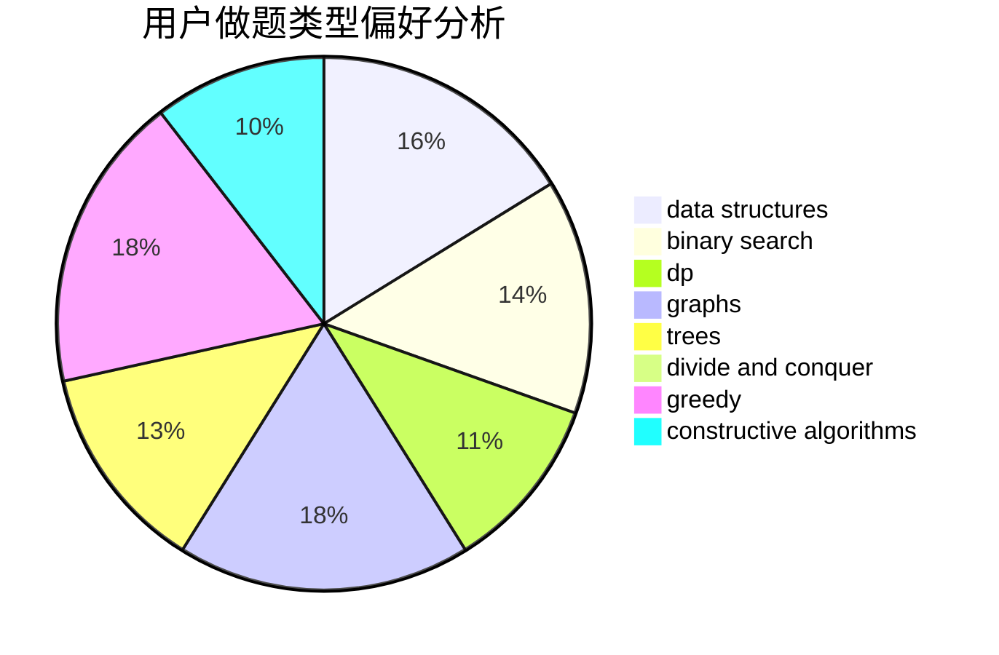

# abovhan

<!-- tabs:start -->

#### **用户提交结果分析**

#### **用户做题类型偏好分析**

#### **用户错题知识点分析**

<!-- tabs:end -->
# 推荐题目
[1338A](https://codeforces.com/contest/1338/problem/A)		greedy,
                        math		  
[859F](https://codeforces.com/contest/859/problem/F)		greedy		  
[713A](https://codeforces.com/contest/713/problem/A)		data structures,
                        implementation		  
[1334F](https://codeforces.com/contest/1334/problem/F)		binary search,
                        data structures,
                        dp,
                        greedy		  
[1510I](https://codeforces.com/contest/1510/problem/I)		greedy,
                        interactive,
                        math,
                        probabilities		  
[835B](https://codeforces.com/contest/835/problem/B)		greedy		  
[1205F](https://codeforces.com/contest/1205/problem/F)		constructive algorithms,
                        math		  
[765A](https://codeforces.com/contest/765/problem/A)		implementation,
                        math		  
[1011A](https://codeforces.com/contest/1011/problem/A)		greedy,
                        implementation,
                        sortings		  
[316A2](https://codeforces.com/contest/316A/problem/2)		math		  
