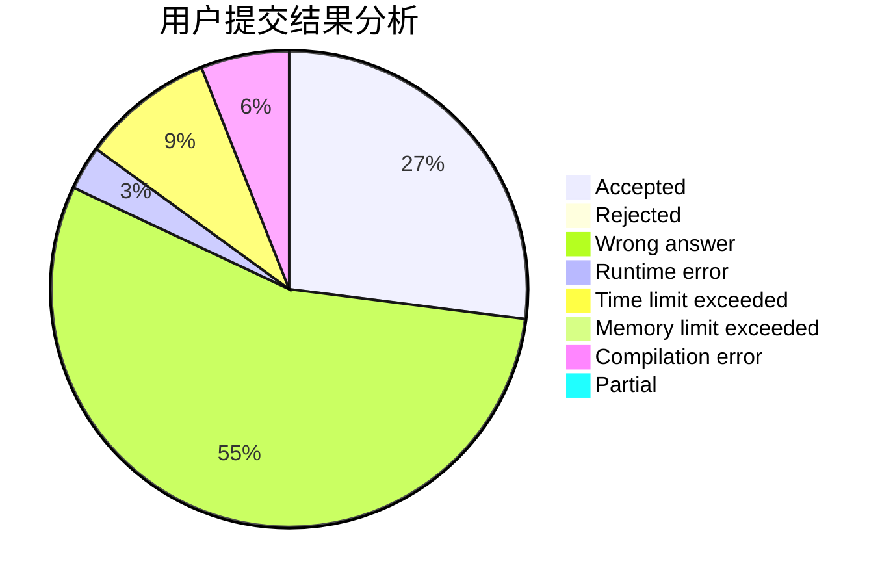
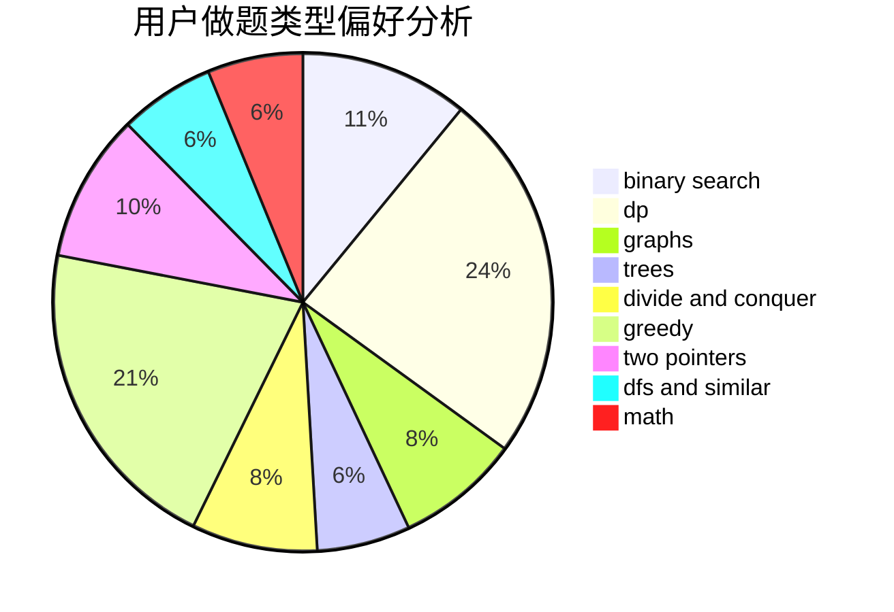

# abovhan

<!-- tabs:start -->

#### **用户提交结果分析**

#### **用户做题类型偏好分析**

<!-- tabs:end -->
# 推荐题目
[1345B](https://codeforces.com/contest/1345/problem/B)
[877C](https://codeforces.com/contest/877/problem/C)
[732B](https://codeforces.com/contest/732/problem/B)
[1341E](https://codeforces.com/contest/1341/problem/E)
[166A](https://codeforces.com/contest/166/problem/A)
[852I](https://codeforces.com/contest/852/problem/I)
[120J](https://codeforces.com/contest/120/problem/J)
[784D](https://codeforces.com/contest/784/problem/D)
[1011D](https://codeforces.com/contest/1011/problem/D)
[33A](https://codeforces.com/contest/33/problem/A)
