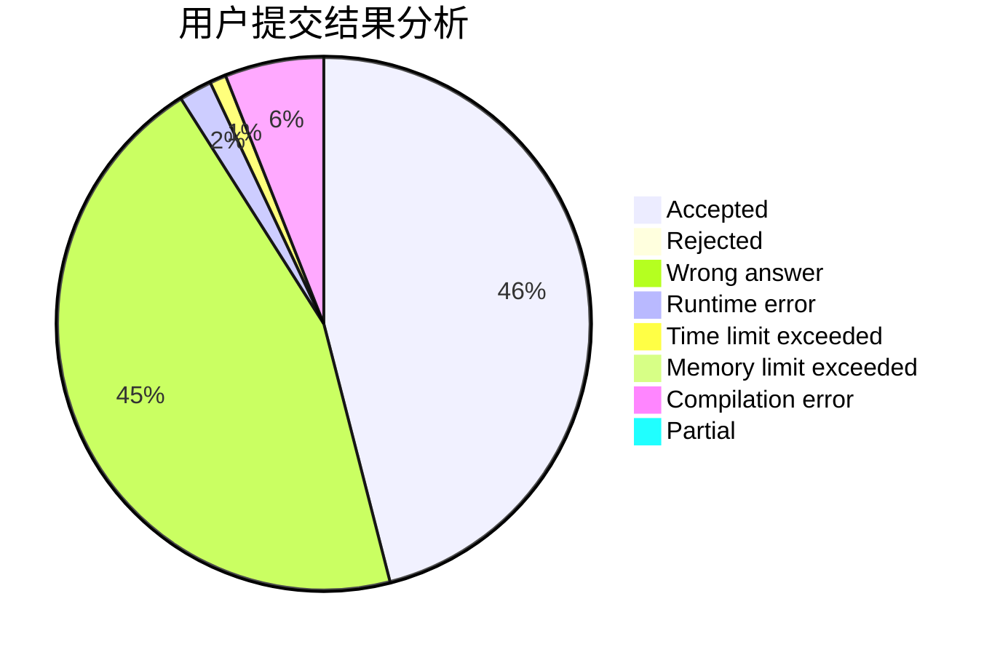
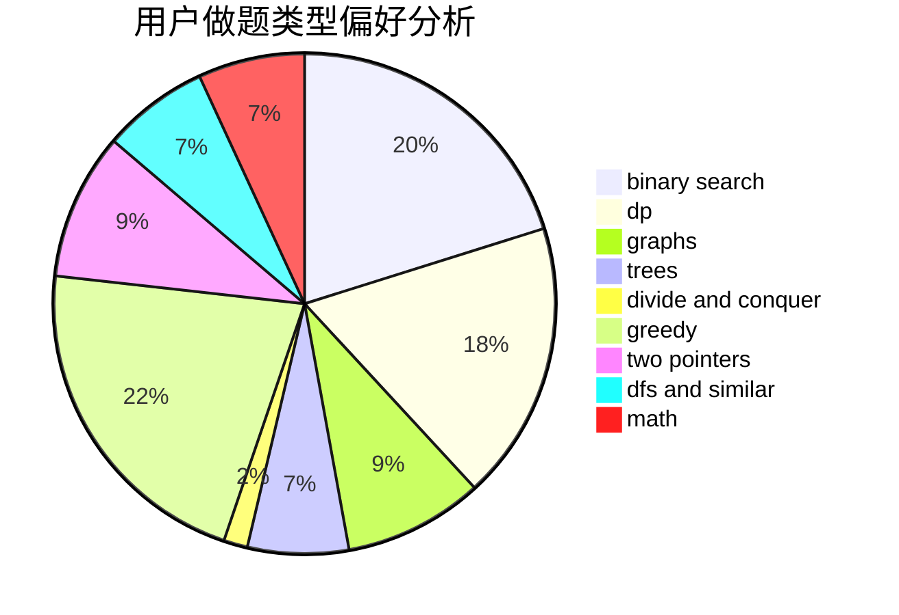

# abyssfish

<!-- tabs:start -->

#### **用户提交结果分析**

#### **用户做题类型偏好分析**

<!-- tabs:end -->
# 推荐题目
[933B](https://codeforces.com/contest/933/problem/B)
[913G](https://codeforces.com/contest/913/problem/G)
[1508B](https://codeforces.com/contest/1508/problem/B)
[1442A](https://codeforces.com/contest/1442/problem/A)
[1096E](https://codeforces.com/contest/1096/problem/E)
[12A](https://codeforces.com/contest/12/problem/A)
[855E](https://codeforces.com/contest/855/problem/E)
[794E](https://codeforces.com/contest/794/problem/E)
[55C](https://codeforces.com/contest/55/problem/C)
[627F](https://codeforces.com/contest/627/problem/F)
