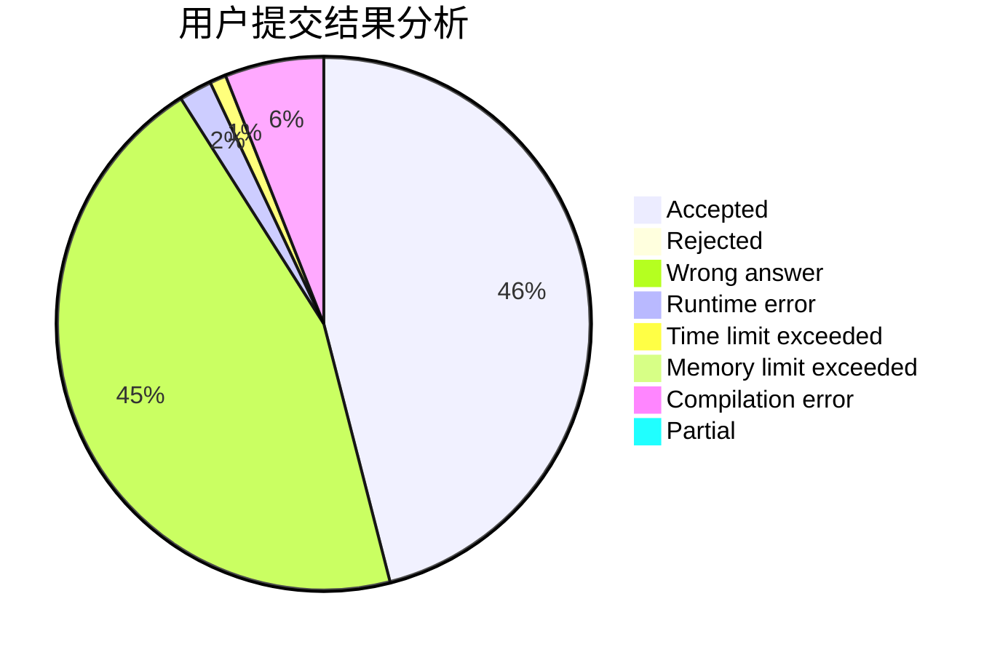
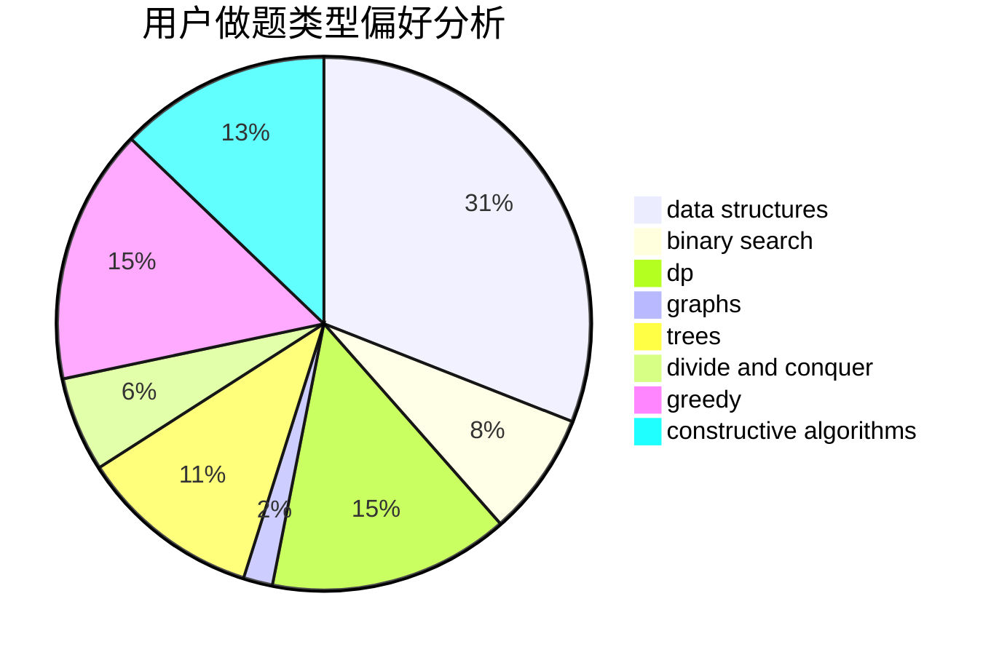
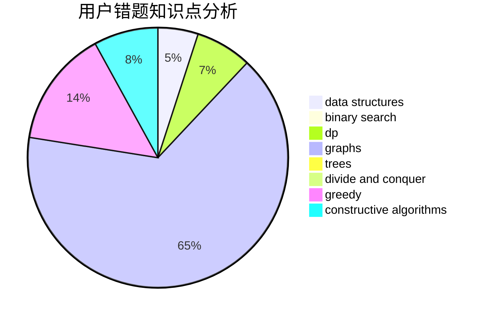

# abyssfish

<!-- tabs:start -->

#### **用户提交结果分析**

#### **用户做题类型偏好分析**

#### **用户错题知识点分析**

<!-- tabs:end -->
# 推荐题目
[933B](https://codeforces.com/contest/933/problem/B)		math		  
[913G](https://codeforces.com/contest/913/problem/G)		math,
                        number theory		  
[1508B](https://codeforces.com/contest/1508/problem/B)		binary search,
                        bitmasks,
                        combinatorics,
                        constructive algorithms,
                        implementation,
                        math		  
[1442A](https://codeforces.com/contest/1442/problem/A)		constructive algorithms,
                        dp,
                        greedy		  
[1096E](https://codeforces.com/contest/1096/problem/E)		combinatorics,
                        dp,
                        math,
                        probabilities		  
[12A](https://codeforces.com/contest/12/problem/A)		implementation		  
[855E](https://codeforces.com/contest/855/problem/E)		bitmasks,
                        dp		  
[794E](https://codeforces.com/contest/794/problem/E)		games,
                        math		  
[55C](https://codeforces.com/contest/55/problem/C)		games		  
[627F](https://codeforces.com/contest/627/problem/F)		dfs and similar,
                        dsu,
                        graphs,
                        trees		  
