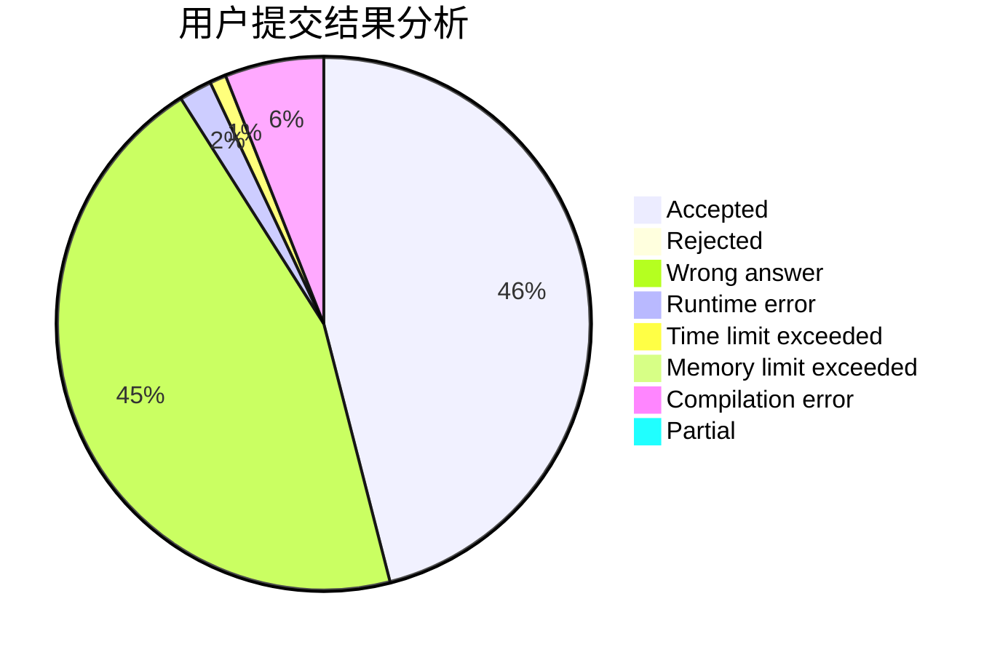
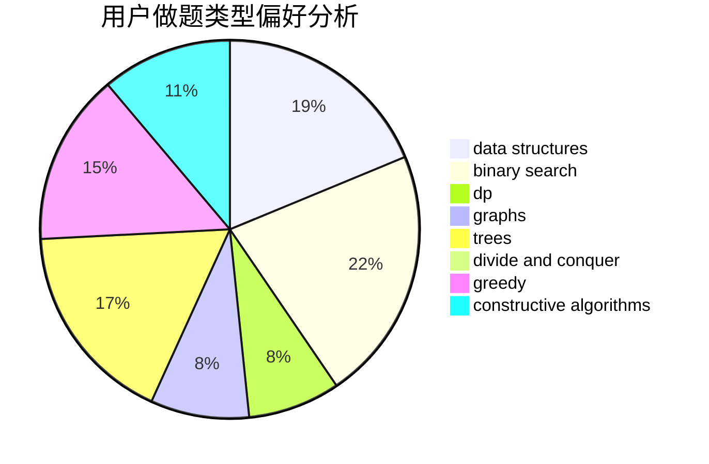
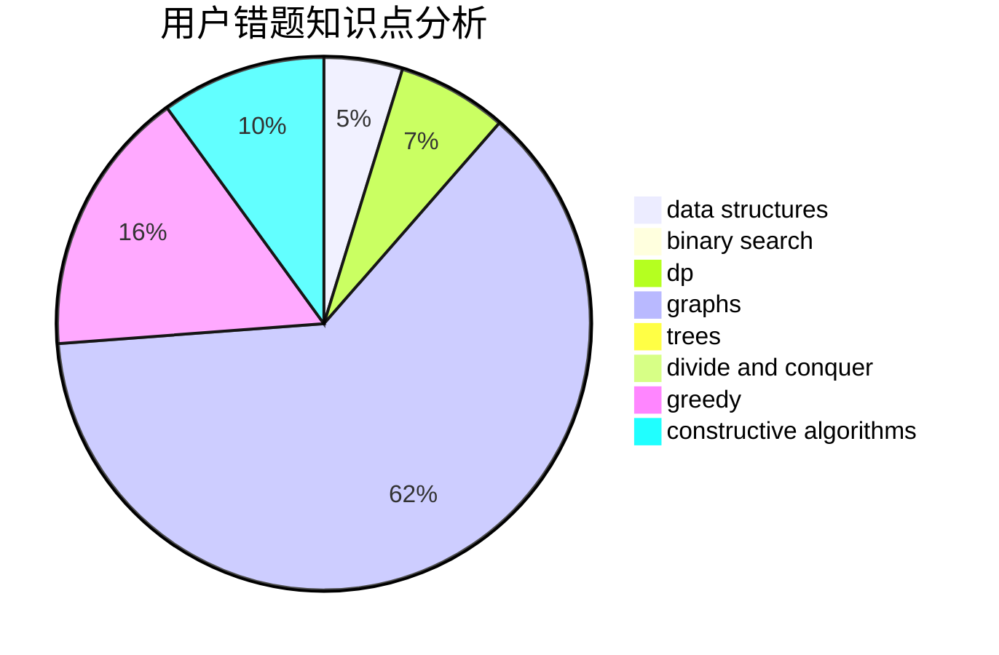

# abyssfish

<!-- tabs:start -->

#### **用户提交结果分析**

#### **用户做题类型偏好分析**

#### **用户错题知识点分析**

<!-- tabs:end -->
# 推荐题目
[914C](https://codeforces.com/contest/914/problem/C)		brute force,
                        combinatorics,
                        dp		  
[896D](https://codeforces.com/contest/896/problem/D)		chinese remainder theorem,
                        combinatorics,
                        math,
                        number theory		  
[1498E](https://codeforces.com/contest/1498/problem/E)		brute force,
                        graphs,
                        greedy,
                        interactive,
                        sortings		  
[1432B](https://codeforces.com/contest/1432/problem/B)		dsu,graphs,sortings,trees		  
[1096B](https://codeforces.com/contest/1096/problem/B)		combinatorics,
                        math,
                        strings		  
[1292F](https://codeforces.com/contest/1292/problem/F)		bitmasks,
                        combinatorics,
                        dp		  
[837G](https://codeforces.com/contest/837/problem/G)		data structures		  
[776E](https://codeforces.com/contest/776/problem/E)		math,
                        number theory		  
[538H](https://codeforces.com/contest/538/problem/H)		2-sat,
                        data structures,
                        dfs and similar,
                        greedy		  
[609A](https://codeforces.com/contest/609/problem/A)		greedy,
                        implementation,
                        sortings		  
