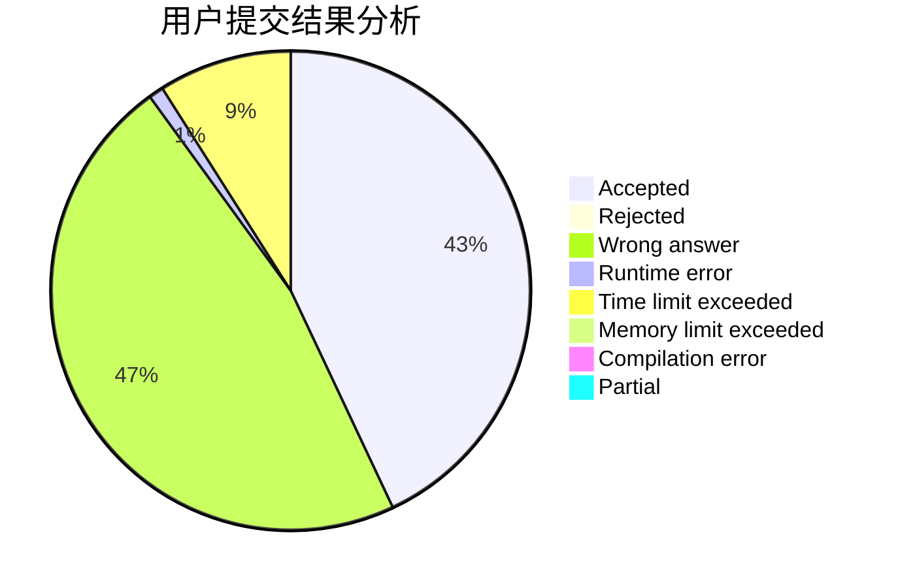
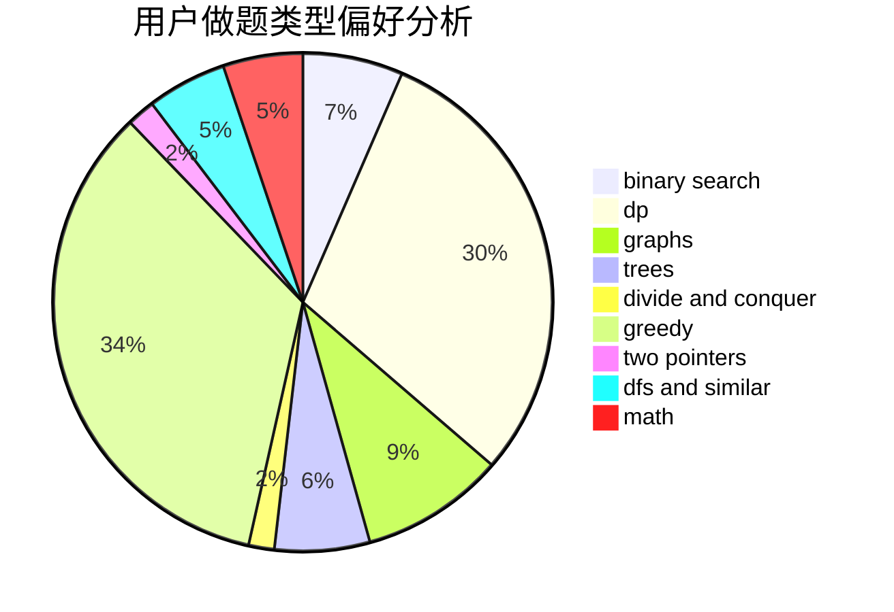

# ac-automata

<!-- tabs:start -->

#### **用户提交结果分析**

#### **用户做题类型偏好分析**

<!-- tabs:end -->
# 推荐题目
[1237D](https://codeforces.com/contest/1237/problem/D)
[1464A](https://codeforces.com/contest/1464/problem/A)
[56A](https://codeforces.com/contest/56/problem/A)
[1424G](https://codeforces.com/contest/1424/problem/G)
[869E](https://codeforces.com/contest/869/problem/E)
[1036B](https://codeforces.com/contest/1036/problem/B)
[1015D](https://codeforces.com/contest/1015/problem/D)
[1328D](https://codeforces.com/contest/1328/problem/D)
[997E](https://codeforces.com/contest/997/problem/E)
[672C](https://codeforces.com/contest/672/problem/C)
