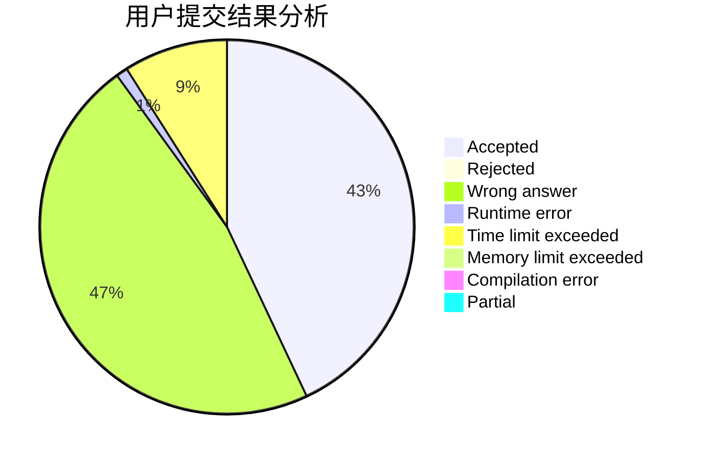
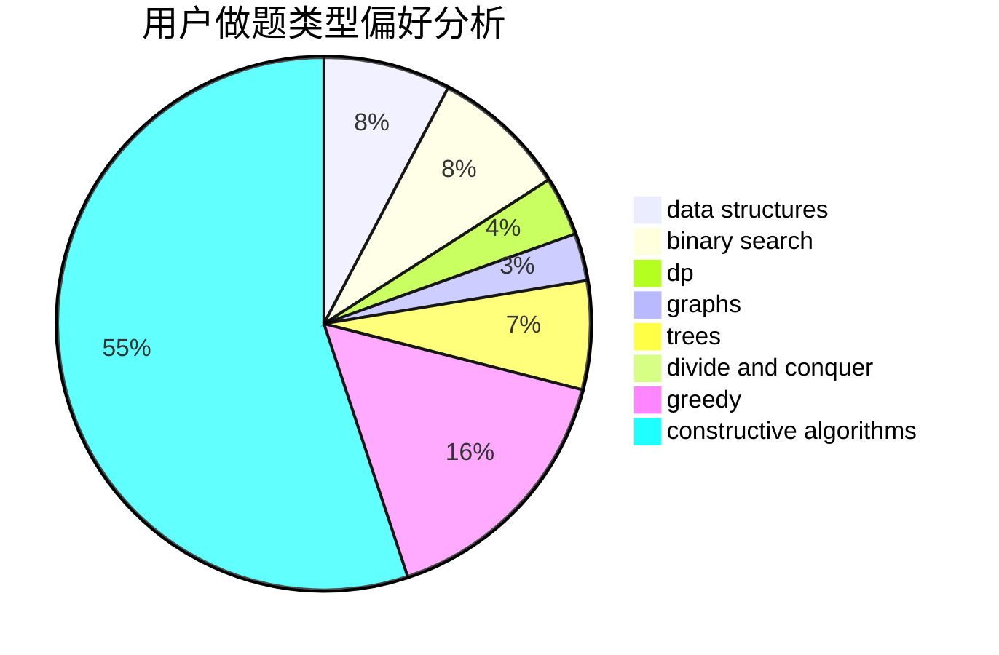
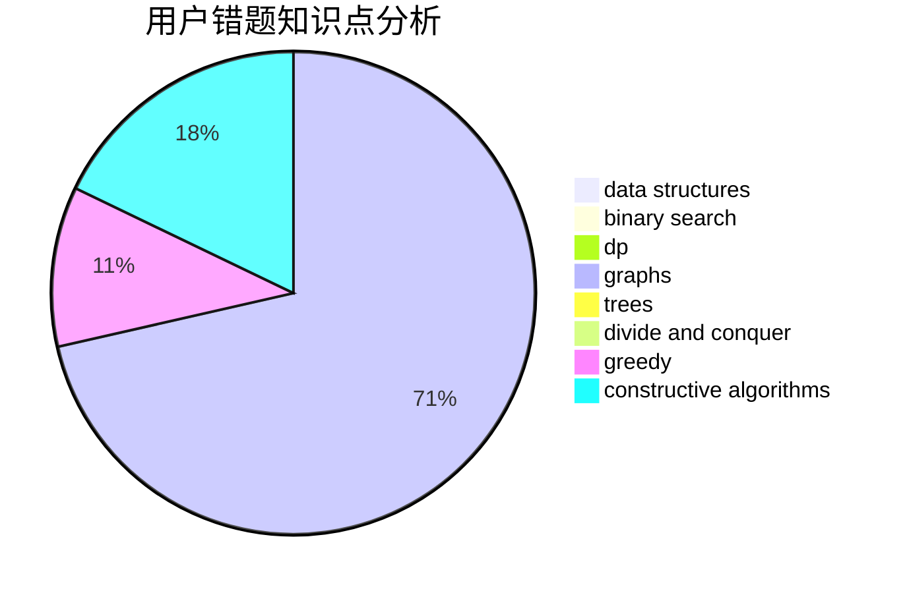

# ac-automata

<!-- tabs:start -->

#### **用户提交结果分析**

#### **用户做题类型偏好分析**

#### **用户错题知识点分析**

<!-- tabs:end -->
# 推荐题目
[1228E](https://codeforces.com/contest/1228/problem/E)		combinatorics,
                        dp,
                        math		  
[1454D](https://codeforces.com/contest/1454/problem/D)		constructive algorithms,
                        math,
                        number theory		  
[545A](https://codeforces.com/contest/545/problem/A)		implementation		  
[1416F](https://codeforces.com/contest/1416/problem/F)		flows,
                        graph matchings,
                        greedy,
                        implementation		  
[850F](https://codeforces.com/contest/850/problem/F)		math		  
[1034D](https://codeforces.com/contest/1034/problem/D)		binary search,
                        data structures,
                        two pointers		  
[1015C](https://codeforces.com/contest/1015/problem/C)		sortings		  
[1321E](https://codeforces.com/contest/1321/problem/E)		dsu,graphs,sortings,trees		  
[982B](https://codeforces.com/contest/982/problem/B)		data structures,
                        greedy,
                        implementation		  
[645G](https://codeforces.com/contest/645/problem/G)		binary search,
                        geometry		  
