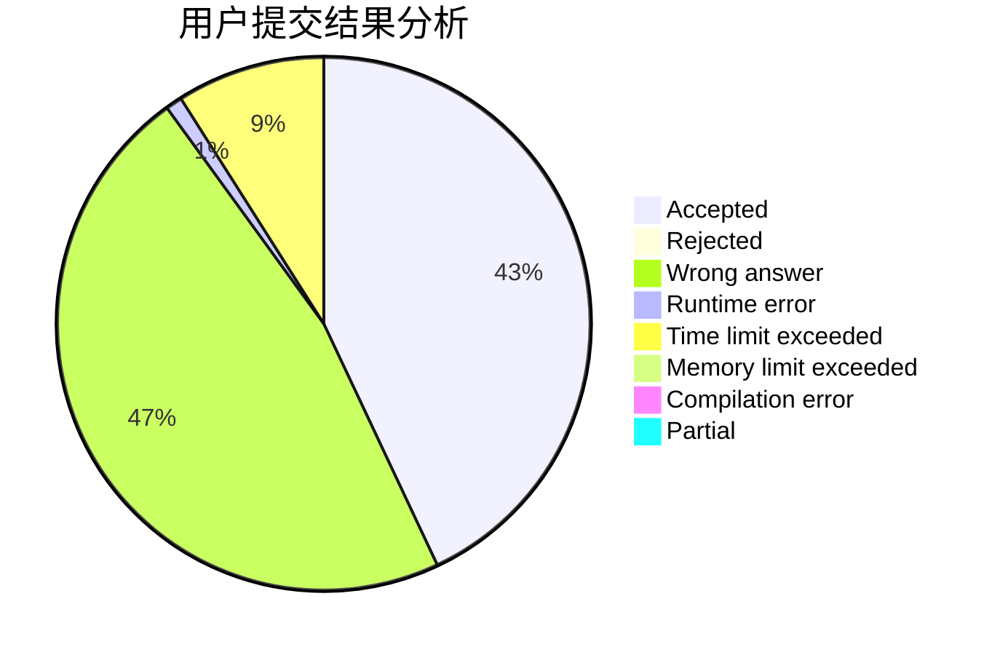
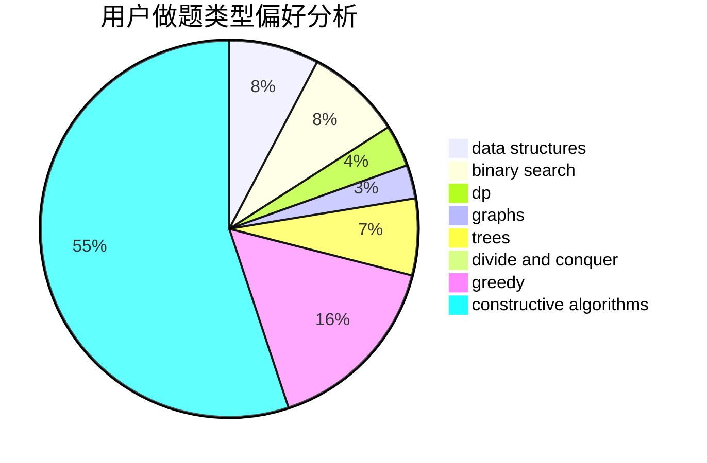
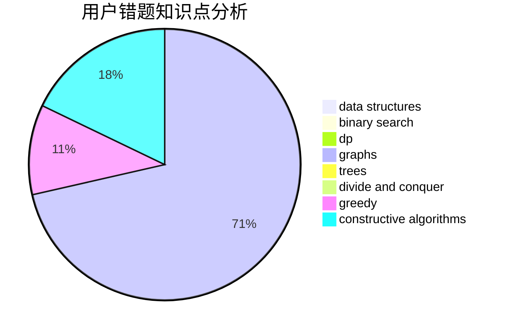

# ac-automata
<!-- tabs:start -->
#### **用户提交结果分析**

#### **用户做题类型偏好分析**

#### **用户错题知识点分析**

<!-- tabs:end -->
# 推荐题目
[Number into Sequence](http://codeforces.com/problemset/problem/1454/D)		constructive algorithms,
                        math,
                        number theory		  
[Another Filling the Grid](http://codeforces.com/problemset/problem/1228/E)		combinatorics,
                        dp,
                        math		  
[Toy Cars](http://codeforces.com/problemset/problem/545/A)		implementation		  
[DZY Loves Strings](http://codeforces.com/problemset/problem/447/B)		greedy,
                        implementation		  
[World of Darkraft: Battle for Azathoth](https://codeforces.com/contest/1321/problem/E)		brute force,
                        data structures,
                        sortings		  
[Showing Off](http://codeforces.com/problemset/problem/1416/F)		flows,
                        graph matchings,
                        greedy,
                        implementation		  
[Pie or die](http://codeforces.com/problemset/problem/55/C)		games		  
[Intervals of Intervals](http://codeforces.com/problemset/problem/1034/D)		binary search,
                        data structures,
                        two pointers		  
[Love Triangles](http://codeforces.com/problemset/problem/553/C)		dfs and similar,
                        dsu,
                        graphs		  
[Rainbow Balls](http://codeforces.com/problemset/problem/850/F)		math		  
<!-- tabs:start -->
#### **data structures**
[Number into Sequence](https://codeforces.com/contest/1321/problem/E)		brute force,
                        data structures,
                        sortings		  
[Another Filling the Grid](http://codeforces.com/problemset/problem/1034/D)		binary search,
                        data structures,
                        two pointers		  
[Toy Cars](http://codeforces.com/problemset/problem/982/B)		data structures,
                        greedy,
                        implementation		  
[DZY Loves Strings](http://codeforces.com/problemset/problem/722/F)		chinese remainder theorem,
                        data structures,
                        implementation,
                        number theory,
                        two pointers		  
[World of Darkraft: Battle for Azathoth](http://codeforces.com/problemset/problem/879/B)		data structures,
                        implementation		  
[Showing Off](http://codeforces.com/problemset/problem/1452/G)		data structures,
                        dfs and similar,
                        greedy,
                        trees		  
[Pie or die](http://codeforces.com/problemset/problem/379/F)		data structures,
                        divide and conquer,
                        trees		  
[Intervals of Intervals](http://codeforces.com/problemset/problem/1389/F)		data structures,
                        dp,
                        graph matchings,
                        sortings		  
[Love Triangles](https://codeforces.com/contest/1504/problem/F)		2-sat,
                        constructive algorithms,
                        data structures,
                        greedy,
                        sortings,
                        two pointers		  
[Rainbow Balls](http://codeforces.com/problemset/problem/727/E)		data structures,
                        hashing,
                        string suffix structures,
                        strings		  
#### **binary search**
[Number into Sequence](http://codeforces.com/problemset/problem/1034/D)		binary search,
                        data structures,
                        two pointers		  
[Another Filling the Grid](http://codeforces.com/problemset/problem/645/G)		binary search,
                        geometry		  
[Toy Cars](http://codeforces.com/problemset/problem/1111/C)		binary search,
                        brute force,
                        divide and conquer,
                        math		  
[DZY Loves Strings](http://codeforces.com/problemset/problem/623/C)		binary search,
                        dp		  
[World of Darkraft: Battle for Azathoth](http://codeforces.com/problemset/problem/965/D)		binary search,
                        flows,
                        greedy,
                        two pointers		  
[Showing Off](http://codeforces.com/problemset/problem/825/D)		binary search,
                        greedy,
                        implementation		  
[Pie or die](http://codeforces.com/problemset/problem/1492/C)		binary search,
                        data structures,
                        dp,
                        greedy,
                        two pointers		  
[Intervals of Intervals](http://codeforces.com/problemset/problem/1463/D)		binary search,
                        constructive algorithms,
                        greedy,
                        two pointers		  
[Love Triangles](http://codeforces.com/problemset/problem/1490/G)		binary search,
                        data structures,
                        math		  
[Rainbow Balls](http://codeforces.com/problemset/problem/1479/D)		binary search,
                        bitmasks,
                        brute force,
                        data structures,
                        probabilities,
                        trees		  
#### **dp**
[Number into Sequence](http://codeforces.com/problemset/problem/1228/E)		combinatorics,
                        dp,
                        math		  
[Another Filling the Grid](http://codeforces.com/problemset/problem/82/D)		dp		  
[Toy Cars](http://codeforces.com/problemset/problem/590/D)		dp		  
[DZY Loves Strings](http://codeforces.com/problemset/problem/598/E)		brute force,
                        dp		  
[World of Darkraft: Battle for Azathoth](http://codeforces.com/problemset/problem/623/C)		binary search,
                        dp		  
[Showing Off](http://codeforces.com/problemset/problem/1389/F)		data structures,
                        dp,
                        graph matchings,
                        sortings		  
[Pie or die](http://codeforces.com/problemset/problem/1073/E)		bitmasks,
                        combinatorics,
                        dp,
                        math		  
[Intervals of Intervals](http://codeforces.com/problemset/problem/1140/D)		dp,
                        greedy,
                        math		  
[Love Triangles](http://codeforces.com/problemset/problem/176/B)		dp		  
[Rainbow Balls](http://codeforces.com/problemset/problem/1492/C)		binary search,
                        data structures,
                        dp,
                        greedy,
                        two pointers		  
#### **graph**
[Number into Sequence](http://codeforces.com/problemset/problem/1416/F)		flows,
                        graph matchings,
                        greedy,
                        implementation		  
[Another Filling the Grid](http://codeforces.com/problemset/problem/553/C)		dfs and similar,
                        dsu,
                        graphs		  
[Toy Cars](http://codeforces.com/problemset/problem/954/D)		dfs and similar,
                        graphs,
                        shortest paths		  
[DZY Loves Strings](http://codeforces.com/problemset/problem/1389/F)		data structures,
                        dp,
                        graph matchings,
                        sortings		  
[World of Darkraft: Battle for Azathoth](http://codeforces.com/problemset/problem/1487/C)		brute force,
                        constructive algorithms,
                        dfs and similar,
                        graphs,
                        greedy,
                        implementation,
                        math		  
[Showing Off](http://codeforces.com/problemset/problem/1437/C)		dp,
                        flows,
                        graph matchings,
                        greedy,
                        math,
                        sortings		  
[Pie or die](http://codeforces.com/problemset/problem/1470/D)		constructive algorithms,
                        dfs and similar,
                        graph matchings,
                        graphs,
                        greedy		  
[Intervals of Intervals](http://codeforces.com/problemset/problem/1476/C)		dp,
                        graphs,
                        greedy		  
[Love Triangles](http://codeforces.com/problemset/problem/1304/D)		constructive algorithms,
                        graphs,
                        greedy,
                        two pointers		  
[Rainbow Balls](http://codeforces.com/problemset/problem/1475/C)		combinatorics,
                        graphs,
                        math		  
#### **trees**
[Number into Sequence](http://codeforces.com/problemset/problem/1452/G)		data structures,
                        dfs and similar,
                        greedy,
                        trees		  
[Another Filling the Grid](http://codeforces.com/problemset/problem/379/F)		data structures,
                        divide and conquer,
                        trees		  
[Toy Cars](http://codeforces.com/problemset/problem/482/E)		data structures,
                        trees		  
[DZY Loves Strings](http://codeforces.com/problemset/problem/1479/D)		binary search,
                        bitmasks,
                        brute force,
                        data structures,
                        probabilities,
                        trees		  
[World of Darkraft: Battle for Azathoth](http://codeforces.com/problemset/problem/1511/C)		brute force,
                        data structures,
                        implementation,
                        trees		  
[Showing Off](http://codeforces.com/problemset/problem/1499/F)		combinatorics,
                        dfs and similar,
                        dp,
                        trees		  
[Pie or die](http://codeforces.com/problemset/problem/1491/E)		brute force,
                        dfs and similar,
                        divide and conquer,
                        number theory,
                        trees		  
[Intervals of Intervals](http://codeforces.com/problemset/problem/1466/D)		data structures,
                        greedy,
                        sortings,
                        trees		  
[Love Triangles](http://codeforces.com/problemset/problem/1495/D)		combinatorics,
                        dfs and similar,
                        graphs,
                        math,
                        shortest paths,
                        trees		  
[Rainbow Balls](http://codeforces.com/problemset/problem/1303/G)		data structures,
                        divide and conquer,
                        geometry,
                        trees		  
#### **divide and conquer**
[Number into Sequence](http://codeforces.com/problemset/problem/1111/C)		binary search,
                        brute force,
                        divide and conquer,
                        math		  
[Another Filling the Grid](http://codeforces.com/problemset/problem/379/F)		data structures,
                        divide and conquer,
                        trees		  
[Toy Cars](http://codeforces.com/problemset/problem/1461/D)		binary search,
                        brute force,
                        data structures,
                        divide and conquer,
                        implementation,
                        sortings		  
[DZY Loves Strings](http://codeforces.com/problemset/problem/1466/G)		combinatorics,
                        divide and conquer,
                        hashing,
                        math,
                        string suffix structures,
                        strings		  
[World of Darkraft: Battle for Azathoth](http://codeforces.com/problemset/problem/1490/D)		dfs and similar,
                        divide and conquer,
                        implementation		  
[Showing Off](https://codeforces.com/contest/1483/problem/C)		data structures,
                        divide and conquer,
                        dp		  
[Pie or die](http://codeforces.com/problemset/problem/1491/E)		brute force,
                        dfs and similar,
                        divide and conquer,
                        number theory,
                        trees		  
[Intervals of Intervals](http://codeforces.com/problemset/problem/1303/G)		data structures,
                        divide and conquer,
                        geometry,
                        trees		  
[Love Triangles](http://codeforces.com/problemset/problem/1494/D)		constructive algorithms,
                        data structures,
                        dfs and similar,
                        divide and conquer,
                        dsu,
                        greedy,
                        sortings,
                        trees		  
[Rainbow Balls](http://codeforces.com/problemset/problem/1482/E)		data structures,
                        divide and conquer,
                        dp		  
#### **greedy**
[Number into Sequence](http://codeforces.com/problemset/problem/447/B)		greedy,
                        implementation		  
[Another Filling the Grid](http://codeforces.com/problemset/problem/1416/F)		flows,
                        graph matchings,
                        greedy,
                        implementation		  
[Toy Cars](http://codeforces.com/problemset/problem/140/B)		brute force,
                        greedy,
                        implementation		  
[DZY Loves Strings](http://codeforces.com/problemset/problem/982/B)		data structures,
                        greedy,
                        implementation		  
[World of Darkraft: Battle for Azathoth](http://codeforces.com/problemset/problem/1452/G)		data structures,
                        dfs and similar,
                        greedy,
                        trees		  
[Showing Off](http://codeforces.com/problemset/problem/354/A)		brute force,
                        greedy,
                        math		  
[Pie or die](http://codeforces.com/problemset/problem/743/A)		constructive algorithms,
                        greedy,
                        implementation		  
[Intervals of Intervals](http://codeforces.com/problemset/problem/1040/A)		greedy		  
[Love Triangles](http://codeforces.com/problemset/problem/337/B)		greedy,
                        math,
                        number theory		  
[Rainbow Balls](https://codeforces.com/contest/1323/problem/C)		greedy		  
#### **constructive algorithms**
[Number into Sequence](http://codeforces.com/problemset/problem/1454/D)		constructive algorithms,
                        math,
                        number theory		  
[Another Filling the Grid](http://codeforces.com/problemset/problem/743/A)		constructive algorithms,
                        greedy,
                        implementation		  
[Toy Cars](http://codeforces.com/problemset/problem/488/B)		brute force,
                        constructive algorithms,
                        math		  
[DZY Loves Strings](http://codeforces.com/problemset/problem/901/B)		constructive algorithms,
                        math		  
[World of Darkraft: Battle for Azathoth](https://codeforces.com/contest/1504/problem/F)		2-sat,
                        constructive algorithms,
                        data structures,
                        greedy,
                        sortings,
                        two pointers		  
[Showing Off](http://codeforces.com/problemset/problem/1063/E)		constructive algorithms,
                        math		  
[Pie or die](http://codeforces.com/problemset/problem/1270/B)		constructive algorithms,
                        greedy,
                        math		  
[Intervals of Intervals](http://codeforces.com/problemset/problem/1493/A)		constructive algorithms,
                        greedy		  
[Love Triangles](http://codeforces.com/problemset/problem/1463/D)		binary search,
                        constructive algorithms,
                        greedy,
                        two pointers		  
[Rainbow Balls](https://codeforces.com/contest/1456/problem/B)		bitmasks,
                        brute force,
                        constructive algorithms		  
#### **sortings**
[Number into Sequence](https://codeforces.com/contest/1321/problem/E)		brute force,
                        data structures,
                        sortings		  
[Another Filling the Grid](http://codeforces.com/problemset/problem/1015/C)		sortings		  
[Toy Cars](http://codeforces.com/problemset/problem/1389/F)		data structures,
                        dp,
                        graph matchings,
                        sortings		  
[DZY Loves Strings](https://codeforces.com/contest/1504/problem/F)		2-sat,
                        constructive algorithms,
                        data structures,
                        greedy,
                        sortings,
                        two pointers		  
[World of Darkraft: Battle for Azathoth](http://codeforces.com/problemset/problem/632/C)		sortings,
                        strings		  
[Showing Off](https://codeforces.com/contest/1496/problem/C)		geometry,
                        greedy,
                        math,
                        sortings		  
[Pie or die](http://codeforces.com/problemset/problem/1495/A)		geometry,
                        greedy,
                        math,
                        sortings		  
[Intervals of Intervals](http://codeforces.com/problemset/problem/1497/A)		brute force,
                        data structures,
                        greedy,
                        sortings		  
[Love Triangles](http://codeforces.com/problemset/problem/1427/A)		math,
                        sortings		  
[Rainbow Balls](http://codeforces.com/problemset/problem/1461/D)		binary search,
                        brute force,
                        data structures,
                        divide and conquer,
                        implementation,
                        sortings		  
<!-- tabs:end -->
