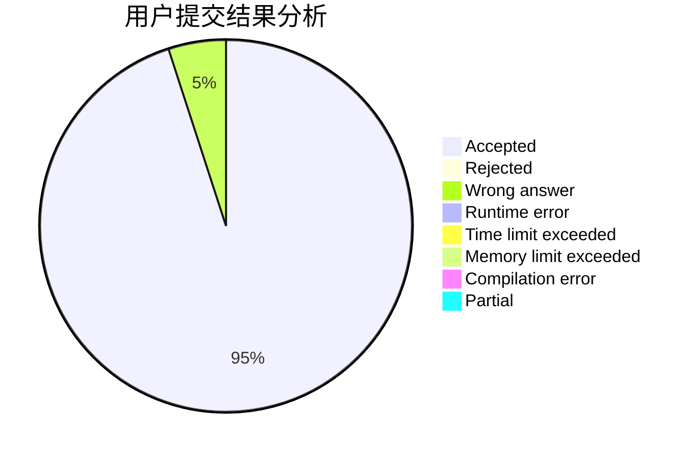
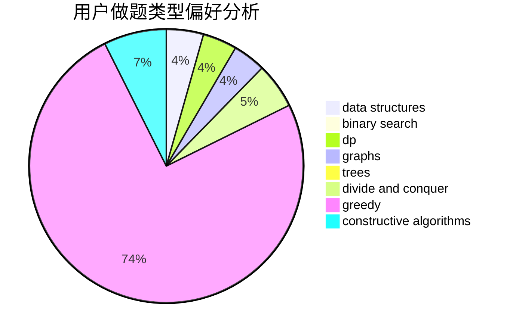
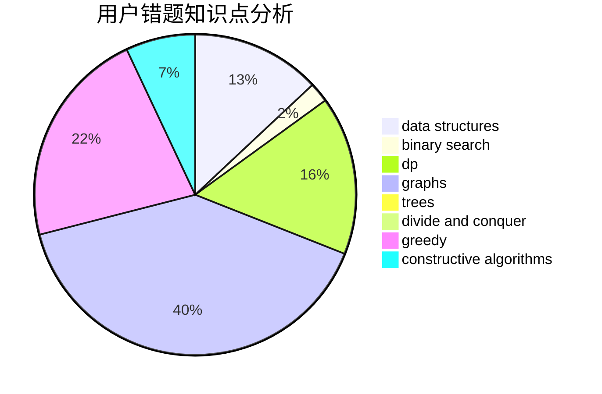

# acccccccc

<!-- tabs:start -->

#### **用户提交结果分析**

#### **用户做题类型偏好分析**

#### **用户错题知识点分析**

<!-- tabs:end -->
# 推荐题目
[1451C](https://codeforces.com/contest/1451/problem/C)		dp,
                        greedy,
                        hashing,
                        implementation,
                        strings		  
[1385E](https://codeforces.com/contest/1385/problem/E)		constructive algorithms,
                        dfs and similar,
                        graphs		  
[146C](https://codeforces.com/contest/146/problem/C)		dsu,graphs,sortings,trees		  
[258B](https://codeforces.com/contest/258/problem/B)		brute force,
                        combinatorics,
                        dp		  
[803F](https://codeforces.com/contest/803/problem/F)		bitmasks,
                        combinatorics,
                        number theory		  
[381B](https://codeforces.com/contest/381/problem/B)		greedy,
                        implementation,
                        sortings		  
[840A](https://codeforces.com/contest/840/problem/A)		combinatorics,
                        greedy,
                        math,
                        number theory,
                        sortings		  
[1225A](https://codeforces.com/contest/1225/problem/A)		math		  
[1205C](https://codeforces.com/contest/1205/problem/C)		implementation,
                        interactive		  
[890A](https://codeforces.com/contest/890/problem/A)		dsu,graphs,sortings,trees		  
