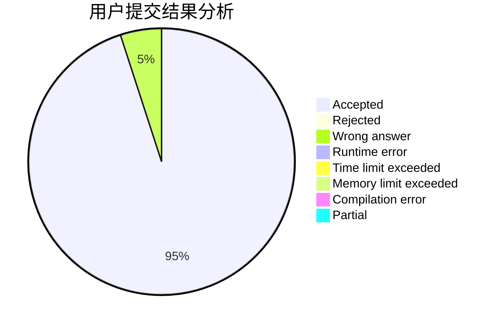
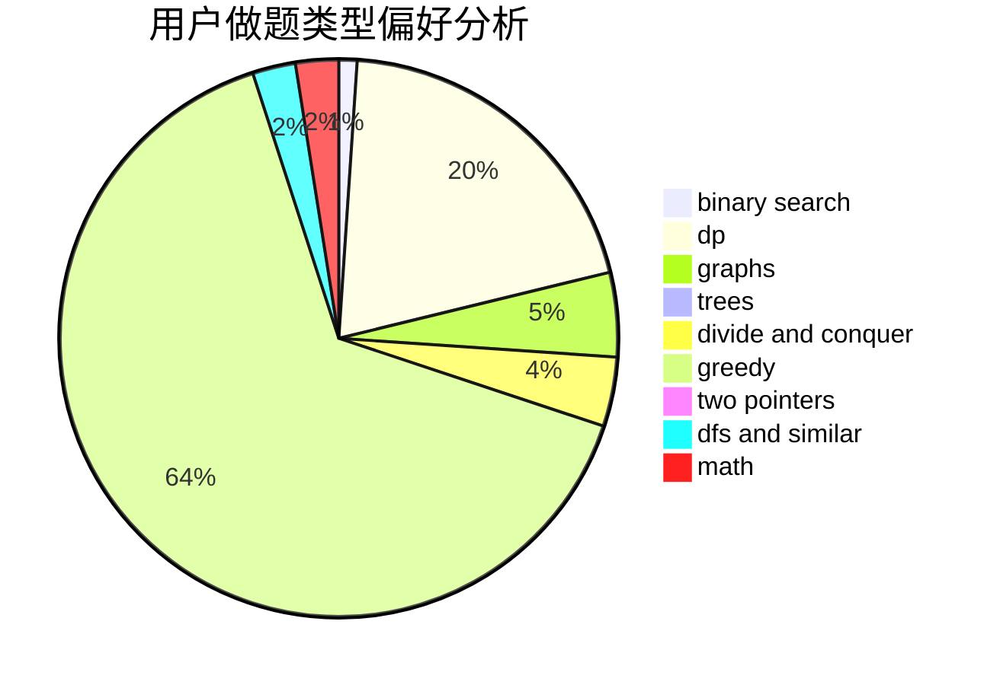

# acccccccc

<!-- tabs:start -->

#### **用户提交结果分析**

#### **用户做题类型偏好分析**

<!-- tabs:end -->
# 推荐题目
[1451C](https://codeforces.com/contest/1451/problem/C)
[1385E](https://codeforces.com/contest/1385/problem/E)
[146C](https://codeforces.com/contest/146/problem/C)
[258B](https://codeforces.com/contest/258/problem/B)
[803F](https://codeforces.com/contest/803/problem/F)
[381B](https://codeforces.com/contest/381/problem/B)
[840A](https://codeforces.com/contest/840/problem/A)
[1225A](https://codeforces.com/contest/1225/problem/A)
[1205C](https://codeforces.com/contest/1205/problem/C)
[890A](https://codeforces.com/contest/890/problem/A)
