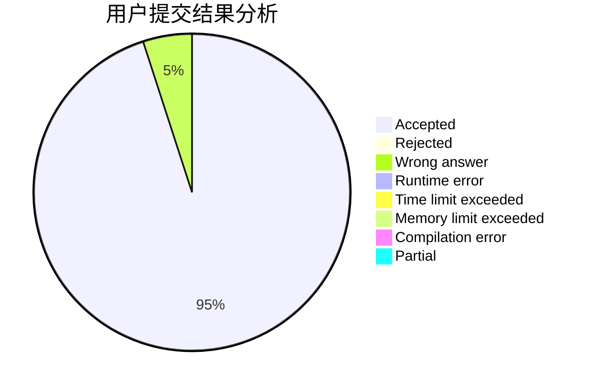
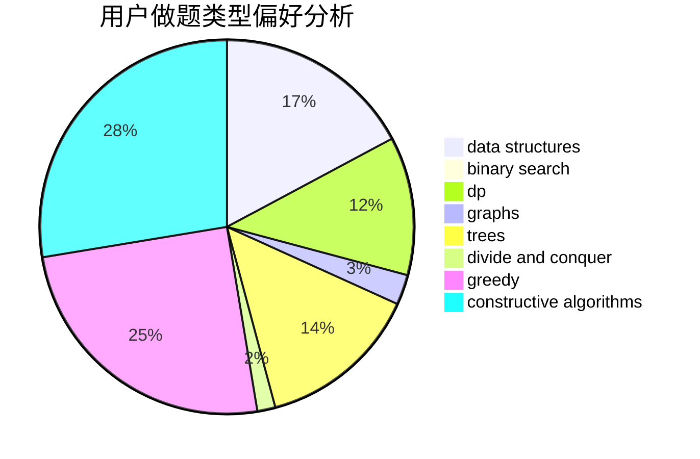
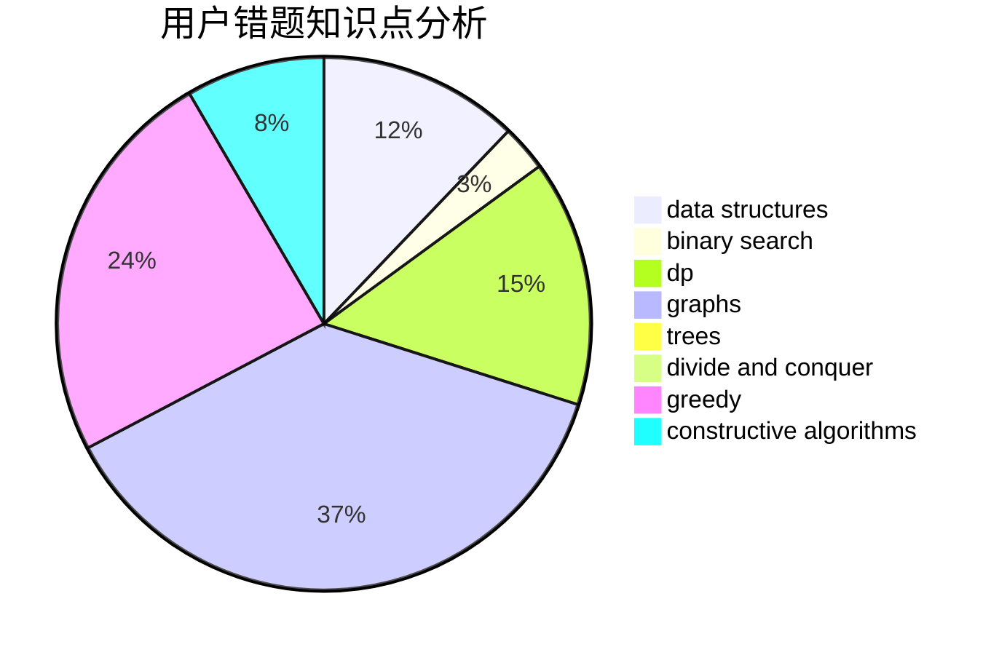

# acccccccc

<!-- tabs:start -->

#### **用户提交结果分析**

#### **用户做题类型偏好分析**

#### **用户错题知识点分析**

<!-- tabs:end -->
# 推荐题目
[1440D](https://codeforces.com/contest/1440/problem/D)		dsu,graphs,sortings,trees		  
[1376B1](https://codeforces.com/contest/1376B/problem/1)		dsu,graphs,sortings,trees		  
[1462E2](https://codeforces.com/contest/1462E/problem/2)		binary search,
                        combinatorics,
                        implementation,
                        math,
                        sortings,
                        two pointers		  
[235C](https://codeforces.com/contest/235/problem/C)		data structures,
                        string suffix structures,
                        strings		  
[788B](https://codeforces.com/contest/788/problem/B)		combinatorics,
                        constructive algorithms,
                        dfs and similar,
                        dsu,
                        graphs		  
[356C](https://codeforces.com/contest/356/problem/C)		combinatorics,
                        constructive algorithms,
                        greedy,
                        implementation		  
[820A](https://codeforces.com/contest/820/problem/A)		implementation		  
[1217D](https://codeforces.com/contest/1217/problem/D)		constructive algorithms,
                        dfs and similar,
                        graphs		  
[1200D](https://codeforces.com/contest/1200/problem/D)		brute force,
                        data structures,
                        dp,
                        implementation,
                        two pointers		  
[86D](https://codeforces.com/contest/86/problem/D)		data structures,
                        implementation,
                        math,
                        two pointers		  
