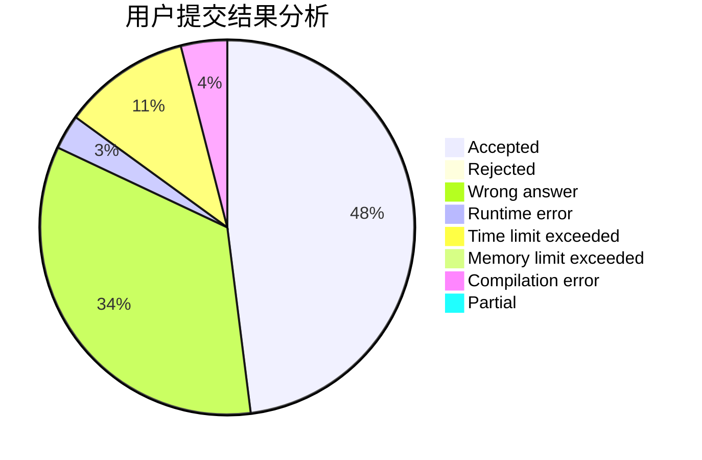
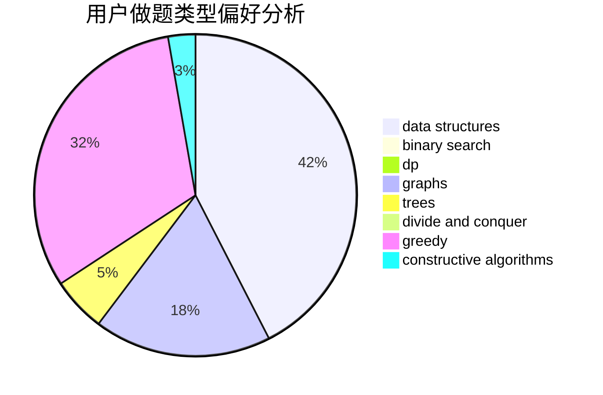

# acidLemon

<!-- tabs:start -->

#### **用户提交结果分析**

#### **用户做题类型偏好分析**

#### **用户错题知识点分析**

<!-- tabs:end -->
# 推荐题目
[261D](https://codeforces.com/contest/261/problem/D)		dp		  
[29B](https://codeforces.com/contest/29/problem/B)		implementation		  
[762A](https://codeforces.com/contest/762/problem/A)		math,
                        number theory		  
[118D](https://codeforces.com/contest/118/problem/D)		dp		  
[908F](https://codeforces.com/contest/908/problem/F)		graphs,
                        greedy,
                        implementation		  
[42A](https://codeforces.com/contest/42/problem/A)		greedy,
                        implementation		  
[668D](https://codeforces.com/contest/668/problem/D)		dsu,graphs,sortings,trees		  
[13871](https://codeforces.com/contest/1387/problem/1)		dsu,graphs,sortings,trees		  
[476A](https://codeforces.com/contest/476/problem/A)		implementation,
                        math		  
[1004A](https://codeforces.com/contest/1004/problem/A)		implementation		  
