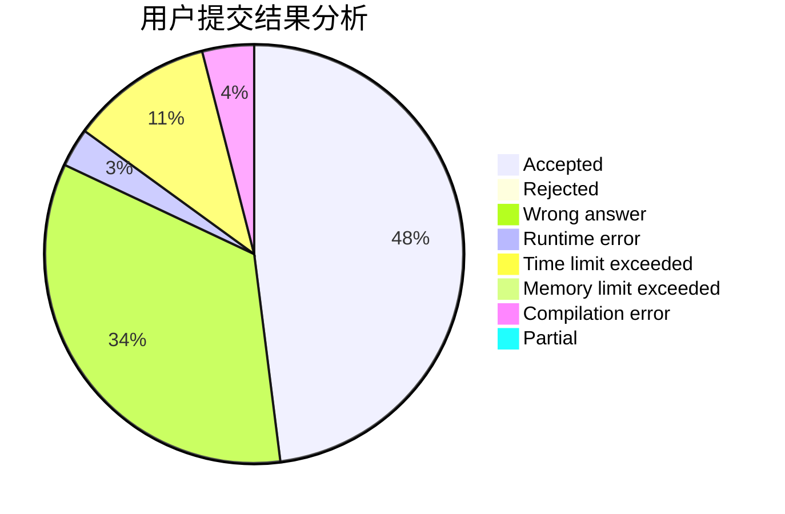
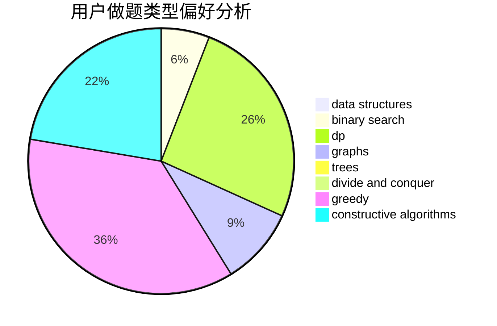

# acidLemon

<!-- tabs:start -->

#### **用户提交结果分析**

#### **用户做题类型偏好分析**

#### **用户错题知识点分析**

<!-- tabs:end -->
# 推荐题目
[240F](https://codeforces.com/contest/240/problem/F)		data structures		  
[283B](https://codeforces.com/contest/283/problem/B)		dfs and similar,
                        dp,
                        graphs		  
[741A](https://codeforces.com/contest/741/problem/A)		dfs and similar,
                        math		  
[1186A](https://codeforces.com/contest/1186/problem/A)		implementation		  
[888G](https://codeforces.com/contest/888/problem/G)		bitmasks,
                        constructive algorithms,
                        data structures		  
[400E](https://codeforces.com/contest/400/problem/E)		binary search,
                        bitmasks,
                        data structures		  
[639B](https://codeforces.com/contest/639/problem/B)		constructive algorithms,
                        graphs,
                        trees		  
[1377A3](https://codeforces.com/contest/1377A/problem/3)		dsu,graphs,sortings,trees		  
[454A](https://codeforces.com/contest/454/problem/A)		implementation		  
[1003D](https://codeforces.com/contest/1003/problem/D)		greedy		  
