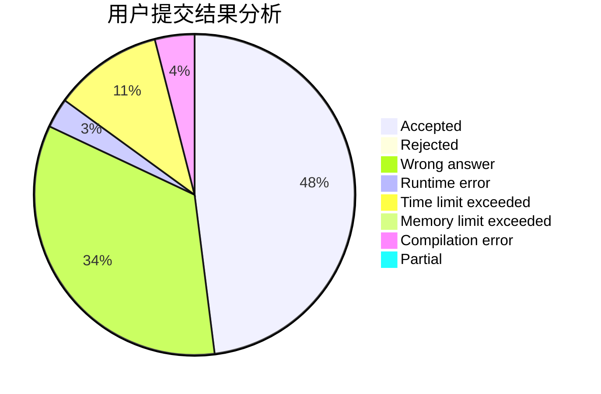
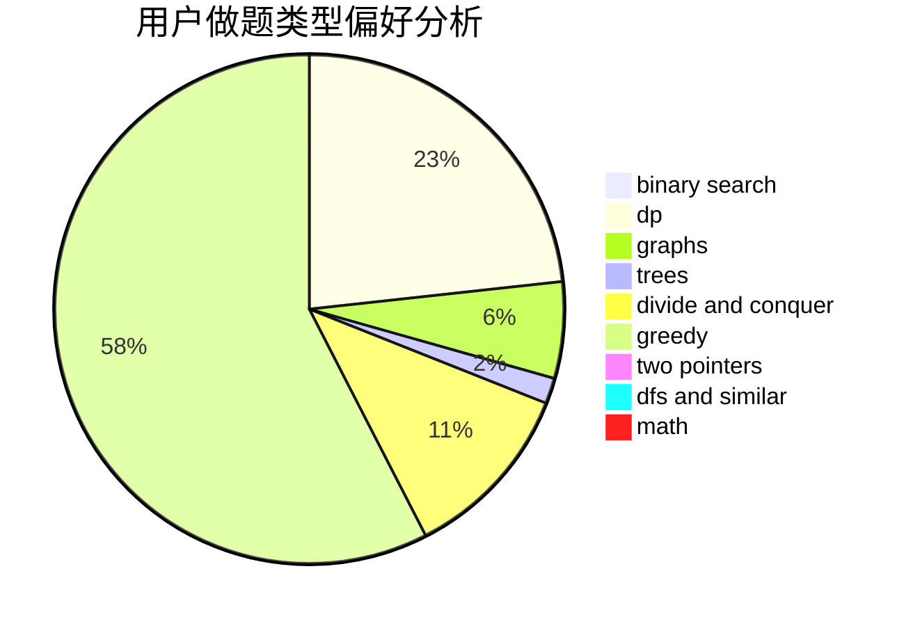

# acidLemon

<!-- tabs:start -->

#### **用户提交结果分析**

#### **用户做题类型偏好分析**

<!-- tabs:end -->
# 推荐题目
[261D](https://codeforces.com/contest/261/problem/D)
[29B](https://codeforces.com/contest/29/problem/B)
[762A](https://codeforces.com/contest/762/problem/A)
[118D](https://codeforces.com/contest/118/problem/D)
[908F](https://codeforces.com/contest/908/problem/F)
[42A](https://codeforces.com/contest/42/problem/A)
[668D](https://codeforces.com/contest/668/problem/D)
[13871](https://codeforces.com/contest/1387/problem/1)
[476A](https://codeforces.com/contest/476/problem/A)
[1004A](https://codeforces.com/contest/1004/problem/A)
