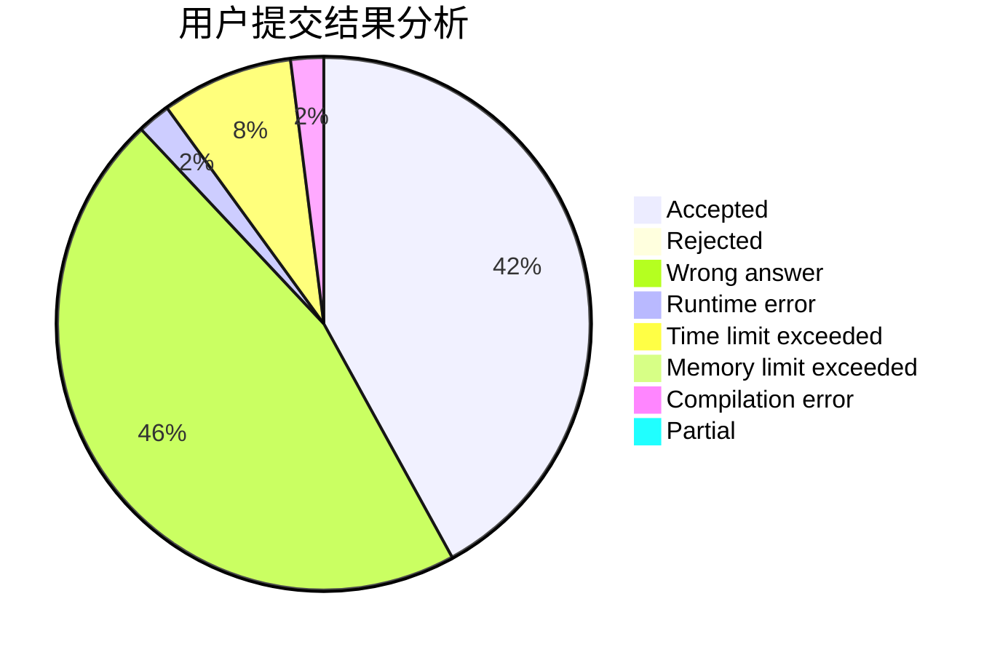
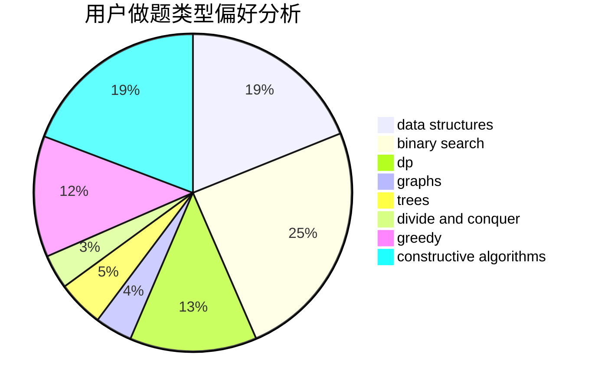
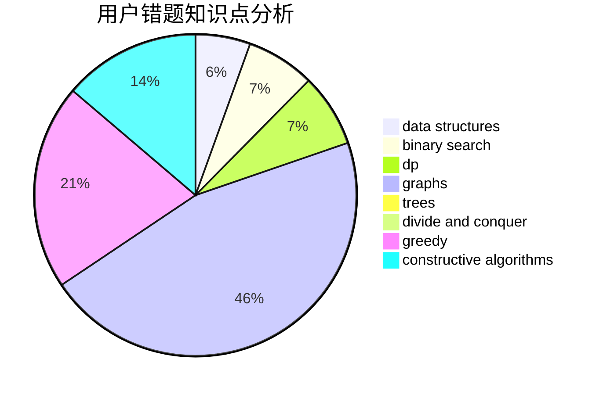

# acrafle

<!-- tabs:start -->

#### **用户提交结果分析**

#### **用户做题类型偏好分析**

#### **用户错题知识点分析**

<!-- tabs:end -->
# 推荐题目
[516A](https://codeforces.com/contest/516/problem/A)		dsu,graphs,sortings,trees		  
[1440B](https://codeforces.com/contest/1440/problem/B)		greedy,
                        math		  
[1342A](https://codeforces.com/contest/1342/problem/A)		greedy,
                        math		  
[455A](https://codeforces.com/contest/455/problem/A)		dp		  
[1404E](https://codeforces.com/contest/1404/problem/E)		flows,
                        graph matchings,
                        graphs		  
[1106F](https://codeforces.com/contest/1106/problem/F)		math,
                        matrices,
                        number theory		  
[125D](https://codeforces.com/contest/125/problem/D)		constructive algorithms,
                        greedy		  
[359B](https://codeforces.com/contest/359/problem/B)		constructive algorithms,
                        dp,
                        math		  
[545A](https://codeforces.com/contest/545/problem/A)		implementation		  
[25A](https://codeforces.com/contest/25/problem/A)		brute force		  
