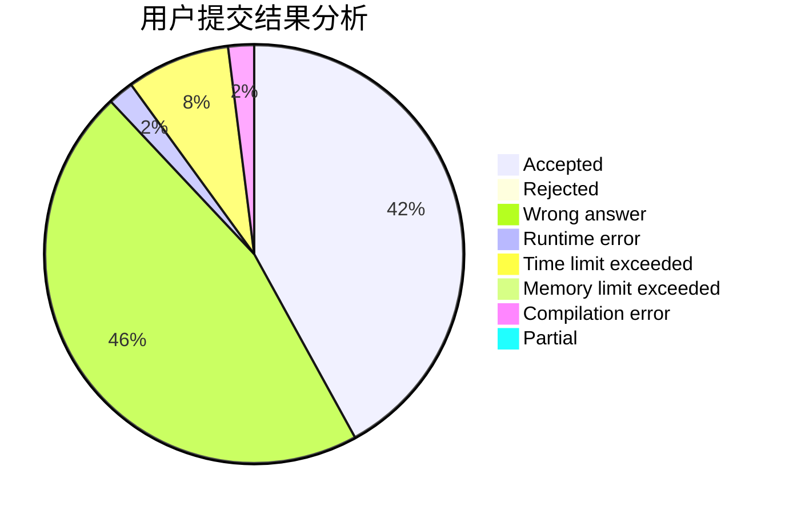
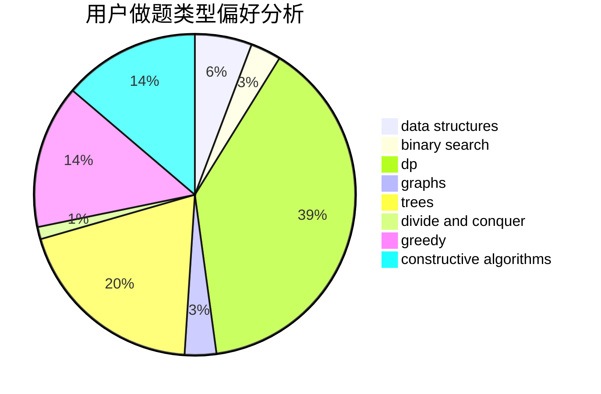
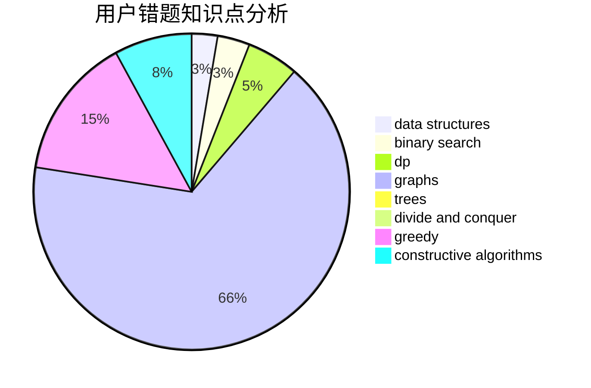

# acrafle

<!-- tabs:start -->

#### **用户提交结果分析**

#### **用户做题类型偏好分析**

#### **用户错题知识点分析**

<!-- tabs:end -->
# 推荐题目
[543A](https://codeforces.com/contest/543/problem/A)		dp		  
[14512](https://codeforces.com/contest/1451/problem/2)		dsu,graphs,sortings,trees		  
[13491](https://codeforces.com/contest/1349/problem/1)		dsu,graphs,sortings,trees		  
[476B](https://codeforces.com/contest/476/problem/B)		bitmasks,
                        brute force,
                        combinatorics,
                        dp,
                        math,
                        probabilities		  
[1416A](https://codeforces.com/contest/1416/problem/A)		binary search,
                        data structures,
                        implementation,
                        two pointers		  
[1107C](https://codeforces.com/contest/1107/problem/C)		greedy,
                        sortings,
                        two pointers		  
[1265D](https://codeforces.com/contest/1265/problem/D)		dsu,graphs,sortings,trees		  
[385E](https://codeforces.com/contest/385/problem/E)		math,
                        matrices		  
[56A](https://codeforces.com/contest/56/problem/A)		implementation		  
[277A](https://codeforces.com/contest/277/problem/A)		dfs and similar,
                        dsu		  
