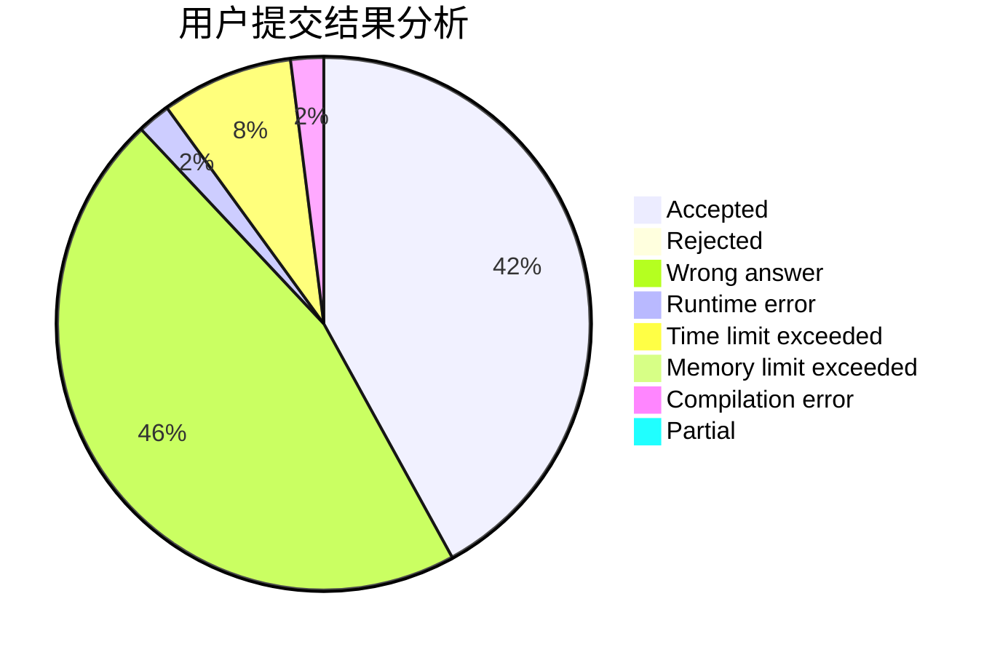
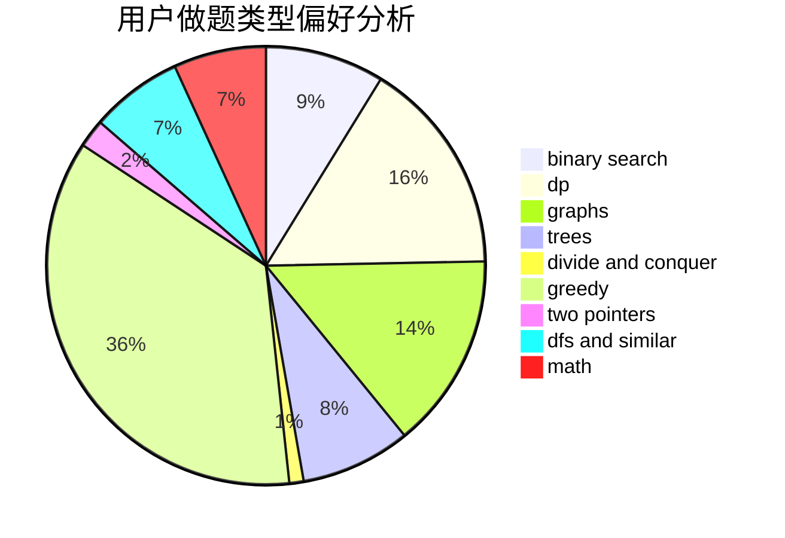

# acrafle

<!-- tabs:start -->

#### **用户提交结果分析**

#### **用户做题类型偏好分析**

<!-- tabs:end -->
# 推荐题目
[543A](https://codeforces.com/contest/543/problem/A)
[14512](https://codeforces.com/contest/1451/problem/2)
[13491](https://codeforces.com/contest/1349/problem/1)
[476B](https://codeforces.com/contest/476/problem/B)
[1416A](https://codeforces.com/contest/1416/problem/A)
[1107C](https://codeforces.com/contest/1107/problem/C)
[1265D](https://codeforces.com/contest/1265/problem/D)
[385E](https://codeforces.com/contest/385/problem/E)
[56A](https://codeforces.com/contest/56/problem/A)
[277A](https://codeforces.com/contest/277/problem/A)
