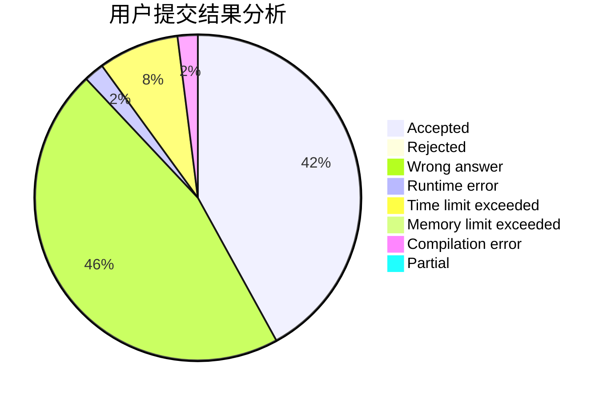
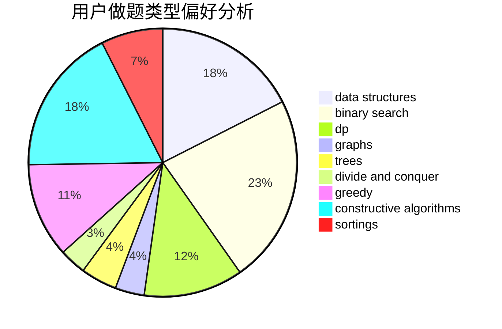
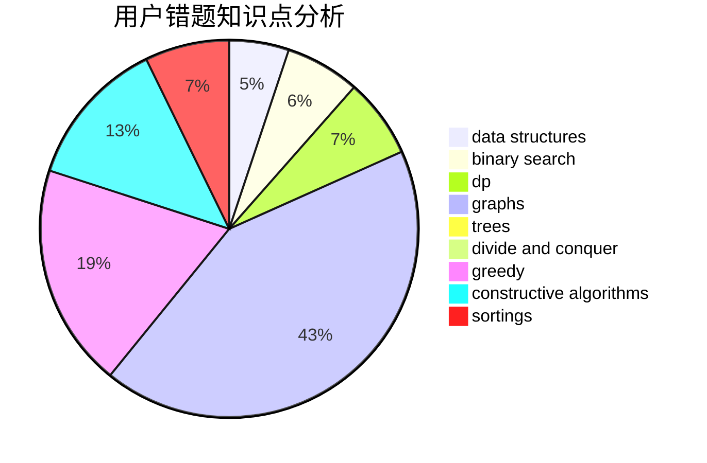

# acrafle
<!-- tabs:start -->
#### **用户提交结果分析**

#### **用户做题类型偏好分析**

#### **用户错题知识点分析**

<!-- tabs:end -->
# 推荐题目
[1404E](http://codeforces.com/problemset/problem/1404/E)		flows,
                        graph matchings,
                        graphs		  
[103C](http://codeforces.com/problemset/problem/103/C)		constructive algorithms,
                        greedy		  
[1440B](http://codeforces.com/problemset/problem/1440/B)		greedy,
                        math		  
[675D](http://codeforces.com/problemset/problem/675/D)		data structures,
                        trees		  
[359B](http://codeforces.com/problemset/problem/359/B)		constructive algorithms,
                        dp,
                        math		  
[455A](http://codeforces.com/problemset/problem/455/A)		dp		  
[134B](http://codeforces.com/problemset/problem/134/B)		brute force,
                        dfs and similar,
                        math,
                        number theory		  
[1106F](http://codeforces.com/problemset/problem/1106/F)		math,
                        matrices,
                        number theory		  
[477D](http://codeforces.com/problemset/problem/477/D)		dp,
                        strings		  
[845A](http://codeforces.com/problemset/problem/845/A)		implementation,
                        sortings		  
<!-- tabs:start -->
#### **data structures**
[675D](http://codeforces.com/problemset/problem/675/D)		data structures,
                        trees		  
[876F](https://codeforces.com/contest/876/problem/F)		binary search,
                        bitmasks,
                        combinatorics,
                        data structures,
                        divide and conquer		  
[1413F](http://codeforces.com/problemset/problem/1413/F)		data structures,
                        trees		  
[612C](http://codeforces.com/problemset/problem/612/C)		data structures,
                        expression parsing,
                        math		  
[1265E](http://codeforces.com/problemset/problem/1265/E)		data structures,
                        dp,
                        math,
                        probabilities		  
[773E](http://codeforces.com/problemset/problem/773/E)		data structures,
                        sortings		  
[618E](http://codeforces.com/problemset/problem/618/E)		data structures,
                        geometry		  
[144D](http://codeforces.com/problemset/problem/144/D)		data structures,
                        dfs and similar,
                        graphs,
                        shortest paths		  
[966E](https://codeforces.com/contest/966/problem/E)		data structures,
                        trees		  
[1175G](http://codeforces.com/problemset/problem/1175/G)		data structures,
                        divide and conquer,
                        dp,
                        geometry,
                        two pointers		  
#### **binary search**
[876F](https://codeforces.com/contest/876/problem/F)		binary search,
                        bitmasks,
                        combinatorics,
                        data structures,
                        divide and conquer		  
[553D](http://codeforces.com/problemset/problem/553/D)		binary search,
                        graphs,
                        greedy		  
[506C](https://codeforces.com/contest/506/problem/C)		binary search,
                        greedy		  
[1007C](http://codeforces.com/problemset/problem/1007/C)		binary search,
                        interactive		  
[492D](http://codeforces.com/problemset/problem/492/D)		binary search,
                        implementation,
                        math,
                        sortings		  
[150E](http://codeforces.com/problemset/problem/150/E)		binary search,
                        data structures,
                        divide and conquer,
                        trees		  
[808E](http://codeforces.com/problemset/problem/808/E)		binary search,
                        dp,
                        greedy,
                        ternary search		  
[1493C](http://codeforces.com/problemset/problem/1493/C)		binary search,
                        brute force,
                        constructive algorithms,
                        greedy,
                        strings		  
[1492C](http://codeforces.com/problemset/problem/1492/C)		binary search,
                        data structures,
                        dp,
                        greedy,
                        two pointers		  
[1463D](http://codeforces.com/problemset/problem/1463/D)		binary search,
                        constructive algorithms,
                        greedy,
                        two pointers		  
#### **dp**
[359B](http://codeforces.com/problemset/problem/359/B)		constructive algorithms,
                        dp,
                        math		  
[455A](http://codeforces.com/problemset/problem/455/A)		dp		  
[477D](http://codeforces.com/problemset/problem/477/D)		dp,
                        strings		  
[1188C](http://codeforces.com/problemset/problem/1188/C)		dp		  
[1265E](http://codeforces.com/problemset/problem/1265/E)		data structures,
                        dp,
                        math,
                        probabilities		  
[354D](http://codeforces.com/problemset/problem/354/D)		dp		  
[1187F](http://codeforces.com/problemset/problem/1187/F)		dp,
                        math,
                        probabilities		  
[750G](http://codeforces.com/problemset/problem/750/G)		bitmasks,
                        brute force,
                        combinatorics,
                        dp		  
[1290F](http://codeforces.com/problemset/problem/1290/F)		dp		  
[1175G](http://codeforces.com/problemset/problem/1175/G)		data structures,
                        divide and conquer,
                        dp,
                        geometry,
                        two pointers		  
#### **graph**
[1404E](http://codeforces.com/problemset/problem/1404/E)		flows,
                        graph matchings,
                        graphs		  
[553D](http://codeforces.com/problemset/problem/553/D)		binary search,
                        graphs,
                        greedy		  
[875F](http://codeforces.com/problemset/problem/875/F)		dsu,
                        graphs,
                        greedy		  
[144D](http://codeforces.com/problemset/problem/144/D)		data structures,
                        dfs and similar,
                        graphs,
                        shortest paths		  
[545E](http://codeforces.com/problemset/problem/545/E)		graphs,
                        greedy,
                        shortest paths		  
[280D](http://codeforces.com/problemset/problem/280/D)		data structures,
                        flows,
                        graphs,
                        implementation		  
[1428B](http://codeforces.com/problemset/problem/1428/B)		graphs,
                        implementation		  
[1487C](http://codeforces.com/problemset/problem/1487/C)		brute force,
                        constructive algorithms,
                        dfs and similar,
                        graphs,
                        greedy,
                        implementation,
                        math		  
[1437C](http://codeforces.com/problemset/problem/1437/C)		dp,
                        flows,
                        graph matchings,
                        greedy,
                        math,
                        sortings		  
[1470D](http://codeforces.com/problemset/problem/1470/D)		constructive algorithms,
                        dfs and similar,
                        graph matchings,
                        graphs,
                        greedy		  
#### **trees**
[675D](http://codeforces.com/problemset/problem/675/D)		data structures,
                        trees		  
[1413F](http://codeforces.com/problemset/problem/1413/F)		data structures,
                        trees		  
[966E](https://codeforces.com/contest/966/problem/E)		data structures,
                        trees		  
[960E](http://codeforces.com/problemset/problem/960/E)		combinatorics,
                        dfs and similar,
                        divide and conquer,
                        dp,
                        probabilities,
                        trees		  
[1482H](http://codeforces.com/problemset/problem/1482/H)		data structures,
                        string suffix structures,
                        trees		  
[150E](http://codeforces.com/problemset/problem/150/E)		binary search,
                        data structures,
                        divide and conquer,
                        trees		  
[61E](http://codeforces.com/problemset/problem/61/E)		data structures,
                        trees		  
[741D](http://codeforces.com/problemset/problem/741/D)		data structures,
                        dfs and similar,
                        trees		  
[1479D](http://codeforces.com/problemset/problem/1479/D)		binary search,
                        bitmasks,
                        brute force,
                        data structures,
                        probabilities,
                        trees		  
[1511C](http://codeforces.com/problemset/problem/1511/C)		brute force,
                        data structures,
                        implementation,
                        trees		  
#### **divide and conquer**
[876F](https://codeforces.com/contest/876/problem/F)		binary search,
                        bitmasks,
                        combinatorics,
                        data structures,
                        divide and conquer		  
[1175G](http://codeforces.com/problemset/problem/1175/G)		data structures,
                        divide and conquer,
                        dp,
                        geometry,
                        two pointers		  
[960E](http://codeforces.com/problemset/problem/960/E)		combinatorics,
                        dfs and similar,
                        divide and conquer,
                        dp,
                        probabilities,
                        trees		  
[150E](http://codeforces.com/problemset/problem/150/E)		binary search,
                        data structures,
                        divide and conquer,
                        trees		  
[1461D](http://codeforces.com/problemset/problem/1461/D)		binary search,
                        brute force,
                        data structures,
                        divide and conquer,
                        implementation,
                        sortings		  
[1466G](http://codeforces.com/problemset/problem/1466/G)		combinatorics,
                        divide and conquer,
                        hashing,
                        math,
                        string suffix structures,
                        strings		  
[1490D](http://codeforces.com/problemset/problem/1490/D)		dfs and similar,
                        divide and conquer,
                        implementation		  
[1483C](https://codeforces.com/contest/1483/problem/C)		data structures,
                        divide and conquer,
                        dp		  
[1491E](http://codeforces.com/problemset/problem/1491/E)		brute force,
                        dfs and similar,
                        divide and conquer,
                        number theory,
                        trees		  
[1303G](http://codeforces.com/problemset/problem/1303/G)		data structures,
                        divide and conquer,
                        geometry,
                        trees		  
#### **greedy**
[103C](http://codeforces.com/problemset/problem/103/C)		constructive algorithms,
                        greedy		  
[1440B](http://codeforces.com/problemset/problem/1440/B)		greedy,
                        math		  
[516A](https://codeforces.com/contest/516/problem/A)		greedy,
                        math,
                        sortings		  
[662D](http://codeforces.com/problemset/problem/662/D)		constructive algorithms,
                        greedy,
                        implementation,
                        math		  
[553D](http://codeforces.com/problemset/problem/553/D)		binary search,
                        graphs,
                        greedy		  
[725F](http://codeforces.com/problemset/problem/725/F)		games,
                        greedy		  
[875F](http://codeforces.com/problemset/problem/875/F)		dsu,
                        graphs,
                        greedy		  
[125D](http://codeforces.com/problemset/problem/125/D)		constructive algorithms,
                        greedy		  
[506C](https://codeforces.com/contest/506/problem/C)		binary search,
                        greedy		  
[442B](http://codeforces.com/problemset/problem/442/B)		greedy,
                        math,
                        probabilities		  
#### **constructive algorithms**
[103C](http://codeforces.com/problemset/problem/103/C)		constructive algorithms,
                        greedy		  
[359B](http://codeforces.com/problemset/problem/359/B)		constructive algorithms,
                        dp,
                        math		  
[662D](http://codeforces.com/problemset/problem/662/D)		constructive algorithms,
                        greedy,
                        implementation,
                        math		  
[1276E](http://codeforces.com/problemset/problem/1276/E)		constructive algorithms		  
[125D](http://codeforces.com/problemset/problem/125/D)		constructive algorithms,
                        greedy		  
[277B](http://codeforces.com/problemset/problem/277/B)		constructive algorithms,
                        geometry		  
[1131F](http://codeforces.com/problemset/problem/1131/F)		constructive algorithms,
                        dsu		  
[1355F](http://codeforces.com/problemset/problem/1355/F)		constructive algorithms,
                        interactive,
                        number theory		  
[1382C2](https://codeforces.com/contest/1382/problem/C2)		constructive algorithms,
                        data structures,
                        implementation,
                        strings,
                        two pointers		  
[1025G](http://codeforces.com/problemset/problem/1025/G)		constructive algorithms,
                        math		  
#### **sortings**
[845A](http://codeforces.com/problemset/problem/845/A)		implementation,
                        sortings		  
[516A](https://codeforces.com/contest/516/problem/A)		greedy,
                        math,
                        sortings		  
[434A](https://codeforces.com/contest/434/problem/A)		implementation,
                        math,
                        sortings		  
[773E](http://codeforces.com/problemset/problem/773/E)		data structures,
                        sortings		  
[492D](http://codeforces.com/problemset/problem/492/D)		binary search,
                        implementation,
                        math,
                        sortings		  
[681E](http://codeforces.com/problemset/problem/681/E)		geometry,
                        sortings		  
[527D](http://codeforces.com/problemset/problem/527/D)		data structures,
                        dp,
                        greedy,
                        implementation,
                        sortings		  
[1248B](http://codeforces.com/problemset/problem/1248/B)		greedy,
                        math,
                        sortings		  
[1503D](http://codeforces.com/problemset/problem/1503/D)		2-sat,
                        constructive algorithms,
                        data structures,
                        greedy,
                        sortings,
                        two pointers		  
[1496C](https://codeforces.com/contest/1496/problem/C)		geometry,
                        greedy,
                        math,
                        sortings		  
<!-- tabs:end -->
