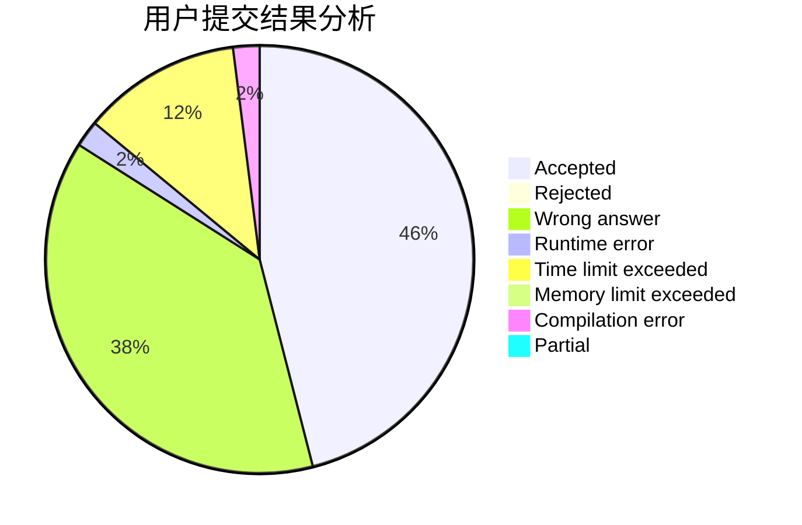
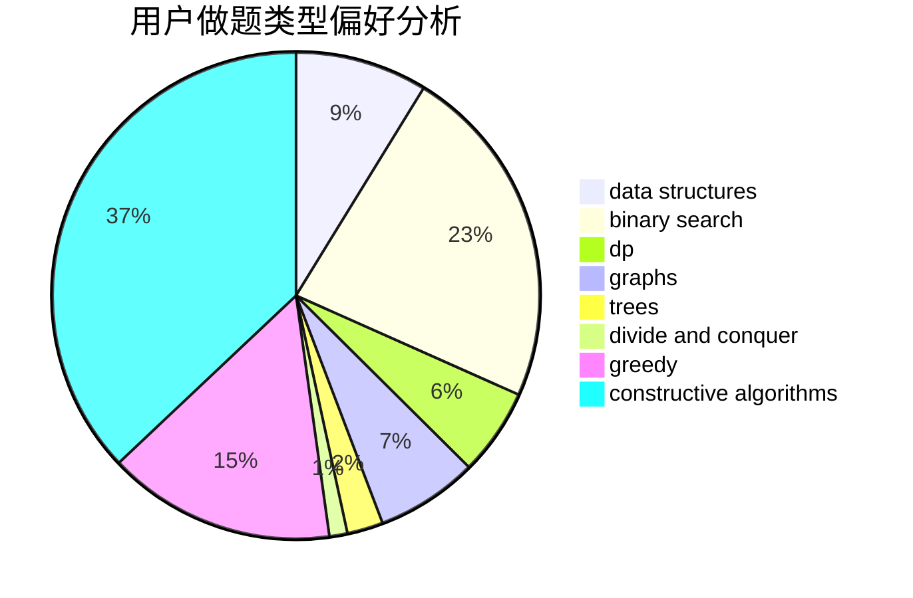

# acwing_meow
<!-- tabs:start -->
#### **用户提交结果分析**

#### **用户做题类型偏好分析**

#### **用户错题知识点分析**

<!-- tabs:end -->
# 推荐题目
[Chemical table](http://codeforces.com/problemset/problem/1012/B)		constructive algorithms,
                        dfs and similar,
                        dsu,
                        graphs,
                        matrices		  
[Primal Sport](https://codeforces.com/contest/947/problem/A)		math,
                        number theory		  
[Ice cream coloring](http://codeforces.com/problemset/problem/804/C)		constructive algorithms,
                        dfs and similar,
                        greedy		  
[Circle of Students](http://codeforces.com/problemset/problem/1203/A)		implementation		  
[Slime and Sequences (Easy Version)](http://codeforces.com/problemset/problem/1349/F1)		dp,
                        fft,
                        math		  
[Quasi-palindrome](http://codeforces.com/problemset/problem/863/A)		brute force,
                        implementation		  
[Traffic Lights](http://codeforces.com/problemset/problem/29/B)		implementation		  
[Magazine Ad](http://codeforces.com/problemset/problem/803/D)		binary search,
                        greedy		  
[ZgukistringZ](http://codeforces.com/problemset/problem/551/B)		brute force,
                        constructive algorithms,
                        implementation,
                        strings		  
[Cyclic Cipher](http://codeforces.com/problemset/problem/722/F)		chinese remainder theorem,
                        data structures,
                        implementation,
                        number theory,
                        two pointers		  
<!-- tabs:start -->
#### **data structures**
[Chemical table](http://codeforces.com/problemset/problem/722/F)		chinese remainder theorem,
                        data structures,
                        implementation,
                        number theory,
                        two pointers		  
[Primal Sport](http://codeforces.com/problemset/problem/1140/F)		data structures,
                        divide and conquer,
                        dsu		  
[Ice cream coloring](https://codeforces.com/contest/1180/problem/C)		data structures,
                        implementation		  
[Circle of Students](http://codeforces.com/problemset/problem/815/D)		binary search,
                        combinatorics,
                        data structures,
                        geometry		  
[Slime and Sequences (Easy Version)](http://codeforces.com/problemset/problem/1474/D)		data structures,
                        dp,
                        greedy,
                        math		  
[Quasi-palindrome](http://codeforces.com/problemset/problem/1492/C)		binary search,
                        data structures,
                        dp,
                        greedy,
                        two pointers		  
[Traffic Lights](http://codeforces.com/problemset/problem/1490/G)		binary search,
                        data structures,
                        math		  
[Magazine Ad](http://codeforces.com/problemset/problem/1479/D)		binary search,
                        bitmasks,
                        brute force,
                        data structures,
                        probabilities,
                        trees		  
[ZgukistringZ](http://codeforces.com/problemset/problem/1497/A)		brute force,
                        data structures,
                        greedy,
                        sortings		  
[Cyclic Cipher](http://codeforces.com/problemset/problem/1491/C)		brute force,
                        data structures,
                        dp,
                        greedy,
                        implementation		  
#### **binary search**
[Chemical table](http://codeforces.com/problemset/problem/803/D)		binary search,
                        greedy		  
[Primal Sport](http://codeforces.com/problemset/problem/645/D)		binary search,
                        dp,
                        graphs		  
[Ice cream coloring](http://codeforces.com/problemset/problem/230/B)		binary search,
                        implementation,
                        math,
                        number theory		  
[Circle of Students](http://codeforces.com/problemset/problem/815/D)		binary search,
                        combinatorics,
                        data structures,
                        geometry		  
[Slime and Sequences (Easy Version)](http://codeforces.com/problemset/problem/1492/C)		binary search,
                        data structures,
                        dp,
                        greedy,
                        two pointers		  
[Quasi-palindrome](http://codeforces.com/problemset/problem/1463/D)		binary search,
                        constructive algorithms,
                        greedy,
                        two pointers		  
[Traffic Lights](http://codeforces.com/problemset/problem/1490/G)		binary search,
                        data structures,
                        math		  
[Magazine Ad](http://codeforces.com/problemset/problem/1479/D)		binary search,
                        bitmasks,
                        brute force,
                        data structures,
                        probabilities,
                        trees		  
[ZgukistringZ](http://codeforces.com/problemset/problem/1436/E)		binary search,
                        data structures,
                        two pointers		  
[Cyclic Cipher](http://codeforces.com/problemset/problem/1461/D)		binary search,
                        brute force,
                        data structures,
                        divide and conquer,
                        implementation,
                        sortings		  
#### **dp**
[Chemical table](http://codeforces.com/problemset/problem/1349/F1)		dp,
                        fft,
                        math		  
[Primal Sport](http://codeforces.com/problemset/problem/645/D)		binary search,
                        dp,
                        graphs		  
[Ice cream coloring](http://codeforces.com/problemset/problem/1032/E)		dp,
                        math		  
[Circle of Students](http://codeforces.com/problemset/problem/225/C)		dp,
                        matrices		  
[Slime and Sequences (Easy Version)](http://codeforces.com/problemset/problem/1340/C)		dfs and similar,
                        dp,
                        graphs,
                        shortest paths		  
[Quasi-palindrome](http://codeforces.com/problemset/problem/288/E)		dp,
                        implementation,
                        math		  
[Traffic Lights](http://codeforces.com/problemset/problem/1396/C)		dp,
                        greedy,
                        implementation		  
[Magazine Ad](http://codeforces.com/problemset/problem/468/E)		dp,
                        graph matchings,
                        math,
                        meet-in-the-middle		  
[ZgukistringZ](http://codeforces.com/problemset/problem/1474/F)		dp,
                        math,
                        matrices		  
[Cyclic Cipher](http://codeforces.com/problemset/problem/1474/D)		data structures,
                        dp,
                        greedy,
                        math		  
#### **graph**
[Chemical table](http://codeforces.com/problemset/problem/1012/B)		constructive algorithms,
                        dfs and similar,
                        dsu,
                        graphs,
                        matrices		  
[Primal Sport](http://codeforces.com/problemset/problem/645/D)		binary search,
                        dp,
                        graphs		  
[Ice cream coloring](http://codeforces.com/problemset/problem/1340/C)		dfs and similar,
                        dp,
                        graphs,
                        shortest paths		  
[Circle of Students](https://codeforces.com/contest/1229/problem/C)		graphs		  
[Slime and Sequences (Easy Version)](http://codeforces.com/problemset/problem/508/D)		dfs and similar,
                        graphs		  
[Quasi-palindrome](http://codeforces.com/problemset/problem/666/B)		graphs,
                        shortest paths		  
[Traffic Lights](http://codeforces.com/problemset/problem/468/E)		dp,
                        graph matchings,
                        math,
                        meet-in-the-middle		  
[Magazine Ad](http://codeforces.com/problemset/problem/1487/C)		brute force,
                        constructive algorithms,
                        dfs and similar,
                        graphs,
                        greedy,
                        implementation,
                        math		  
[ZgukistringZ](http://codeforces.com/problemset/problem/1437/C)		dp,
                        flows,
                        graph matchings,
                        greedy,
                        math,
                        sortings		  
[Cyclic Cipher](http://codeforces.com/problemset/problem/1470/D)		constructive algorithms,
                        dfs and similar,
                        graph matchings,
                        graphs,
                        greedy		  
#### **trees**
[Chemical table](http://codeforces.com/problemset/problem/959/C)		constructive algorithms,
                        trees		  
[Primal Sport](http://codeforces.com/problemset/problem/1479/D)		binary search,
                        bitmasks,
                        brute force,
                        data structures,
                        probabilities,
                        trees		  
[Ice cream coloring](http://codeforces.com/problemset/problem/1511/C)		brute force,
                        data structures,
                        implementation,
                        trees		  
[Circle of Students](http://codeforces.com/problemset/problem/1499/F)		combinatorics,
                        dfs and similar,
                        dp,
                        trees		  
[Slime and Sequences (Easy Version)](http://codeforces.com/problemset/problem/1491/E)		brute force,
                        dfs and similar,
                        divide and conquer,
                        number theory,
                        trees		  
[Quasi-palindrome](http://codeforces.com/problemset/problem/1466/D)		data structures,
                        greedy,
                        sortings,
                        trees		  
[Traffic Lights](http://codeforces.com/problemset/problem/1495/D)		combinatorics,
                        dfs and similar,
                        graphs,
                        math,
                        shortest paths,
                        trees		  
[Magazine Ad](http://codeforces.com/problemset/problem/1303/G)		data structures,
                        divide and conquer,
                        geometry,
                        trees		  
[ZgukistringZ](http://codeforces.com/problemset/problem/1454/E)		combinatorics,
                        dfs and similar,
                        graphs,
                        trees		  
[Cyclic Cipher](http://codeforces.com/problemset/problem/1494/D)		constructive algorithms,
                        data structures,
                        dfs and similar,
                        divide and conquer,
                        dsu,
                        greedy,
                        sortings,
                        trees		  
#### **divide and conquer**
[Chemical table](http://codeforces.com/problemset/problem/1140/F)		data structures,
                        divide and conquer,
                        dsu		  
[Primal Sport](http://codeforces.com/problemset/problem/873/D)		constructive algorithms,
                        divide and conquer		  
[Ice cream coloring](http://codeforces.com/problemset/problem/1461/D)		binary search,
                        brute force,
                        data structures,
                        divide and conquer,
                        implementation,
                        sortings		  
[Circle of Students](http://codeforces.com/problemset/problem/1466/G)		combinatorics,
                        divide and conquer,
                        hashing,
                        math,
                        string suffix structures,
                        strings		  
[Slime and Sequences (Easy Version)](http://codeforces.com/problemset/problem/1490/D)		dfs and similar,
                        divide and conquer,
                        implementation		  
[Quasi-palindrome](https://codeforces.com/contest/1483/problem/C)		data structures,
                        divide and conquer,
                        dp		  
[Traffic Lights](http://codeforces.com/problemset/problem/1491/E)		brute force,
                        dfs and similar,
                        divide and conquer,
                        number theory,
                        trees		  
[Magazine Ad](http://codeforces.com/problemset/problem/1303/G)		data structures,
                        divide and conquer,
                        geometry,
                        trees		  
[ZgukistringZ](http://codeforces.com/problemset/problem/1494/D)		constructive algorithms,
                        data structures,
                        dfs and similar,
                        divide and conquer,
                        dsu,
                        greedy,
                        sortings,
                        trees		  
[Cyclic Cipher](http://codeforces.com/problemset/problem/1482/E)		data structures,
                        divide and conquer,
                        dp		  
#### **greedy**
[Chemical table](http://codeforces.com/problemset/problem/804/C)		constructive algorithms,
                        dfs and similar,
                        greedy		  
[Primal Sport](http://codeforces.com/problemset/problem/803/D)		binary search,
                        greedy		  
[Ice cream coloring](http://codeforces.com/problemset/problem/1197/B)		greedy,
                        implementation		  
[Circle of Students](http://codeforces.com/problemset/problem/847/K)		greedy,
                        implementation,
                        sortings		  
[Slime and Sequences (Easy Version)](http://codeforces.com/problemset/problem/853/A)		greedy		  
[Quasi-palindrome](http://codeforces.com/problemset/problem/1396/C)		dp,
                        greedy,
                        implementation		  
[Traffic Lights](http://codeforces.com/problemset/problem/58/B)		greedy		  
[Magazine Ad](http://codeforces.com/problemset/problem/1077/B)		greedy		  
[ZgukistringZ](http://codeforces.com/problemset/problem/794/C)		games,
                        greedy,
                        sortings		  
[Cyclic Cipher](http://codeforces.com/problemset/problem/1474/D)		data structures,
                        dp,
                        greedy,
                        math		  
#### **constructive algorithms**
[Chemical table](http://codeforces.com/problemset/problem/1012/B)		constructive algorithms,
                        dfs and similar,
                        dsu,
                        graphs,
                        matrices		  
[Primal Sport](http://codeforces.com/problemset/problem/804/C)		constructive algorithms,
                        dfs and similar,
                        greedy		  
[Ice cream coloring](http://codeforces.com/problemset/problem/551/B)		brute force,
                        constructive algorithms,
                        implementation,
                        strings		  
[Circle of Students](http://codeforces.com/problemset/problem/959/C)		constructive algorithms,
                        trees		  
[Slime and Sequences (Easy Version)](http://codeforces.com/problemset/problem/613/C)		constructive algorithms,
                        math		  
[Quasi-palindrome](http://codeforces.com/problemset/problem/873/D)		constructive algorithms,
                        divide and conquer		  
[Traffic Lights](http://codeforces.com/problemset/problem/934/B)		constructive algorithms,
                        implementation		  
[Magazine Ad](http://codeforces.com/problemset/problem/439/C)		brute force,
                        constructive algorithms,
                        implementation,
                        number theory		  
[ZgukistringZ](http://codeforces.com/problemset/problem/1237/H)		constructive algorithms		  
[Cyclic Cipher](http://codeforces.com/problemset/problem/1463/B)		bitmasks,
                        constructive algorithms,
                        greedy		  
#### **sortings**
[Chemical table](http://codeforces.com/problemset/problem/847/K)		greedy,
                        implementation,
                        sortings		  
[Primal Sport](http://codeforces.com/problemset/problem/794/C)		games,
                        greedy,
                        sortings		  
[Ice cream coloring](https://codeforces.com/contest/1496/problem/C)		geometry,
                        greedy,
                        math,
                        sortings		  
[Circle of Students](http://codeforces.com/problemset/problem/1495/A)		geometry,
                        greedy,
                        math,
                        sortings		  
[Slime and Sequences (Easy Version)](http://codeforces.com/problemset/problem/1497/A)		brute force,
                        data structures,
                        greedy,
                        sortings		  
[Quasi-palindrome](http://codeforces.com/problemset/problem/1427/A)		math,
                        sortings		  
[Traffic Lights](http://codeforces.com/problemset/problem/1461/D)		binary search,
                        brute force,
                        data structures,
                        divide and conquer,
                        implementation,
                        sortings		  
[Magazine Ad](http://codeforces.com/problemset/problem/1437/C)		dp,
                        flows,
                        graph matchings,
                        greedy,
                        math,
                        sortings		  
[ZgukistringZ](http://codeforces.com/problemset/problem/1473/A)		greedy,
                        implementation,
                        math,
                        sortings		  
[Cyclic Cipher](http://codeforces.com/problemset/problem/1486/B)		binary search,
                        geometry,
                        shortest paths,
                        sortings		  
<!-- tabs:end -->
