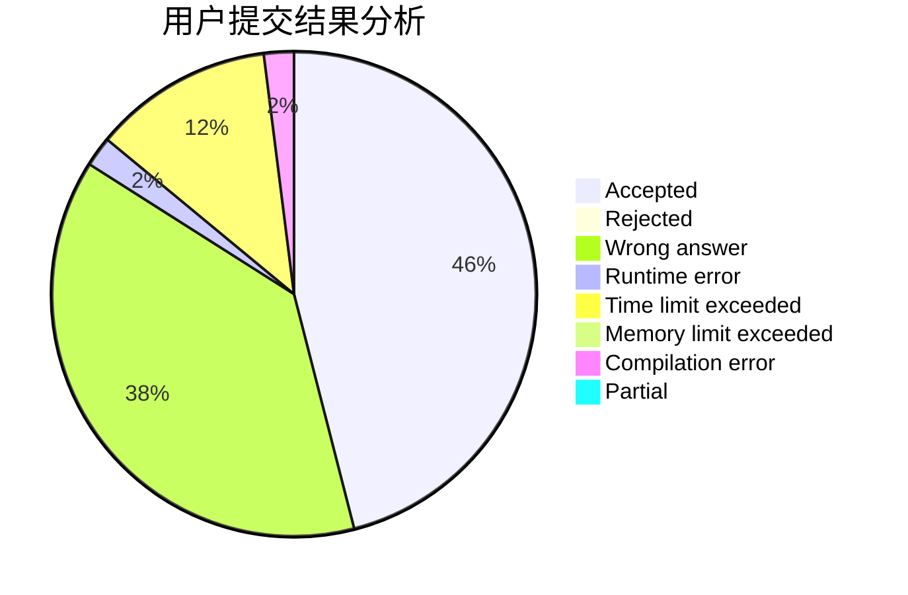
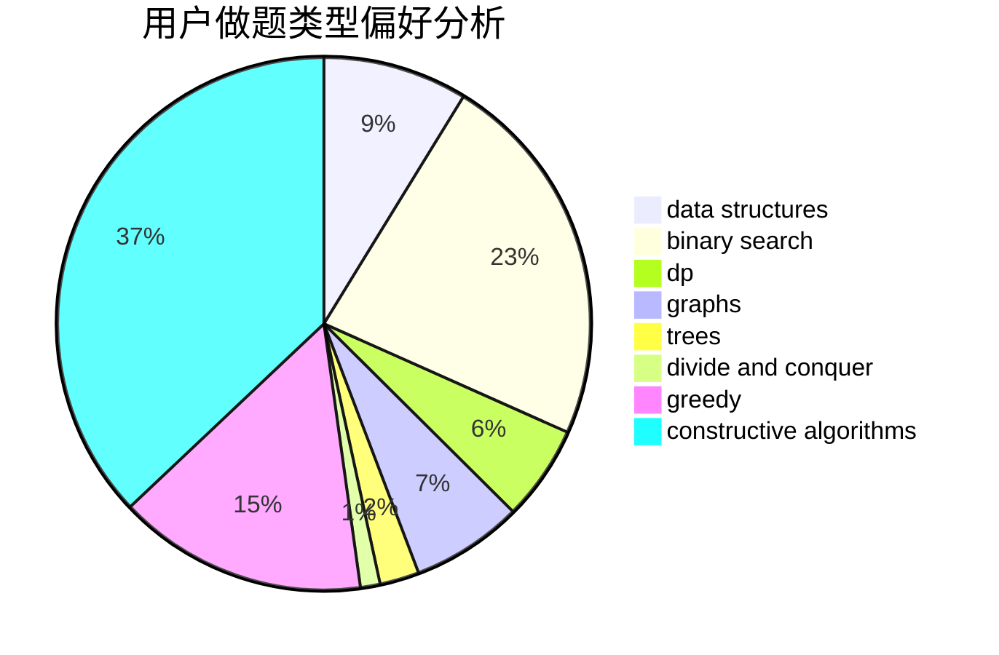

# acwing_meow

<!-- tabs:start -->

#### **用户提交结果分析**

#### **用户做题类型偏好分析**

#### **用户错题知识点分析**

<!-- tabs:end -->
# 推荐题目
[947A](https://codeforces.com/contest/947/problem/A)		dsu,graphs,sortings,trees		  
[863A](https://codeforces.com/contest/863/problem/A)		brute force,
                        implementation		  
[1349F1](https://codeforces.com/contest/1349F/problem/1)		dp,
                        fft,
                        math		  
[1140F](https://codeforces.com/contest/1140/problem/F)		data structures,
                        divide and conquer,
                        dsu		  
[895D](https://codeforces.com/contest/895/problem/D)		combinatorics,
                        math,
                        strings		  
[551B](https://codeforces.com/contest/551/problem/B)		brute force,
                        constructive algorithms,
                        implementation,
                        strings		  
[847K](https://codeforces.com/contest/847/problem/K)		greedy,
                        implementation,
                        sortings		  
[934B](https://codeforces.com/contest/934/problem/B)		constructive algorithms,
                        implementation		  
[225C](https://codeforces.com/contest/225/problem/C)		dp,
                        matrices		  
[803D](https://codeforces.com/contest/803/problem/D)		binary search,
                        greedy		  
