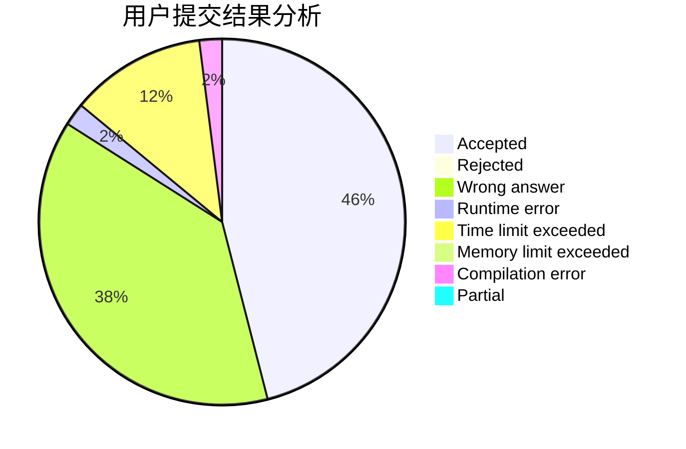
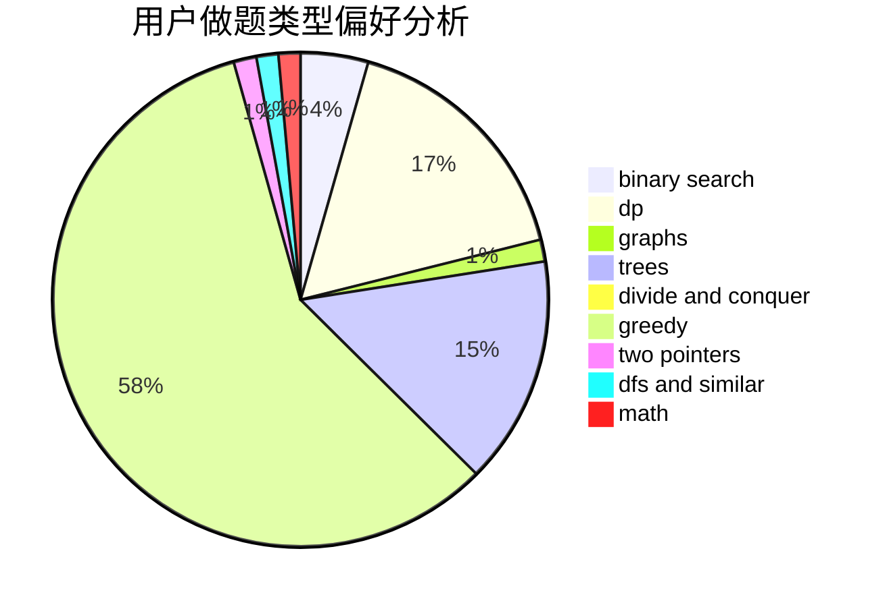

# acwing_meow

<!-- tabs:start -->

#### **用户提交结果分析**

#### **用户做题类型偏好分析**

<!-- tabs:end -->
# 推荐题目
[963E](https://codeforces.com/contest/963/problem/E)
[883C](https://codeforces.com/contest/883/problem/C)
[13571](https://codeforces.com/contest/1357/problem/1)
[1142D](https://codeforces.com/contest/1142/problem/D)
[913B](https://codeforces.com/contest/913/problem/B)
[576C](https://codeforces.com/contest/576/problem/C)
[866C](https://codeforces.com/contest/866/problem/C)
[956A](https://codeforces.com/contest/956/problem/A)
[243C](https://codeforces.com/contest/243/problem/C)
[819B](https://codeforces.com/contest/819/problem/B)
