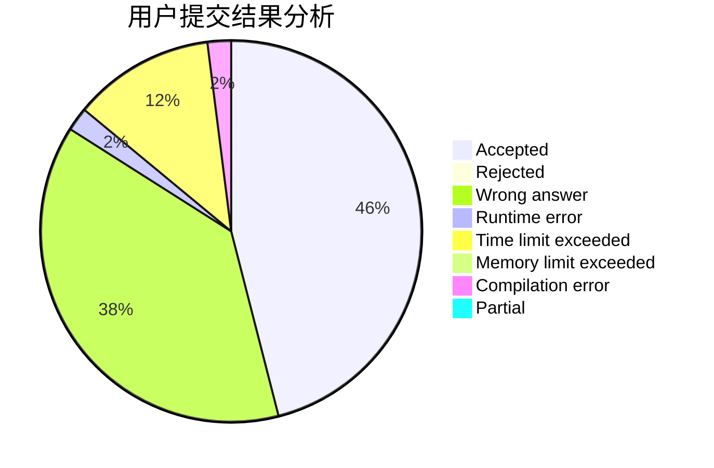
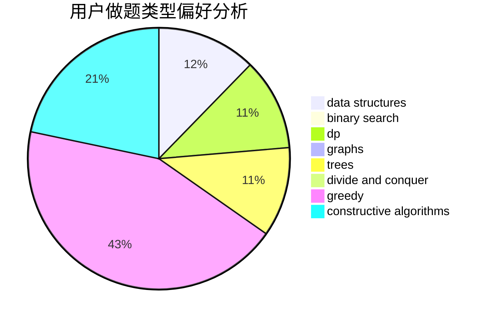

# acwing_meow

<!-- tabs:start -->

#### **用户提交结果分析**

#### **用户做题类型偏好分析**

#### **用户错题知识点分析**

<!-- tabs:end -->
# 推荐题目
[963E](https://codeforces.com/contest/963/problem/E)		math		  
[883C](https://codeforces.com/contest/883/problem/C)		binary search,
                        implementation		  
[13571](https://codeforces.com/contest/1357/problem/1)		dsu,graphs,sortings,trees		  
[1142D](https://codeforces.com/contest/1142/problem/D)		dp		  
[913B](https://codeforces.com/contest/913/problem/B)		implementation,
                        trees		  
[576C](https://codeforces.com/contest/576/problem/C)		constructive algorithms,
                        divide and conquer,
                        geometry,
                        greedy,
                        sortings		  
[866C](https://codeforces.com/contest/866/problem/C)		dsu,graphs,sortings,trees		  
[956A](https://codeforces.com/contest/956/problem/A)		dsu,graphs,sortings,trees		  
[243C](https://codeforces.com/contest/243/problem/C)		dfs and similar,
                        implementation		  
[819B](https://codeforces.com/contest/819/problem/B)		data structures,
                        implementation,
                        math		  
