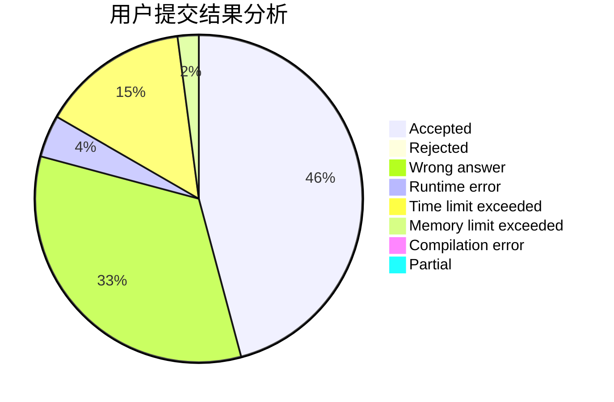
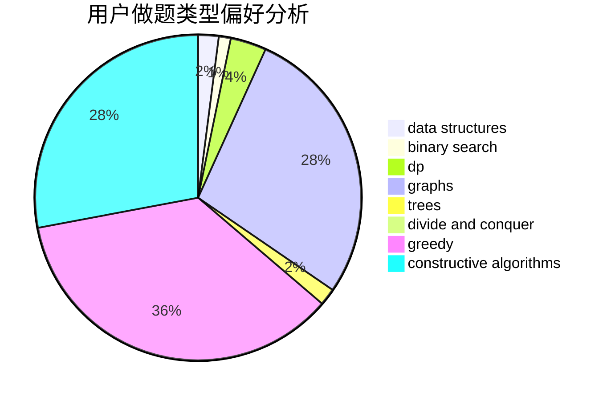

# 11000100

<!-- tabs:start -->

#### **用户提交结果分析**

#### **用户做题类型偏好分析**

#### **用户错题知识点分析**

<!-- tabs:end -->
# 推荐题目
[1092F](https://codeforces.com/contest/1092/problem/F)		dfs and similar,
                        dp,
                        trees		  
[1096D](https://codeforces.com/contest/1096/problem/D)		dp		  
[1092E](https://codeforces.com/contest/1092/problem/E)		constructive algorithms,
                        dfs and similar,
                        greedy,
                        trees		  
[1095F](https://codeforces.com/contest/1095/problem/F)		dsu,
                        graphs,
                        greedy		  
[1093G](https://codeforces.com/contest/1093/problem/G)		bitmasks,
                        data structures		  
[1093B](https://codeforces.com/contest/1093/problem/B)		constructive algorithms,
                        greedy,
                        sortings,
                        strings		  
[1093F](https://codeforces.com/contest/1093/problem/F)		dp		  
[1095A](https://codeforces.com/contest/1095/problem/A)		implementation		  
[1096E](https://codeforces.com/contest/1096/problem/E)		combinatorics,
                        dp,
                        math,
                        probabilities		  
[1093C](https://codeforces.com/contest/1093/problem/C)		greedy		  
