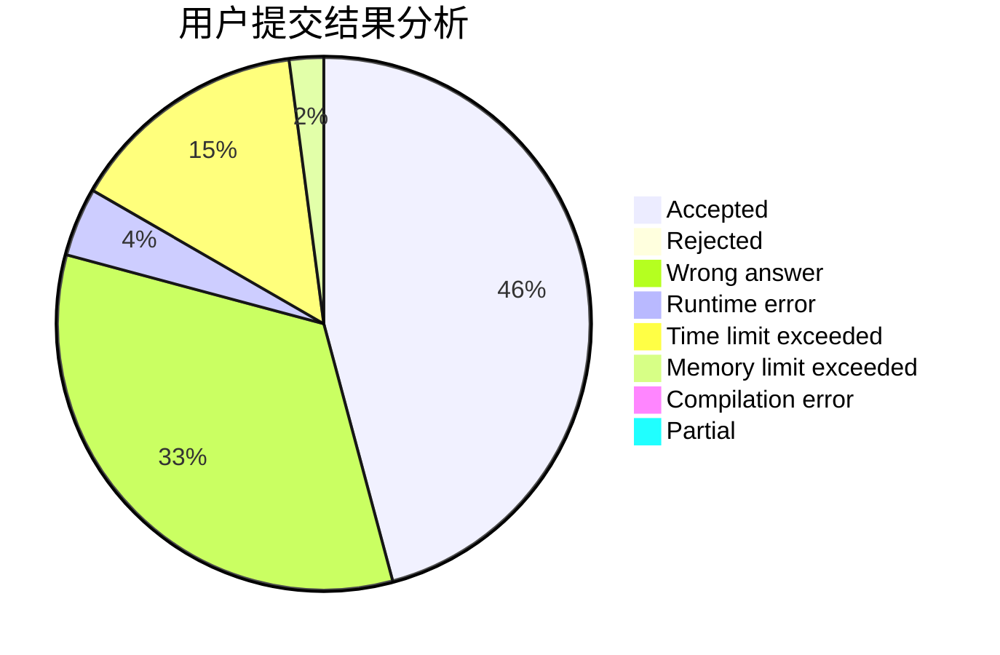
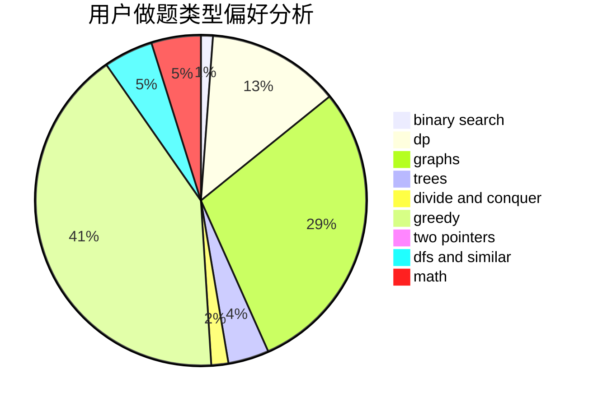

# 11000100

<!-- tabs:start -->

#### **用户提交结果分析**

#### **用户做题类型偏好分析**

<!-- tabs:end -->
# 推荐题目
[1092F](https://codeforces.com/contest/1092/problem/F)
[1096D](https://codeforces.com/contest/1096/problem/D)
[1092E](https://codeforces.com/contest/1092/problem/E)
[1095F](https://codeforces.com/contest/1095/problem/F)
[1093G](https://codeforces.com/contest/1093/problem/G)
[1093B](https://codeforces.com/contest/1093/problem/B)
[1093F](https://codeforces.com/contest/1093/problem/F)
[1095A](https://codeforces.com/contest/1095/problem/A)
[1096E](https://codeforces.com/contest/1096/problem/E)
[1093C](https://codeforces.com/contest/1093/problem/C)
