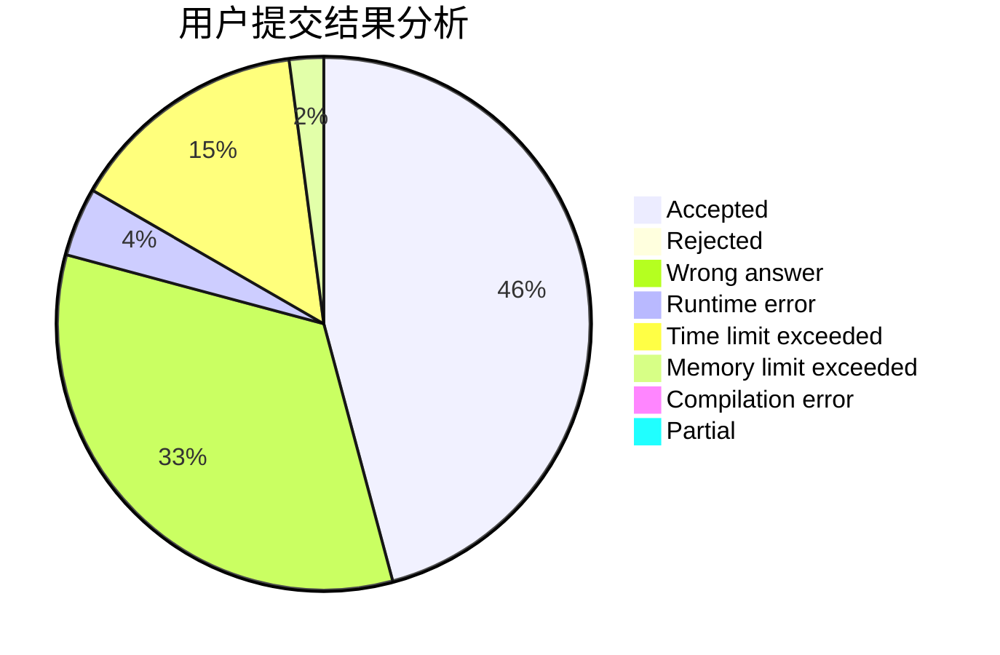
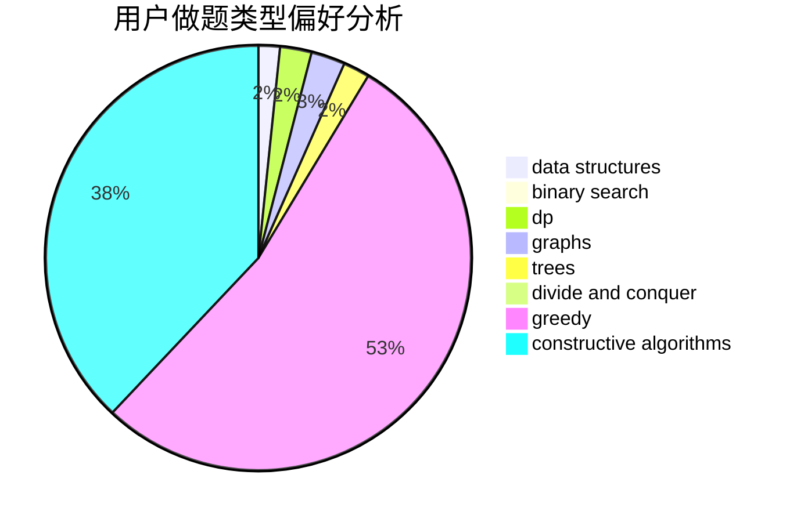
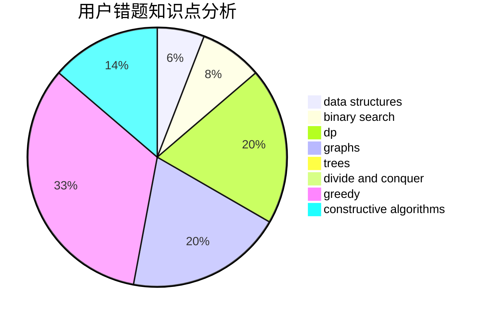

# 11000100

<!-- tabs:start -->

#### **用户提交结果分析**

#### **用户做题类型偏好分析**

#### **用户错题知识点分析**

<!-- tabs:end -->
# 推荐题目
[1092D1](https://codeforces.com/contest/1092D/problem/1)		greedy,
                        implementation,
                        math		  
[1096A](https://codeforces.com/contest/1096/problem/A)		greedy,
                        implementation,
                        math		  
[1092B](https://codeforces.com/contest/1092/problem/B)		sortings		  
[1095C](https://codeforces.com/contest/1095/problem/C)		bitmasks,
                        greedy		  
[1093D](https://codeforces.com/contest/1093/problem/D)		dfs and similar,
                        graphs		  
[1092E](https://codeforces.com/contest/1092/problem/E)		constructive algorithms,
                        dfs and similar,
                        greedy,
                        trees		  
[1093C](https://codeforces.com/contest/1093/problem/C)		greedy		  
[1093E](https://codeforces.com/contest/1093/problem/E)		data structures		  
[1096B](https://codeforces.com/contest/1096/problem/B)		combinatorics,
                        math,
                        strings		  
[1092F](https://codeforces.com/contest/1092/problem/F)		dfs and similar,
                        dp,
                        trees		  
