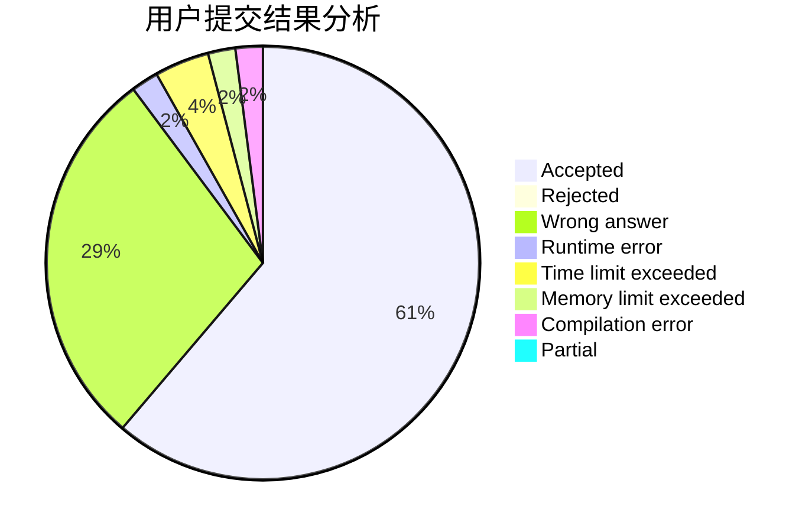
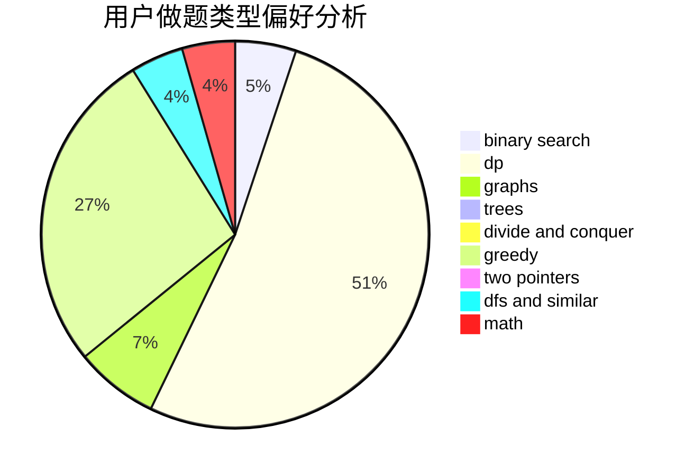

# AmamiyaKokoro

<!-- tabs:start -->

#### **用户提交结果分析**

#### **用户做题类型偏好分析**

<!-- tabs:end -->
# 推荐题目
[323C](https://codeforces.com/contest/323/problem/C)
[327A](https://codeforces.com/contest/327/problem/A)
[1290F](https://codeforces.com/contest/1290/problem/F)
[1256F](https://codeforces.com/contest/1256/problem/F)
[325D](https://codeforces.com/contest/325/problem/D)
[325B](https://codeforces.com/contest/325/problem/B)
[327D](https://codeforces.com/contest/327/problem/D)
[325E](https://codeforces.com/contest/325/problem/E)
[323B](https://codeforces.com/contest/323/problem/B)
[328A](https://codeforces.com/contest/328/problem/A)
