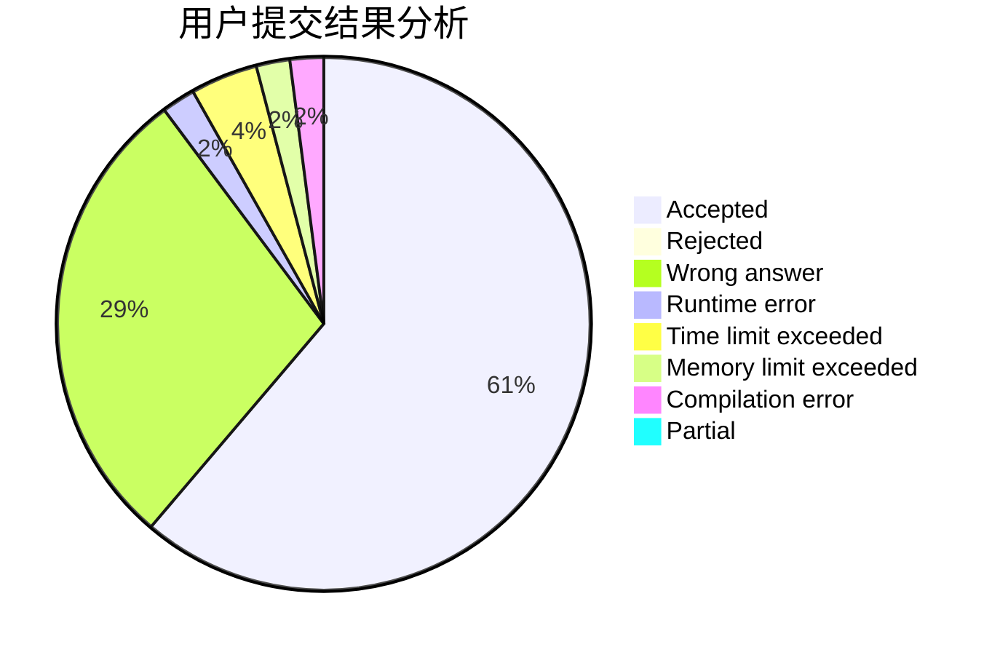
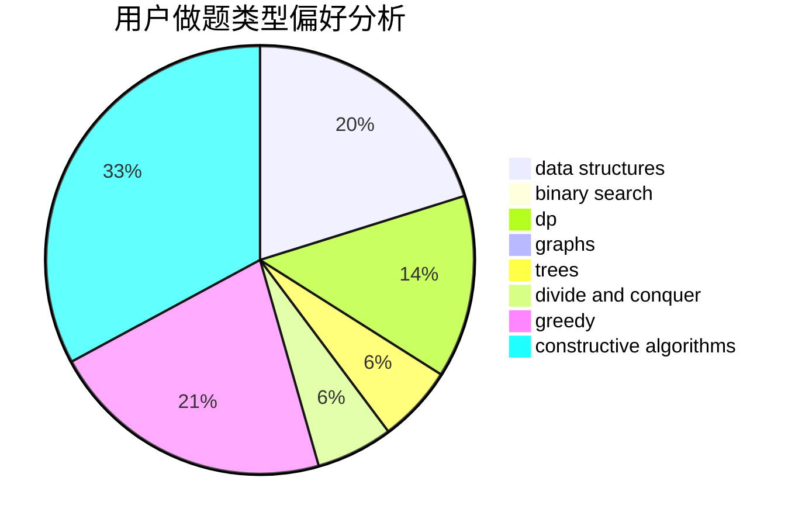
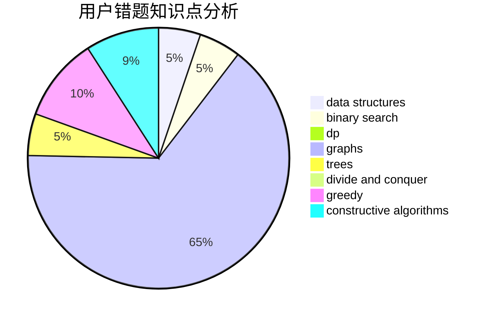

# AmamiyaKokoro

<!-- tabs:start -->

#### **用户提交结果分析**

#### **用户做题类型偏好分析**

#### **用户错题知识点分析**

<!-- tabs:end -->
# 推荐题目
[304B](https://codeforces.com/contest/304/problem/B)		brute force,
                        implementation		  
[305D](https://codeforces.com/contest/305/problem/D)		combinatorics,
                        math		  
[1283F](https://codeforces.com/contest/1283/problem/F)		constructive algorithms,
                        greedy,
                        trees		  
[1251E1](https://codeforces.com/contest/1251E/problem/1)		data structures,
                        dp,
                        greedy		  
[305B](https://codeforces.com/contest/305/problem/B)		brute force,
                        implementation,
                        math		  
[304D](https://codeforces.com/contest/304/problem/D)		dsu,graphs,sortings,trees		  
[306B](https://codeforces.com/contest/306/problem/B)		data structures,
                        greedy,
                        sortings		  
[305C](https://codeforces.com/contest/305/problem/C)		greedy,
                        implementation		  
[303E](https://codeforces.com/contest/303/problem/E)		dp,
                        math,
                        probabilities		  
[306C](https://codeforces.com/contest/306/problem/C)		combinatorics,
                        number theory		  
